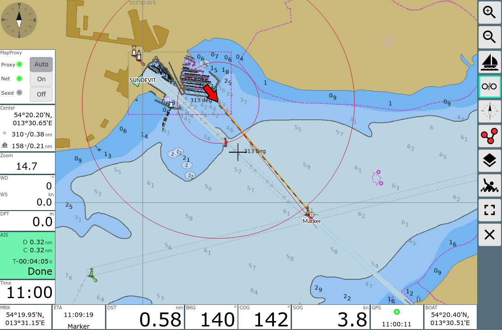
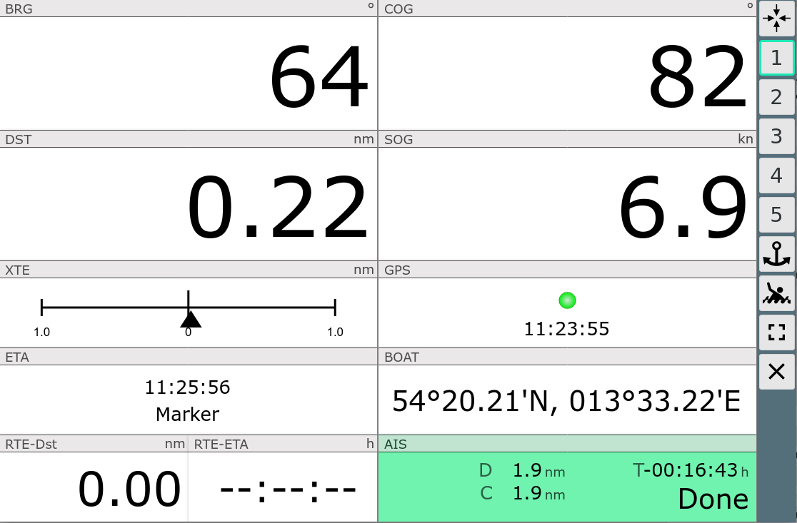
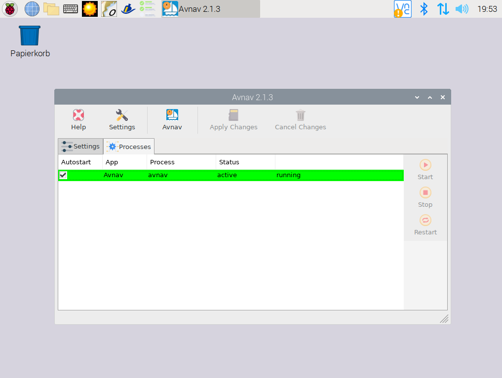

AvNav Installer
###############

AvNav Features
**************

* client server based navigation solution
* server runs on OpenPlotter, client can be any browser
* optimized for touch devices
* integration with SignalK and stand alone
* raster charts and vector charts from `o-charts <https://o-charts.org/>`_
* AIS display and CPA computation
* creating, editing, using, importing and exporting of routes
* simple waypoint routing 
* chart overlays (multiple chart layers, gpx, kml, geojson...)
* MOB alarms
* anchor watch and alarm
* chart display with configurable info displays
* multiple configurable dashboard pages
* night mode
* multiple displays all being synced
* plugins (history, mapproxy, update,...)
* can be adapted/customized with css, java script and python

For further details refer to the `documentation <https://www.wellenvogel.net/software/avnav/docs/beschreibung.html?lang=en>`_
or have a look at some `videos <https://www.youtube.com/playlist?list=PLxNyj_GYzonmrSgnqtHogY7XK-TANk6q3>`_.

Installer
*********

* will download and install the AvNav software and the necessary plugins
* show the status of the server part and allow to start and stop it
* allow for some basic settings (others directly within the AvNav app itself)
* set up connectivity between SignalK and AvNav
* NMEA traffic is configured to run from SignalK to AvNav

Processes and Ports
____________________

AvNav has a main process ("avnav") that handles all the NMEA data and server functions.
It has one port for the web access (default: 8080).
To handle o-charts there is an additional process (controlled and started by avnav)
that has an own port for the access to those charts (default 8082).
To run updates from the AvNav web app there is an additionaly avnavupdater 
process that is running independently from avnav and again has an own port for the web access
(default: 8085).
You can modify the ports at the settings tab if they interfere with others
applications you have installed. OpenPlotter will check this and warn you accordingly.

