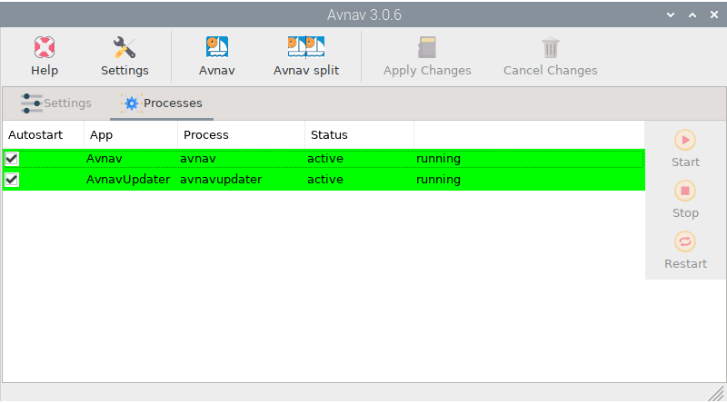
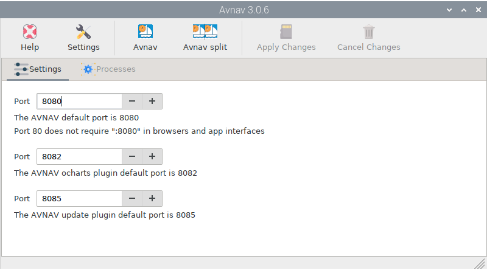

.. |mhelp| image:: ../img/help.png
.. |mSettings| image:: ../img/settings.png

.. |OPavnavStop| image:: img/stop.png

.. |OPavnavRestart| image:: img/restart.png

|OPavnav| AvNav Installer
#########################

.. note::
	To run this app type this in a terminal:

	.. parsed-literal::

		openplotter-avnav

|mhelp| ``Help`` opens an offline copy of this documentation in a browser and |mSettings| ``Settings`` opens the main app *OpenPlotter Settings*.

This app installs the web chart plotter AvNav. Enable/Disable the AvNav server at startup checking ``Autostart``.
You can also |OPavnavStop| ``Stop``, |OPavnavStart| ``Start`` and |OPavnavRestart| ``Restart`` the AvNav server at any time.

Open an instance of AvNav in your local browser by clicking |OPavnavRun| ``Avnav`` or click |OPavnavRun2| ``Avnav split`` to run two instances in the same window.

You can also run AvNav from any device connected to the same network as OpenPlotter using this address: *http://openplotter.local:8080*

By default, AvNav listens on port 8080, but you can change these ports in the |OPavnavSettings| ``Settings`` tab to avoid conflicts with other programs:

.. note::
	Read `here <http://wellenvogel.de/software/avnav/docs/beschreibung.html?lang=en>`_  the full documentation.
