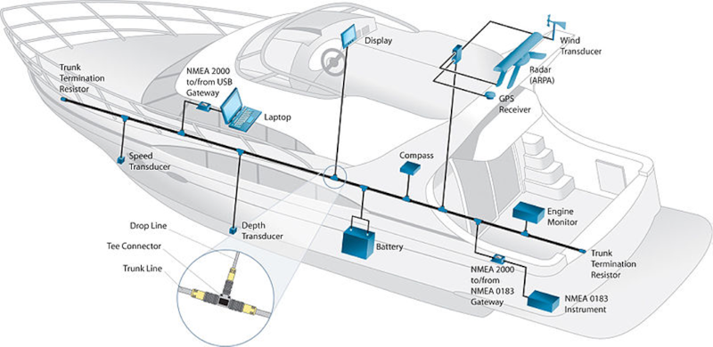
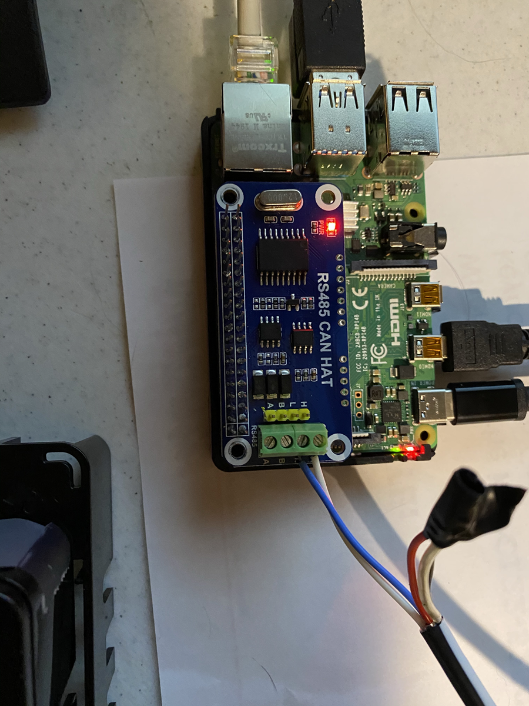
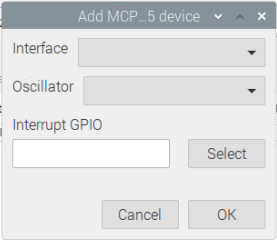
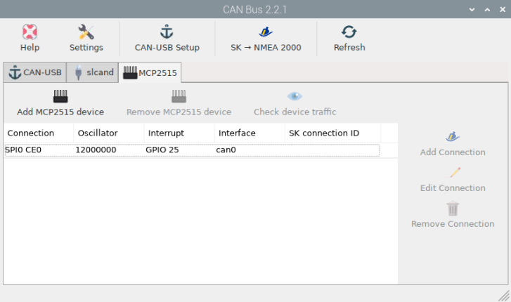
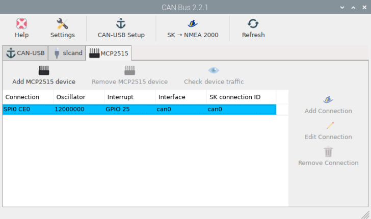
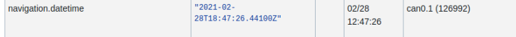

.. _can:

CAN Bus
########

Go into settings (--> openplotter -->) and ensure that the CAN Bus App is installed and the latest

CAN_USB
*******

To be added

Slcand
******

To be added

MCP2515
*******

There are some boards available with the MCP2515 chip on board that can be added into openplotter below is a list of the ones that work:

	• Waveshare RS485 CAN HAT - https://www.amazon.com/gp/product/B07VMB1ZKH

Physical install
****************

Shutdown the Pi and install the Can Board (if it is a CAN Hat).
Connect the Seatalk NG Can H and Can L or the NMEA2000 (N2K) Can H and Can L to the H and L

.. note::
	The Seatalk NG bus needs to be powered - this would normally already be so if you have other devices on the bus but some Multi-function Displays need the bus powering, as well as the device - the power does not connect to the HAT in any way.

.. note::
	Make sure the CAN network is appropriately terminated.  CAN network termination is required to reduce reflection and consists of 60 Ohm resistors at the end points of the CAN networks - some devices have these built in and the Raymarine network has these already  if you are just plugging in to an existing network

Reboot the Pi and open the CAN Bus app.  In the app go to the MCP2515 tab and press the 'Add MCP2515 device' button. 

Pick the correct interface, Oscillator and select the correct GPIO pin. 

On the Waveshare RS485 CAN HAT, this would be SPIO CEO for the interface, the oscillator can be found by looking at the crystal chip on the HAT as per the pic below.  The Interrupt GPIO is GPIO 25, pin 22

.. image:: img/can4.png

Once accepted the CAN bus app should like the pic below

At this point the device is set up but not connected to Signal K.  By selecting the device and then pressing the 'Check device traffic' button, you will see a terminal and the data running through the device.

Connect to Signal K
********************

To connect to Signal K, Select the device and press the 'Add Connection' button.  You will see Signal K restart and the connection ID will be added

If you go into SignalK and there is data on the bus you will see it in the signalK Data Browser.  See an example below

Signal K Output
***************

We need to select which data is sent out by SignalK on the CAN bus.  This data will be sent out to the MFD and other devices on the CAN bus.  Press the 'SK --> NMEA 2000' button and select the items you want to send out.  Press submit and make sure the 'SignalK to NMEA 2000' plugin is enabled.
