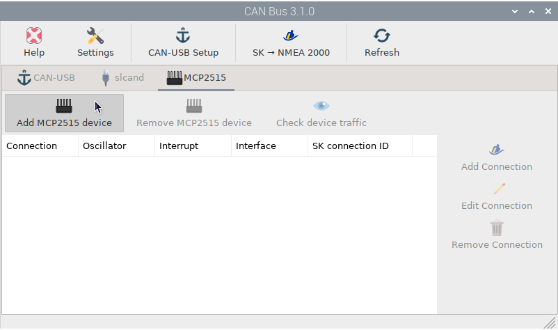
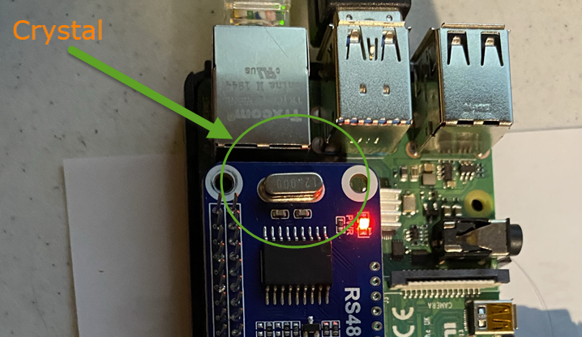
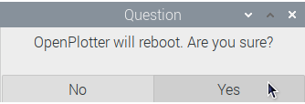
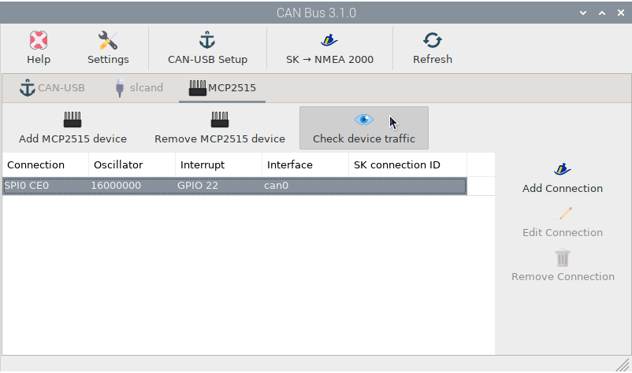
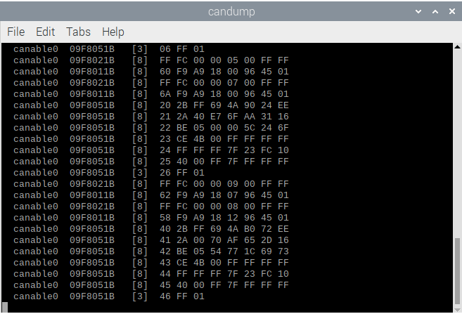
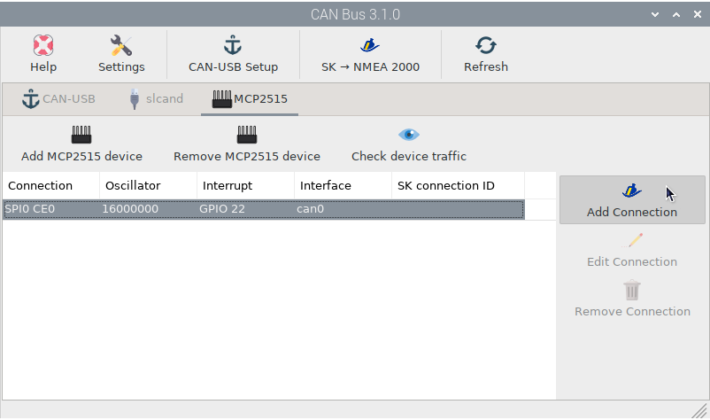
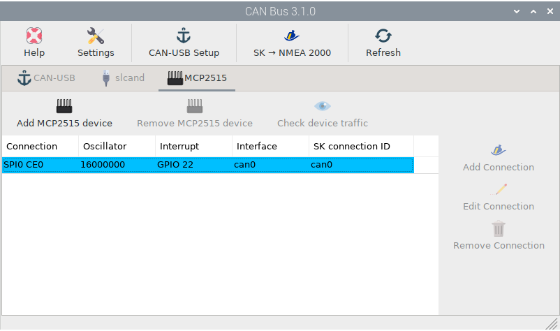
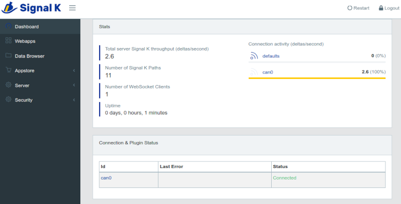
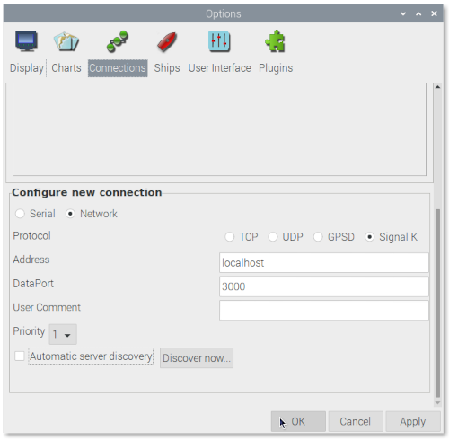

.. _gpioCAN:

.. |OP2515chip| image:: img/chip.png
.. |OPcancheck| image:: img/check.png
.. |OPcanSK| image:: img/sk.png

Input data by MCP2515/MCP251xfd
###############################

There are some HATs for Raspberry Pi available with the MCP2515 chip (and its successor MCP251xfd) on board that you can easily configure in OpenPlotter. After mountig the HAT click on |OP2515chip| ``Add MCP2515 device`` in |OP2515chip| ``MCP2515`` tab:

.. image:: img/canMCP2.png

:Interface: Select *SPI0 CE0* if your HAT connects to GPIO 8 (pin 24) and select *SPI0 CE1* if your HAT connects to GPIO 7 (pin 26).
:Oscillator: The oscillator can be found by looking at the crystal chip on the HAT as per the pic below.
:Interrupt: Select the GPIO your HAT connects for interruption. See the documentation for your device.

After entering the required data the system needs to reboot to apply the changes:

After a rebboot you should receive data on your device. Select the item from the list and click |OPcancheck| ``Check device traffic`` to confirm data entry:

Now we need to get this data to the Signal K server. Select the item from the list and click |OPcanSK| ``Add Connection``. The Signal K server will restart and you are done:

Go to the Signal K server administration interface using your web browser, to confirm that the connection has been made:

Check OpenCPN to make sure there is a connection to the Signal K server and you are getting data from your NMEA 2000 network:

