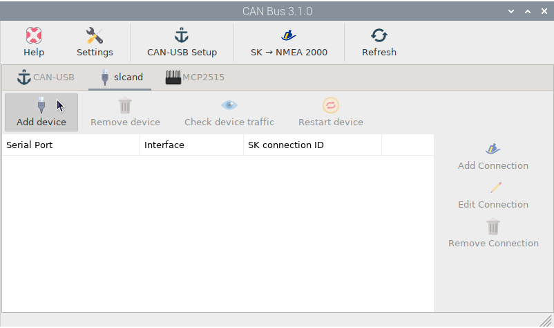
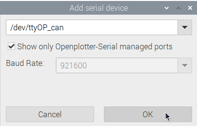
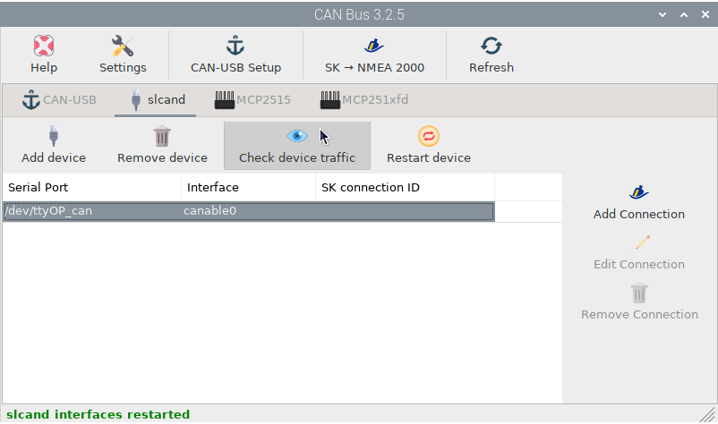
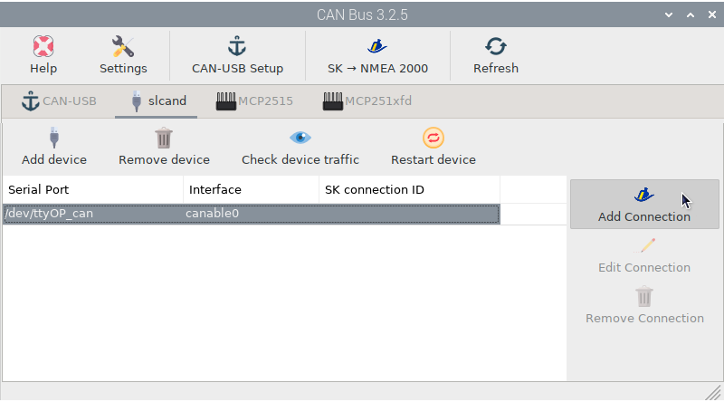
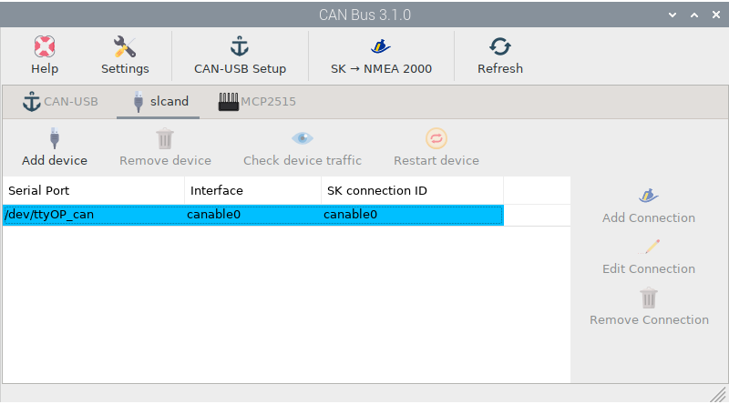
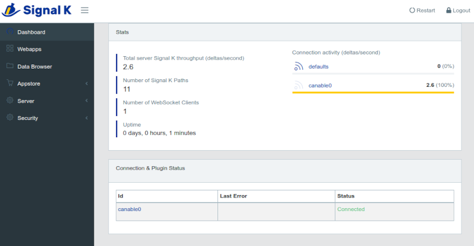

.. _slcand:

.. |OPcanUSB| image:: img/usb.png
.. |OPcancheck| image:: img/check.png
.. |OPcanSK| image:: img/sk.png

|OPcanUSB| Input data by slcand
###############################

This tutorial is for any NMEA 2000 converter that can connect via USB using *slcand* such as the `CANable <https://canable.io/>`_ devices.

First of all you have to define the device using the :ref:`OpenPlotter Serial<serialCAN>` app. Then go back to this OpenPlotter CAN Bus app and click |OPcanUSB| ``Add device`` in |OPcanUSB| ``slcand`` tab:

Select the device you defined in the *OpenPlotter Serial* app and click ``OK``:

From this moment you should receive data on your device. Select the item from the list and click |OPcancheck| ``Check device traffic`` to confirm data entry:

.. image:: img/canSlcand4.png

Now we need to get this data to the Signal K server. Select the item from the list and click |OPcanSK| ``Add Connection``. The Signal K server will restart and you are done:

Go to the Signal K server administrator to confirm that the connection has been made:

Check OpenCPN to make sure there is a connection to the Signal K server and you are getting data from your NMEA 2000 network:

.. image:: ../img/opencpnConnection.png