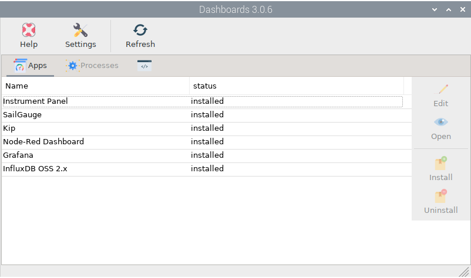
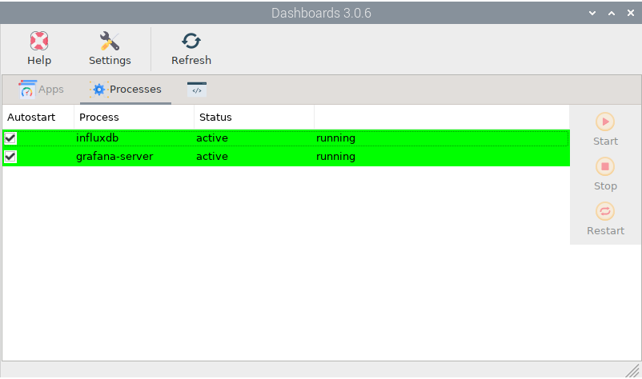
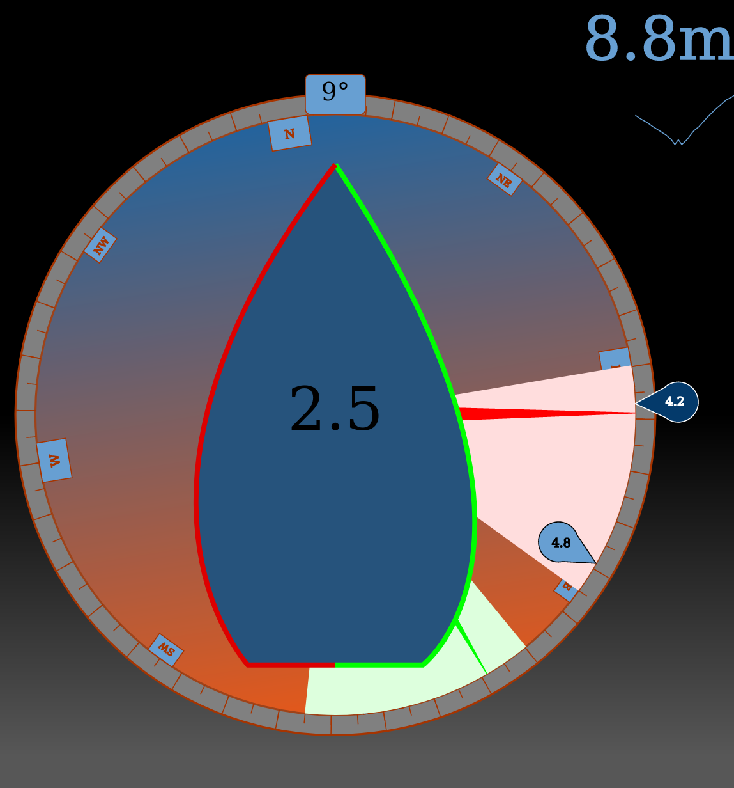

.. |DB| image:: img/openplotter-dashboards.png
.. |mhelp| image:: ../img/help.png
.. |mSettings| image:: ../img/settings.png
.. |DBshow| image:: img/show.png
.. |DBedit| image:: img/edit.png
.. |DBinstall| image:: img/install.png
.. |DBuninstall| image:: img/uninstall.png
.. |DBrefresh| image:: img/refresh.png
.. |DBstart| image:: img/start.png

.. |DBprocess| image:: img/process.png
.. |DBhelp| image:: img/help-on-icon.png

|DB| Dashboards
###############

.. note::
	To run this app type this in a terminal:

	.. parsed-literal::

		openplotter-dashboards

|mhelp| ``Help`` opens an offline copy of this documentation in a browser and |mSettings| ``Settings`` opens the main app *OpenPlotter Settings*.

Select any app from the list and click |DBinstall| ``Install`` or |DBuninstall| ``Uninstall``. Click |DBrefresh| ``Refresh`` after any of these actions to refresh the list.

Most of these dashboards are plugins of Signal K server, but some of them are standalone third-party applications like Grafana or InfluxDB. Once these applications are installed you can |DBstart| ``Start``, |DBstop| ``Stop``, |DBrestart| ``Restart`` and start them at startup checking ``Autostart`` in the |DBprocess| Processes tab:

Instrument Panel
################

.. image:: img/instrumentpanel.png

This is the dashboard built into the Signal K server. It is highly configurable and you can even embed some panels from other apps like Grafana.

You can access this dashboard by selecting *Instrument Panel* in the list and clicking |DBshow| ``Open`` or by typing this adddress in your local browser: *http://localhost:3000/@signalk/instrumentpanel/*. You can also connect to this page from any device connected to the same network as OpenPlotter using the address *http://openplotter.local:3000/@signalk/instrumentpanel/*.

By clicking on the |DBhelp| help icon you will access a complete manual.

SailGauge
#########

This signal K server plugin provides an all-in-one gauge for sailboats.

You can access this dashboard by selecting *SailGauge* in the list and clicking |DBshow| ``Open`` or by typing this adddress in your local browser: *http://localhost:3000/@signalk/sailgauge/*. You can also connect to this page from any device connected to the same network as OpenPlotter using the address *http://openplotter.local:3000/@signalk/sailgauge/*.

Kip
###

.. image:: img/kip.png

Using this wonderful Signal K plugin you will be able to easily build sexy dashboards containing graphs, gauges, numeric and level panels...

You can access this dashboard by selecting *Kip* in the list and clicking |DBshow| ``Open`` or by typing this adddress in your local browser: *http://localhost:3000/@mxtommy/kip/*. You can also connect to this page from any device connected to the same network as OpenPlotter using the address *http://openplotter.local:3000/@mxtommy/kip/*.

Go to the plugin homepage for the list of features and some tips: https://github.com/mxtommy/Kip

Node-Red Dashboard
##################

.. image:: img/nodered_dashboard.png

`Node-RED <https://nodered.org/>`_ is a programming tool that provides a browser-based editor and it allows you to program visually without using a single line of code.

In OpenPlotter, Node-RED comes embedded into the Signal K server as a plugin and contains some specific nodes to manage Signal K data. Go to the plugin homepage to see the list of nodes and some examples: https://github.com/SignalK/node-red-embedded

It also includes the node-red-dashboard plugin that adds more nodes for creating buttons, graphs, gauges, sliders...

You can build Node-RED dashboards by selecting *Node-Red Dashboard* in the list and clicking |DBedit| ``Edit`` or by typing this adddress in your local browser: *http://localhost:3000/plugins/signalk-node-red/redAdmin/*. You can also connect to this page from any device connected to the same network as OpenPlotter using the address *http://openplotter.local:3000/plugins/signalk-node-red/redAdmin/*.

You can see your Node-RED dashboards in action by selecting *Node-Red Dashboard* in the list and clicking |DBshow| ``Open`` or by typing this adddress in your local browser: *http://localhost:3000/plugins/signalk-node-red/redApi/ui/*. You can also connect to this page from any device connected to the same network as OpenPlotter using the address *http://openplotter.local:3000/plugins/signalk-node-red/redApi/ui/*.

Using and learning Node-RED takes some time and is not the goal of this document. If you are not a programmer but would like to learn some basic principles, Node-RED is the perfect starting point. Everything will be possible in OpenPlotter using Node-RED.

- Go to the Node-RED homepage to get started: https://nodered.org/docs
- Go to our dedicated forum to share or ask about Node-RED in OpenPlotter: https://forum.openmarine.net/forumdisplay.php?fid=15
