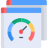
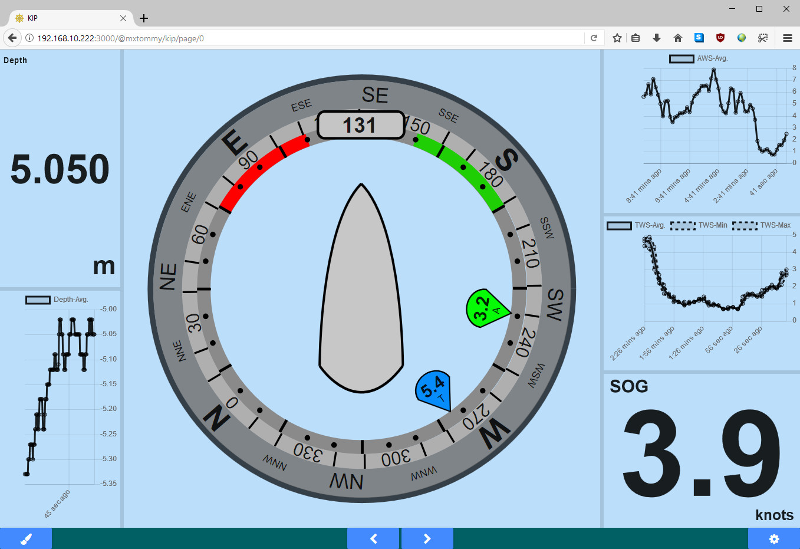
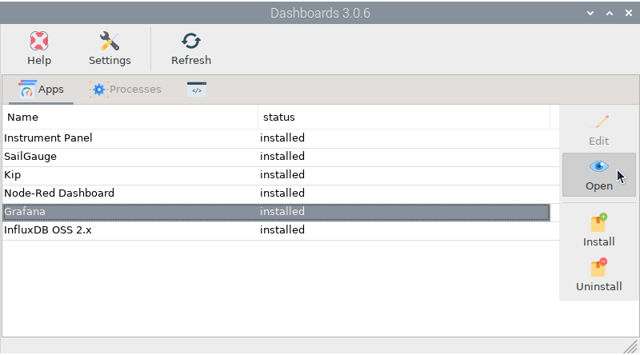
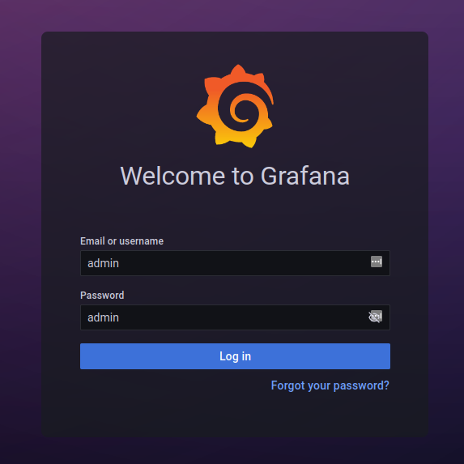
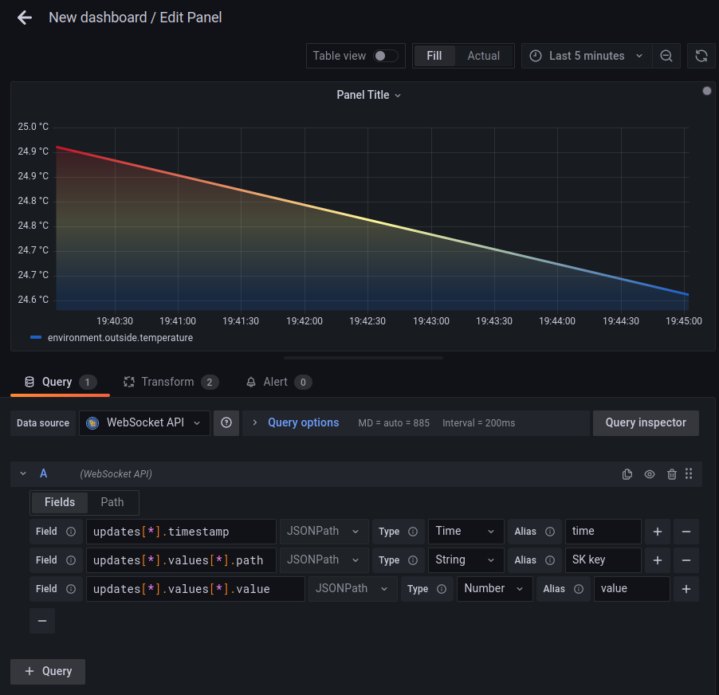
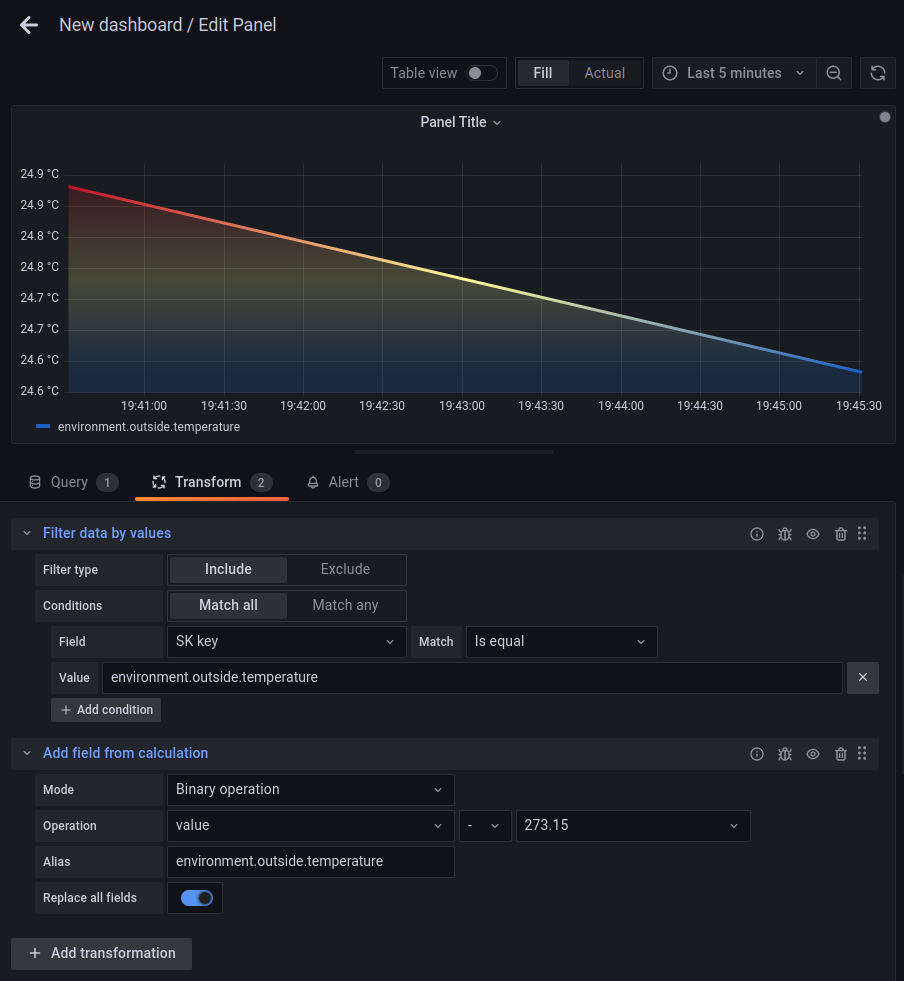
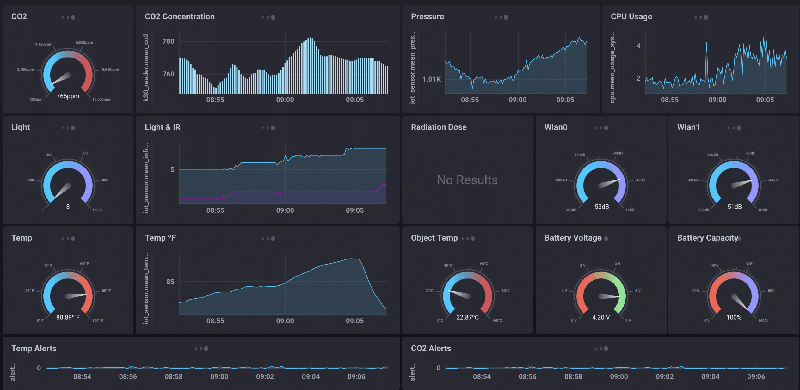

.. |mhelp| image:: ../img/help.png
.. |mSettings| image:: ../img/settings.png

|DB| Dashboards
###############

.. note::
	To run this app type this in a terminal:

	.. parsed-literal::

		openplotter-dashboards

|mhelp| ``Help`` opens an offline copy of this documentation in a browser and |mSettings| ``Settings`` opens the main app *OpenPlotter Settings*.

Instrument Panel
################

.. image:: img/instrumentpanel.png

SailGauge
#########

Kip
###

Node-Red Dashboard
##################

.. image:: img/nodered_dashboard.png

Grafana
#######

.. image:: img/grafana.png

Grafana is one of the most powerful platforms to manage and visualize data. After installation, select *Grafana* in the dashboard list and click |DBshow| ``Open``:

The browser will open and show us the page *http://localhost:3001*. You can also connect to this page from any device connected to the same network as OpenPlotter using the address *http://openplotter.local:3001*.

Use *admin* for both *username* and *Password*. On the next page we will be asked to change and verify a new password.

There are many ways to manage and display data in OpenPlotter using Grafana, but in this short tutorial we will focus on how to display data from the Signal K server in real time. We want to catch the delta messages that the server sends over the websocket connection, so we will use the *WebSocket API* plugin that is pre-installed in OpenPlotter.

Go To :menuselection:`Configuration --> Data sources` and click ``Add data source``. Select *WebSocket API* at the end of the list and write *ws://localhost:3000/signalk/v1/stream?subscribe=all* in ``Host``:

.. image:: img/grafana1.png

After saving, Grafana will be ready to receive all delta messages for all existing Signal K keys and values. Now we need to filter a Signal K key to be displayed on a dashboard, for this example we will use *environment.outside.temperature*.

Go To :menuselection:`Create --> Dashboard` and click ``Add a new panel``. In the ``Query`` tab, select *WebSocket API* as the ``Data Source`` and add 3 ``Fields`` by filling in the ``Field``, ``Type`` and ``Alias`` fields using the data from the image below:

Finally go to ``Transform`` tab and add the ``Filter data by values`` transformation using the settings of the image below:

Signal K uses the Kelvin unit for temperature, so if we want to convert the data to Celsius, we can add another trasformation ``Add field from calculation`` using the settings in the image above.

InfluxDB OSS 2.x
################

