.. |DBshow| image:: img/show.png
.. |DBedit| image:: img/edit.png
.. |DBadd| image:: img/add.png

InfluxDB OSS 2.x
################

.. image:: img/influxdb1.png

.. note::
	InfluxDB OSS 2.x is only available for 64 bit systems.

InfluxDB is a powerful time series database system that can be used to store data and track its' evolution over time. After installation, select *InfluxDB OSS 2.x* in the dashboard list and click |DBshow| ``Open``:

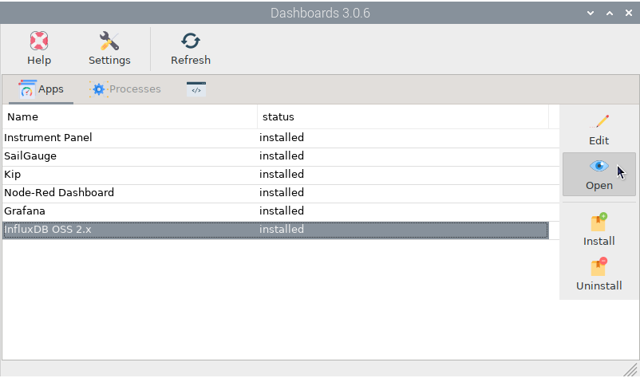

The browser will open and show us the page *http://localhost:8086*. You can also connect to this page from any device connected to the same network as OpenPlotter using the address *http://openplotter.local:8086*.

Fill in all the required fields using data that you can easily remember later. A *Bucket* is what we normally know as a database:

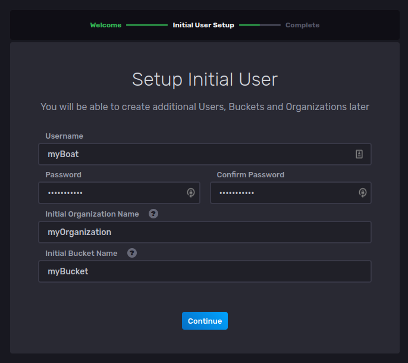

On the next page there are several options to learn the basics of InfluxDB but you can ignore them because here we are going to guide you step by step to store and display data for the Signal K key *environment.outside.temperature*. Click ``Configure Later``.

The amount of space used by InfluxDB will depend significantly on the volume of data you wish to store, and the amount of data you wish to retain. It is important to control the size of your databases so you do not consume all of your valuable storage space. In InfluxDB this is done by configuring *data retention* on each bucket. The retention policy of the bucket we created during the initial setup is set to *Forever* by default, so we will create a new one. Go to :menuselection:`Data --> Buckets` and click ``Create Bucket``:

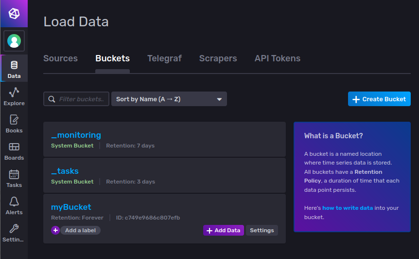

We will call it *myBucket24h* to signify its retention policy, and we will configure *Older Than 24 hours* in ``Delete Data``:

.. image:: img/influxdb22.png

Now we need to create a token so that we are allowed to write data to our buckets from external applications. Go to :menuselection:`Data --> API Tokens` and select *Read/Write API Token* in ``Generate API Token``:

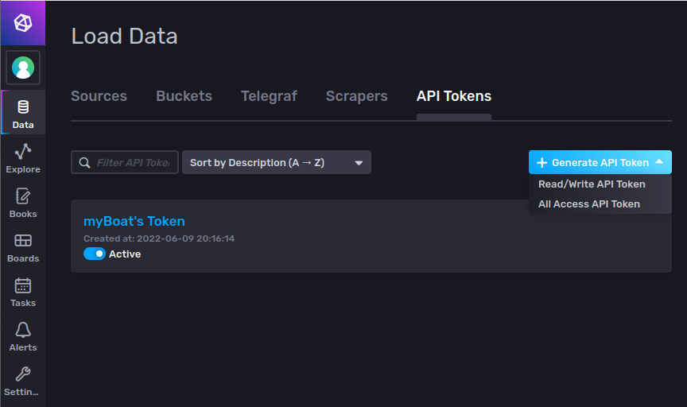

Write a description for your token and select *All Buckets* in both ``Read`` and ``Write`` options. This way we will use the same token for all current and future buckets:

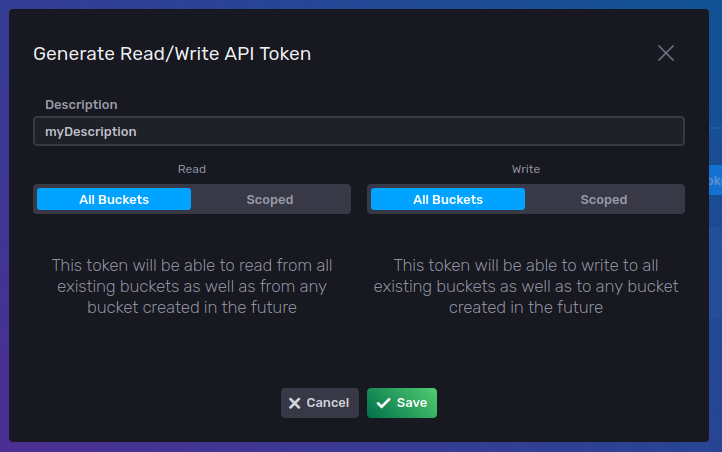

After saving, open your new token and click ``Copy to Clipboard``:

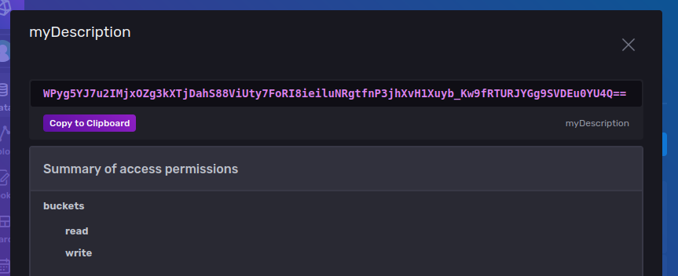

The most complex part of using InfluxDB is sending data to databases using an external application called *Telegraf* but the good news is that OpenPlotter will do the hard work for you. Go back to the *OpenPlotter Dashboards* app, select *InfluxDB OSS 2.x* and this time click |DBedit| ``Edit``:

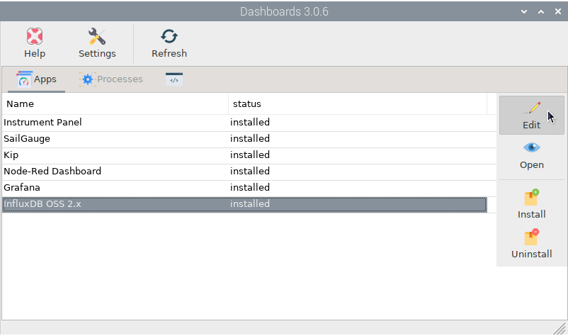

Fill in ``Organization``, ``Bucket`` and ``Token`` with the data that we have used in the previous steps. Be conservative with the ``Ìnterval``, you do not need to store the air temperature every second because you are only interested in its evolution over time, so 10 minutes will be enough. Note that you can not only monitor your ship's data, but also the data of any ships you have data for, such as ships detected by AIS. For this example we will add *self.environment.outside.temperature* in ``Signal K key`` field. Click |DBadd| to add a new item in the list: 

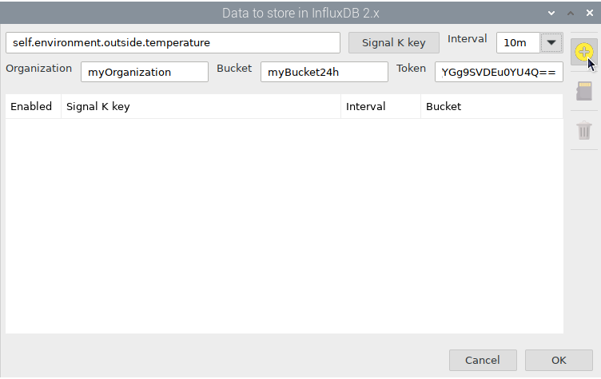

When you have added all the items you want to monitor, click ``OK`` to save and your databases will begin storing data as it becomes available:

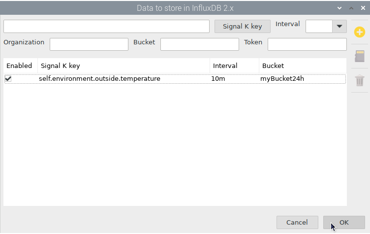

InfluxDB also contains tools for creating dashboards and these tools use *Flux*, an scripting language designed for querying, analyzing, and acting on data. Do not worry, you do not have to learn Flux to create dashboards, just learn how to use these tools and how to make small changes in Flux scripts.

Go back to the InfluxDB web administrator and click ``Explore``. Select *myBucket24h* in ``FROM`` column and filter by *_measurement: self.environment.outside.temperature* and *_field: value* adding 2 extra ``Filter`` columns. Click ``Submit`` to create a *Graph* cell using this query:

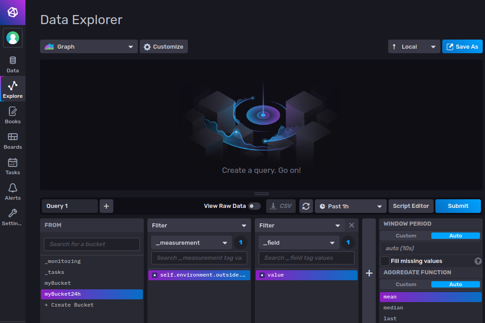

As you can see on the y-axis, Signal K uses Kelvin unit for temperature. If we want to convert the data to Celsius we have to make some changes in the Flux script that this *Query Builder* has created. Click ``Script Editor``:

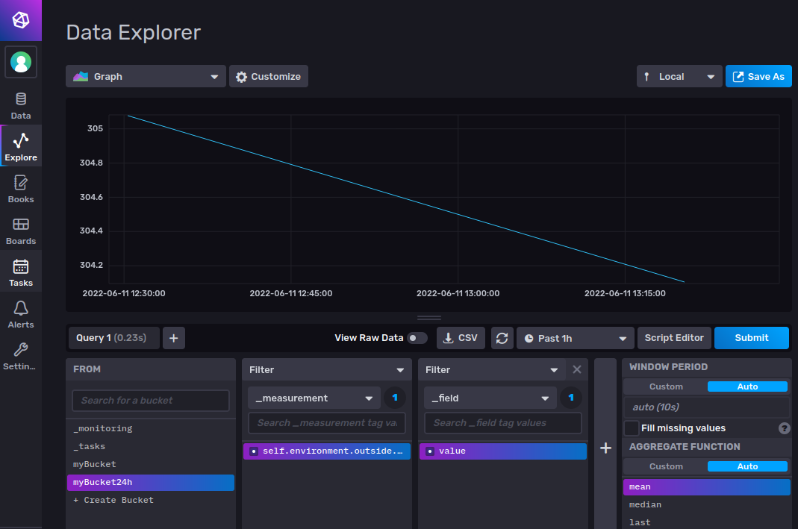

Replace these lines:

.. parsed-literal::

	aggregateWindow(every: v.windowPeriod, fn: mean, createEmpty: false)
	yield(name: "mean")

By this one:

.. parsed-literal::

	map(fn: (r) => ({ r with _value: r._value - 272.15 }))

.. note::
	To convert the data to other units you just have to apply the formula to this line. For example, to convert from Kelvin to Fahrenheit we have to apply the formula 1.8*(K-273)+32:

	.. parsed-literal::

		map(fn: (r) => ({ r with _value: 1.8*(r._value-273)+32 }))

Your final script will look like this:

.. parsed-literal::

	from(bucket: "myBucket24h")
	  |> range(start: v.timeRangeStart, stop: v.timeRangeStop)
	  |> filter(fn: (r) => r["_measurement"] == "self.environment.outside.temperature")
	  |> filter(fn: (r) => r["_field"] == "value")
	  |> map(fn: (r) => ({ r with _value: r._value - 272.15 }))

After clicking ``Submit`` you will see that the y-axis now shows the data in Celsius:

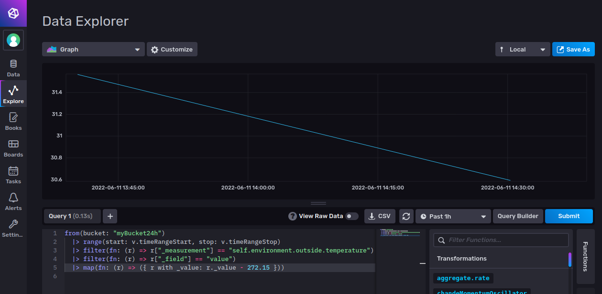

Finally click ``Customize`` to add some aesthetic settings like labels, ranges or suffixes:

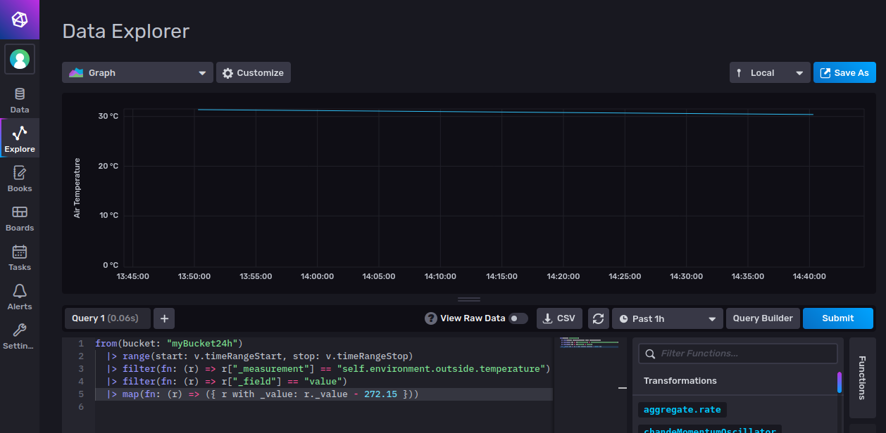

Once you are happy with your cell, click ``Save As`` and continue building your perfect dashboard by adding more cells.

InfluxDB in Grafana
===================

You may prefer to use Grafana to unify all your panels or cells with real-time and stored data. To access to the data stored in InfluDB buckets you have to create a new *Data Source* in Grafana. Go to :menuselection:`Configuration --> Data sources`, click ``Add data source``, select *InfluxDB* in the list and use the data from the image below, fill in ``Organization``, ``Bucket`` and ``Token`` with the data that you have used in the previous steps:

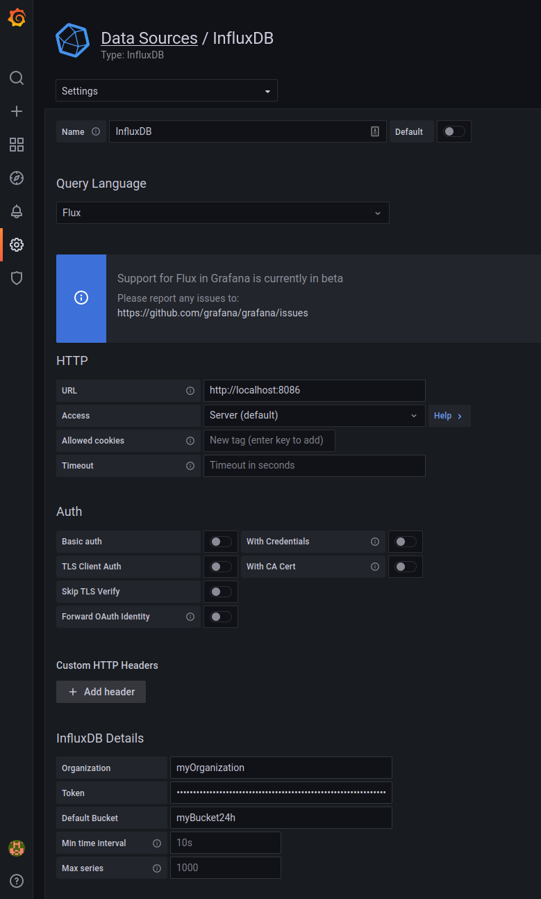

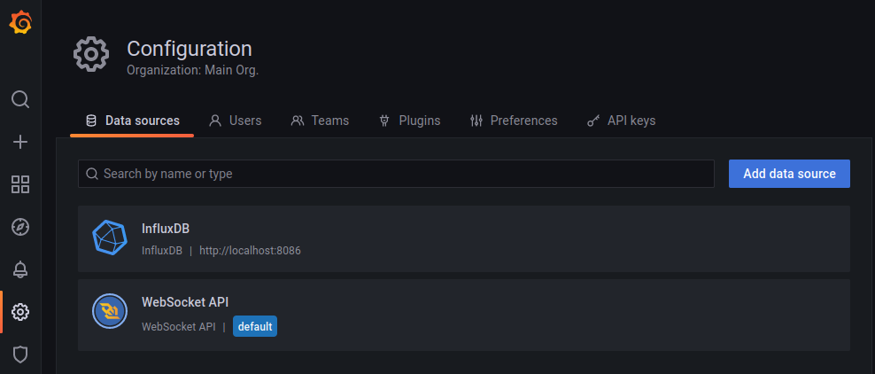

Create a new panel, select *InfluxDB* in ``Data source`` and paste here the same Flux script you have generated using the *Query Builder* in the InfluxDB web administrator:

.. parsed-literal::

	from(bucket: "myBucket24h")
	  |> range(start: v.timeRangeStart, stop: v.timeRangeStop)
	  |> filter(fn: (r) => r["_measurement"] == "self.environment.outside.temperature")
	  |> filter(fn: (r) => r["_field"] == "value")
	  |> map(fn: (r) => ({ r with _value: r._value - 272.15 }))

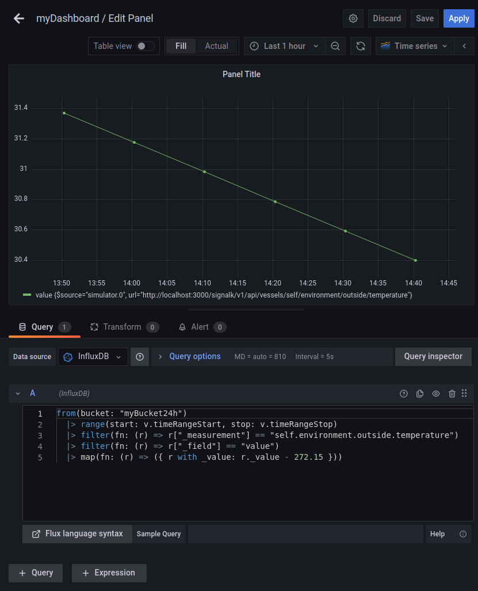

Finally modify the display settings of the panel to adapt it to your preferences and you are done.
