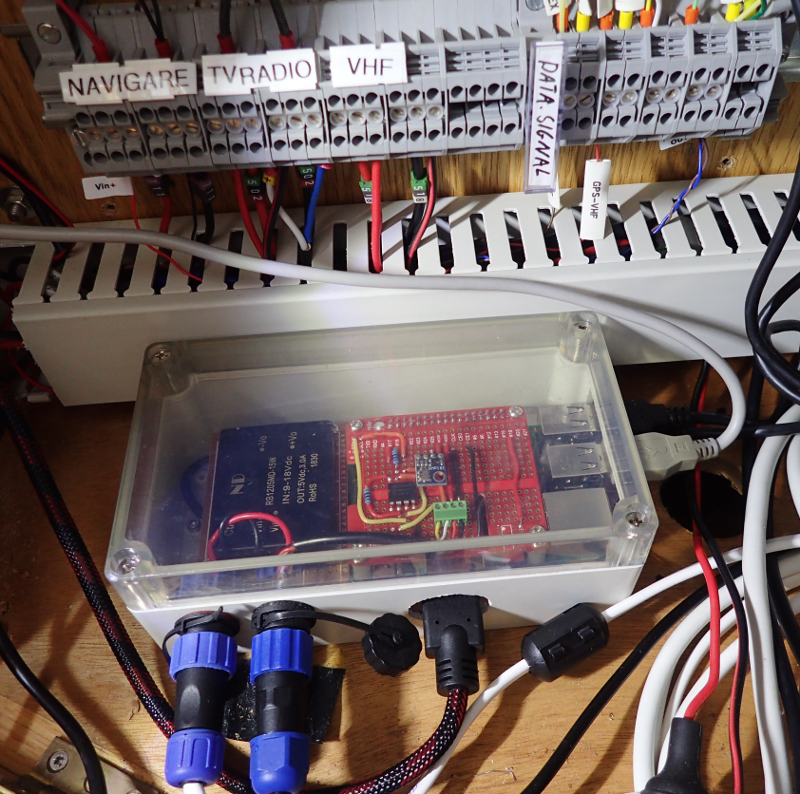
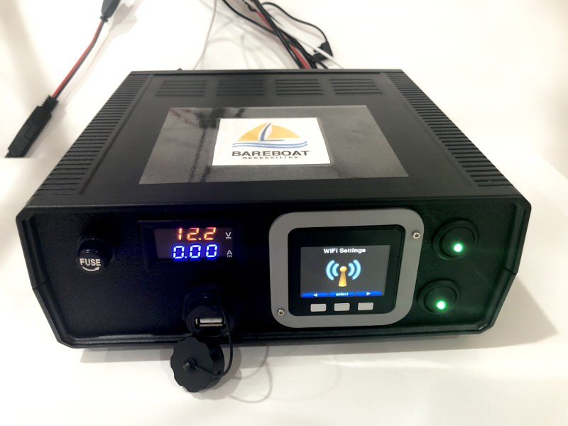
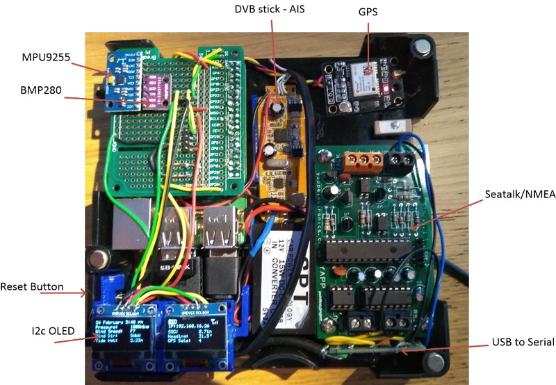
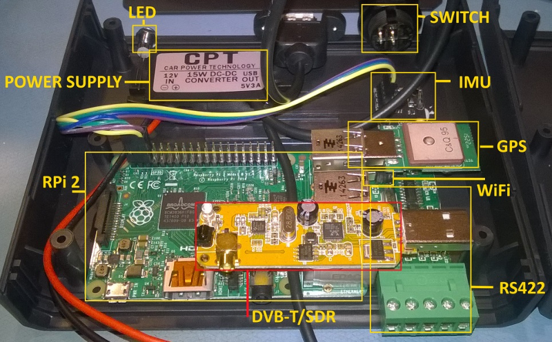
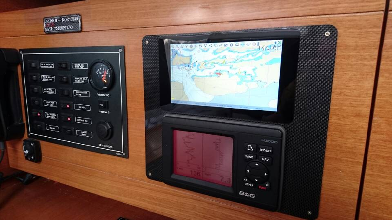

Examples
########

Please send us your projects involving OpenPlotter and we will add them to this Hall of Fame.

Yacht server on board
*********************

:Description: The yacht server data system is a Raspberry Pi based system, with main software OpenPlotter and OpenCPN. The design is based on an Internet of Things on Board (IoToB) approach with remote wireless sensors. Most of the server functions are done running OpenPlotter (which contain a SignalK server) and OpenCPN. The SignalK server accept SignalK messages (temperatures, levels etc) from the IoToB nodes around the yacht...

:More info: https://sites.google.com/site/olewsaa/yacht-server/server-on-board

Bareboat Necessities
********************

:Description: DYI project of building a marine computer, a boat LTE/WiFi gateway, and a cockpit chartplotter display from easily obtainable and affordable components...

:More info: https://bareboat-necessities.github.io/

UK OpenPlotter Build
********************

:Description: I have finally finished my first build of the my Openplotter computer, I say first build as I would like to build a custom PCB for the interfaces to the Pi, but I wanted to get everything together in one box and tested before I finalise my PCB design...

:More info: http://forum.openmarine.net/showthread.php?tid=2371

The Boat PC
***********

:Description: In late 2015 I was doing my usual head-scratching about what gifts to get various family members for the holiday season. My wife mentioned making something electronic for my father-in-laws boat, and after a few hours of collecting thoughts came up with an idea...

:More info: http://labs.domipheus.com/blog/the-boat-pc-a-marine-based-raspberry-pi-project/

*Uredd II* installation
***********************

:Description: *Uredd* is the boats name, it is Norwegian and translates to *Brave*...

:More info: http://forum.openmarine.net/showthread.php?tid=99