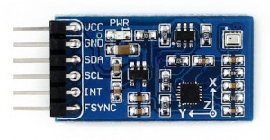
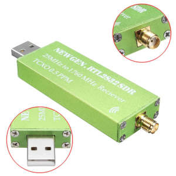

What do you need?
#################

Basics
******

To be added (basic Raspberry stuff)

Extra hardware
**************

IMU
===

An inertial measurement unit (IMU) is an electronic device that measures and reports a body's specific force, angular rate, and the orientation of the body, using a combination of accelerometers, gyroscopes, and magnetometers. IMUs in boats are typically used to get Magnetic Heading, Heel and Trim.

:Wiring:
:Configuring: :ref:`Pypilot compass calibration<calibration>`.

**Recommended**

- InvenSense MPU-9250 single chip.
- InvenSense MPU-9255 single chip.

:Providers: `Pypilot <https://pypilot.org/store/index.php?rt=product/product&path=73&product_id=129>`_ - `Waveshare <https://www.waveshare.com/10-dof-imu-sensor-c.htm>`_. 

- ICM-20948 single chip (coming soon).
- ISM330DHCX + LIS3MDL (coming soon).

**Also supported** 

- InvenSense MPU-9150 single chip.
- InvenSense MPU-6050 plus HMC5883 magnetometer on MPU-6050's aux bus (handled by the MPU-9150 driver).
- InvenSense MPU-6050 gyros + acclerometers. Treated as MPU-9150 without magnetometers.
- STM LSM9DS0 single chip.
- STM LSM9DS1 single chip.
- L3GD20H + LSM303D (optionally with the LPS25H) as used on the Pololu AltIMU-10 v4.
- STM LSM6DS33 + LIS3MDL (optionally with the LPS25H) as used on the Pololu MinIMU-9 v5 and AltIMU-10 v5.
- L3GD20 + LSM303DLHC as used on the Adafruit 9-dof (older version with GD20 gyro).
- L3GD20H + LSM303DLHC (optionally with BMP180) as used on the new Adafruit 10-dof.
- Bosch BMX055 (although magnetometer support is experimental currently).
- Bosch BNO055 IMU with onchip fusion. Note: will not work reliably with Raspberry Pi due to clock-stretching issues.

SDR
===

Software-defined radio (SDR) is a radio communication system where components that have been traditionally implemented in hardware (e.g. mixers, filters, amplifiers, modulators/demodulators, detectors, etc.) are instead implemented by means of software on a personal computer or embedded system. SDRs in boats are typically used to get AIS or weather forecasts.

:Configuring: :ref:`SDR-VHF<sdrVhf>`.

**Recommended**

- R820T/R820T2

:Providers: `OpenMarine <https://shop.openmarine.net/home/12-rtl-sdr-receiver.html>`_ - `rtl-sdr.com <https://www.rtl-sdr.com/buy-rtl-sdr-dvb-t-dongles/>`_.
