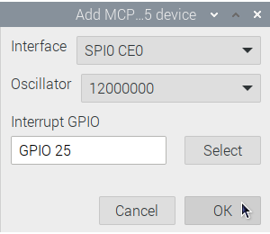
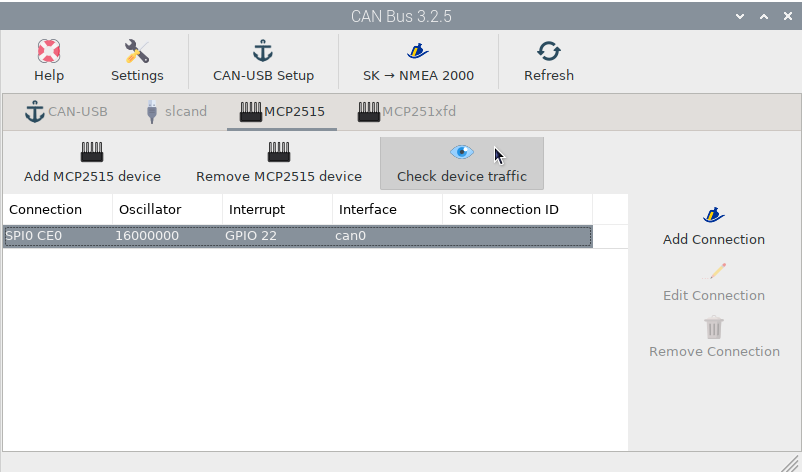
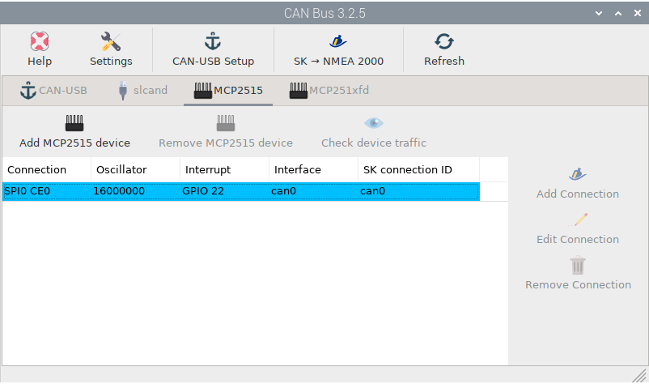

# Input data by MCP2515/MCP251xfd

There are some [HATs for Raspberry Pi](https://macarthur-hat-documentation.readthedocs.io/en/latest/index.html) available with the MCP2515 chip (and its successor MCP251xfd) on board that you can easily configure in OpenPlotter. After mounting the HAT click on  ``Add MCP251xxx device`` in  ``MCP2515`` or ``MCP251xfd`` tabs:

- ***Interface***: Select `SPI0 CE0` if your HAT connects to GPIO 8 (pin 24) and select `SPI0 CE1` if your HAT connects to GPIO 7 (pin 26).
- ***Oscillator***: The oscillator can be found by looking at the crystal chip on the HAT as per the pic below.
- ***Interrupt***: Select the GPIO your HAT connects for interruption. See the documentation for your device.

After entering the required data the system needs to reboot to apply the changes:

After a reboot you should receive data on your device. Select the item from the list and click   ``Check device traffic`` to confirm data entry:

Now we need to get this data to the Signal K server. Select the item from the list and click  ``Add Connection``. The Signal K server will restart and you are done:

Go to the Signal K server administration interface using your web browser, to confirm that the connection has been made:

Check OpenCPN to make sure there is a [connection to the Signal K server](../opencpn/skconnection.md) and you are getting data from your NMEA 2000 network.