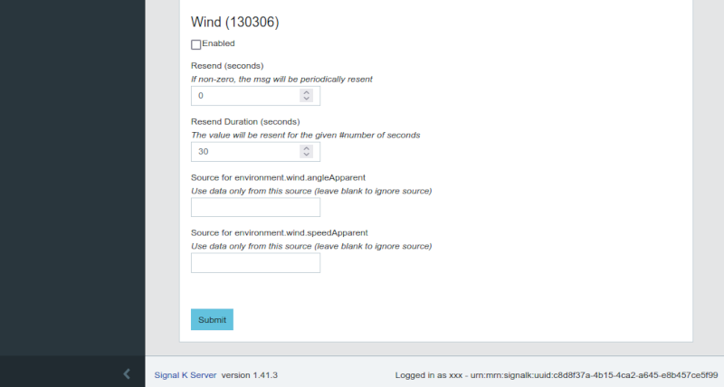

# Output data

You may have some sensors connected to OpenPlotter that receive data in Signal K format, or you may have data from NMEA 0183 or Seatalk1 converters that have also been translated to Signal K format. In these cases, you probably want to convert this data to NMEA 2000 and send it to your CAN Bus using the same device you use to send NMEA 2000 data to OpenPlotter.

## Unblocking transmission

To protect your network, the *Actisense NGT-1* and the *OpenMarine CAN USB Stick* (discontinued) devices have most PGNs blocked for transmission. On *slcand* and *MCP2515* devices, PGNs transmission is not blocked, so you can skip this chapter and go to the next one.

To unblock the PGNs you want to send to your NMEA 2000 network, go to  ``CAN USB`` tab, select the device from the list and click  ``Open device TX PGNs``:

Enable the PGNs you want to unblock and click ``Apply``:

!!! note
	If you see this message: *The list of enabled PGNs is empty, you may need to try a different baudrate or reset your device to 115200 bauds*, click on  `CAN-USB Setup` to fix your device baud rate.

Click ``OK`` to write changes to the device:

## Signal K to NMEA 2000 data conversion

This is valid for all devices. You have to tell the Signal K server what PGNs you need to convert from Signal K format to NMEA 2000 format. To do this we use the Signal K plugin *Signal K to NMEA 2000*. Click  ``SK → NMEA 2000`` and you will be directed to the configuration page of this plugin:

Make sure the general setting *Enabled* is set to ``YES`` an enable Signal K to NMEA 2000 conversion for all desired PGNs:

Click ``Submit`` at the bottom of the page and you are done:

!!! important
	You do not need to do anything else to start sending data through your device. If you have previously set your device to input data, it will start sending this converted data automatically.