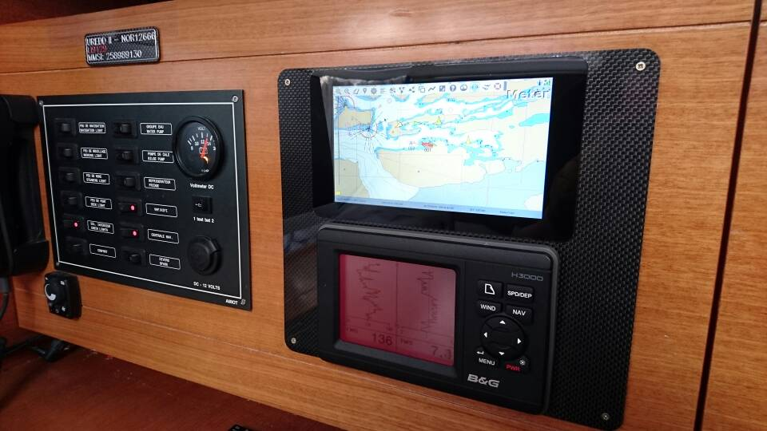
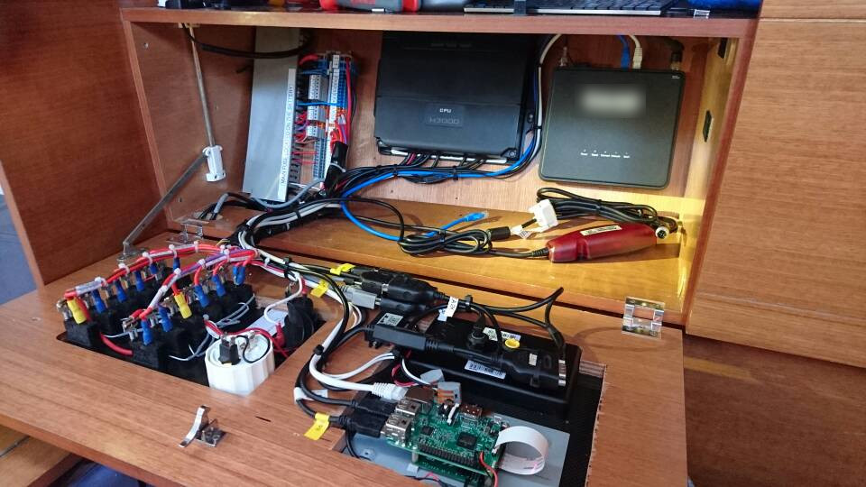

# What is OpenPlotter?

There are people who buy boats but there are also people who build them, why not build your own electronics too? OpenPlotter is a combination of software and hardware to be used as navigational aid on small and medium boats. It is also a complete on-board home automation system. It is open-source, low-cost, low-consumption and it works on ARM computers like the Raspberry Pi or any computer running a Linux Debian derivative. Its design is modular, so you just have to implement what your boat needs. Do it yourself.

## Releases

* **OpenPlotter 4**
	* Code Name: [ShipToGaza](https://shiptogaza.se/)
	* Docs: [https://openplotter.readthedocs.io/4.x.x](https://openplotter.readthedocs.io/4.x.x/)

* **OpenPlotter 3**
	* Code Name: [STOPmaremortum](https://stopmaremortum.org/)
	* Docs: [https://openplotter.readthedocs.io/3.x.x](https://openplotter.readthedocs.io/3.x.x/)

* **OpenPlotter 2**
	* Code Name: [OpenArms](https://www.openarms.es/en)
	* Docs: [https://openplotter.readthedocs.io/2.x.x](https://openplotter.readthedocs.io/2.x.x/)

## Licenses

The code of all OpenPlotter apps is licensed under the [GNU General Public License v3.0](https://www.gnu.org/licenses/gpl-3.0.en.html)

This documentation is licensed under a [Creative Commons Attribution-ShareAlike 4.0 International License](https://creativecommons.org/licenses/by-sa/4.0/)

Icons used in OpenPlotter apps and documentation are from [flaticon.com](https://www.flaticon.com/)

## About us

You will see everywhere the nickname Sailoog. That is me, a guy from Barcelona, Catalonia, who started OpenPlotter as an exercise to learn Python in 2014. After a few years, OpenPlotter has become a very popular project and has helped me make many friends and a few enemies, so as long as this is still this fun, this project will last a long time ;)

My motivations are scientific and political, but OpenPlotter is free and that means that your motivations to use or collaborate with this project can be whatever you want, even the opposite of mine. OpenPlotter is not my main activity.

You will also see that I always use the plural when I speak about OpenPlotter. Although it seems that I am always that boring guy behind everything, many people collaborate on this project that always needs more hands and brains. I cannot mention all the people who have gone through this project because I would forget many of them, but I would like to make a special mention of e-sailing who contributed a lot of code.

OpenPlotter is made up of various pieces of great open source software developed by great teams like OpenCPN, Signal K, Pypilot … We just sew it up with a bit of Python to turn it into a time saving tool for advanced users and a perfect introduction for novice Linux users. Enjoy it!
