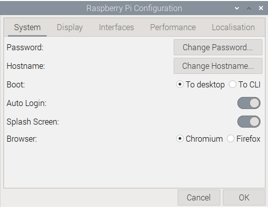
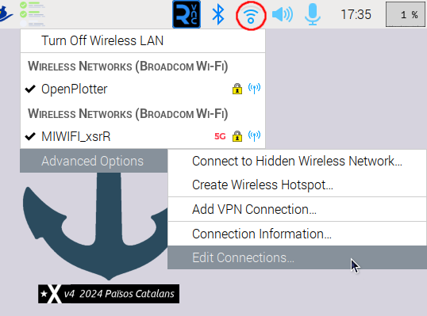
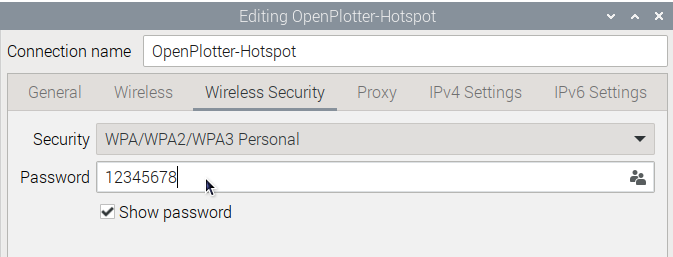

# First steps

Unless you are using the **OpenPlotter À la Carte** edition, after the first boot you should customize and localize your system by changing some important settings such as password or system language. You can do this in ```Main -> Preferences -> Raspberry Pi configuration```



!!! danger
	The default password for default user ***pi*** is ***raspberry***. You MUST change the password; otherwise, anyone can access your system easily.

!!! important
	All programs are pre-installed assuming the user is ***pi***, if you change this username OpenPlotter will not work correctly.

!!! note
	Go to the [Network](../network/network_app.md) chapter to learn how to connect OpenPlotter to the Internet and how network management has changed since the last version.

## Headless

If you are using the [**OpenPlotter Headless**](downloading.md#openplotter-headless) edition, you should see the SSID of the access point after a few seconds of turning the Raspberry Pi on. The Raspberry Pi's internal Wi-Fi device is configured in dual mode, this means that there is a preconfigured access point but it can also connect as a client.

These are the access data to connect remotely to OpenPlotter when you use this headless edition:

|                    |                                     |
|--------------------|-------------------------------------|
| **Access Point**   | SSID: openplotter<br>Password: 12345678|
| **IP**             | IP: 10.42.0.1<br>Address: openplotter.local|
| **SSH**            | Command: ssh pi\@openplotter.local<br>Password: raspberry|
| **Remote desktop** | Address: openplotter.local<br>Port: 5900<br>User: pi<br>Password: raspberry|


!!! danger
	You MUST change the default password of the access point as shown in the following images. Otherwise, anyone can access your system easily.

	

	

	

!!! note
	Using **OpenPlotter À la Carte** edition you will be able to configure all these parameters and more by filling in a form before downloading your custom OpenPlotter.


## Backups

Once you are satisfied with your final setup, it is highly recommended to make a backup to replace the microSD card in case it gets damaged. This is especially recommended if we have installed a paid nautical chart because if we have to reinstall the system, we will surely lose the license.

Raspberry Pi OS incorporates an excellent application to make a backup of the entire SD card called *SD Card copier* that you can find in ```Main -> Accessories```


You will need to connect an external USB card reader with a new SD card the same size or larger than the internal one. In *Copy From Device* field you should select the internal card (something like */dev/mmcblk0*) and in *Copy To Device* field you should select the external card. The name of the external reader may vary, connect and disconnect the external reader several times to be sure which name appears and disappears.

!!! important
	DO NOT check the option *New Partition UUIDs*. Some programs require the original and the copy to be exactly the same in order to function properly.

## Rescue

OpenPlotter is highly configurable and some parameters may produce unexpected effects such as data loops, unstable or even unusable systems. We have added a rescue mode so you can prevent core processes from starting to give you time to modify settings and recover your system.

To enable the rescue mode you have to add this line to /boot/firmware/config.txt

```console
OPrescue=1
```

If your system becomes unusable because it will not boot or goes into a reboot loop, you can access that file by inserting the microSD card into your computer. If you are using OpenPlotter from an SSD, you must boot the system using the microSD card you used to install OpenPlotter on the SSD and once booted you will have access to the files on the SSD.

To disable rescue mode, just delete that line.

## Using OpenPlotter

OK now you are ready to start using OpenPlotter but you do not know where to start. Do not worry, this is normal because the customization options are endless and can be a little overwhelming at first, but you will see how everything is designed to always take you to the next step. When you do something wrong, the system will check itself at startup and inform you of what is wrong and the solution.

Before starting, we recommend that you read at least the  [Settings](../settings/settings_app.md) chapter so that you know which applications contain OpenPlotter and, above all, how to keep them up to date.

Afterwards, the first logical step to start sailing will be to connect your boat's GPS. This can be done in many ways depending on your installation, but they are all explained in the  [Serial](../serial/serial_app.md) chapter.

If you get stuck at any step, do not hesitate to consult and ask in [the forum](https://forum.openmarine.net/) because other users have surely been there before.
