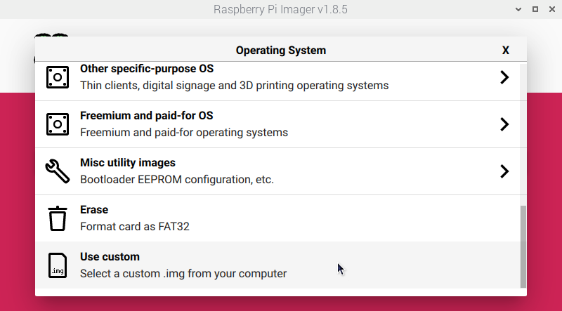
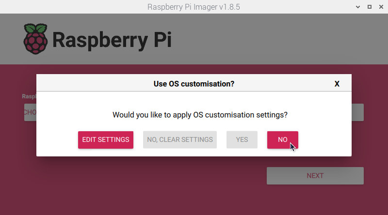
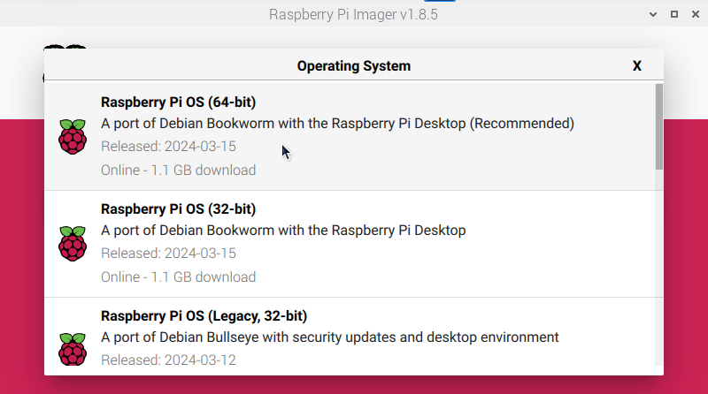

# Installing

## Raspberry Pi

You can choose to install OpenPlotter on a microSD card or solid state drive (SSD). The performance of SSD devices is considerably better.

For both methods you will need a **microSD card**, an **SD card reader device**, and the **Raspberry Pi Imager program** installed on the OS of your choice (Linux, macOS, or Windows).

The minimum microSD card storage size is 8GB, but 16GB or more is recommended.

Download and install the [Raspberry Pi Imager](https://www.raspberrypi.org/software/) program for your OS. 

### MicroSD card

- Download your preferred OpenPlotter edition from the [Raspberry Pi images](downloading.md#raspberry-pi-images) section in *Downloading* chapter.

- Put the microSD card into the SD card reader and run *Raspberry Pi Imager* in your computer.

- Click on ``CHOOSE OS`` and then on ``Use custom``:



- Select the file of the OpenPlotter edition you downloaded from us (you do not need to unzip it).

- Click on ``CHOOSE STORAGE`` and select your microSD card.

- Click on ``NEXT``.

- You will be asked if you want to apply custom OS settings and you must say ``NO``.



!!! important
	All programs are pre-installed assuming the user is ***pi***, if you change this username OpenPlotter will not work correctly.

- When the writing is finished and you are told you can do it, remove the microSD card from the reader, insert it into the Raspberry Pi and that is it.

### SSD

The easiest way to install OpenPlotter on an SSD is to first boot the Raspberry Pi with the official *Raspberry Pi OS* and download OpenPlotter there, then use the *Raspbery Pi Imager* program that is already installed in *Raspberry Pi OS* and directly burn OpenPlotter to the SSD.

- Put the microSD card into the SD card reader and run *Raspberry Pi Imager* in your computer.

- Click on ``CHOOSE OS`` and then on ``Raspberry Pi OS (64-bit)``:



- Click on ``CHOOSE STORAGE`` and select your **microSD card**.

- Click on ``NEXT``.

- You will be asked if you want to apply custom OS settings and you can do whatever you want; choose ``NO`` if you do not know what to do.

- When the writing is finished and you are told you can do it, remove the microSD card from the reader, insert it into the Raspberry Pi, and start *Raspberry Pi OS* for the first time. The SSD must be correctly mounted.

- Open a browser and download your preferred OpenPlotter edition from the [Raspberry Pi images](downloading.md#raspberry-pi-images) section in *Downloading* chapter.

- Go to ``Main -> Accessories -> Imager`` to run *Raspberry Pi Imager*.

- Click on ``CHOOSE OS`` and then on ``Use custom``:


- Select the file of the OpenPlotter edition you downloaded from us (you do not need to unzip it).

- Click on ``CHOOSE STORAGE`` and select your **SSD device**.

- Click on ``NEXT``.

- You will be asked if you want to apply custom OS settings and this time you must say ``NO``.


!!! important
	All programs are pre-installed assuming the user is ***pi***, if you change this username OpenPlotter will not work correctly.

- When the SSD writing is finished, power off the system, remove the SD card from the Raspberry Pi and boot the system.

- OpenPlotter will start from the SSD and that is it. Keep the microSD card in a safe place because it can be used to reinstall OpenPlotter or to boot the system if OpenPlotter becomes unstable. See [Rescue](first_steps.md#rescue) section.


## Desktop and laptop

!!! important
	Each new version of OpenPlotter should only be installed on the indicated system. **OpenPlotter v4 will work only on Debian 12 Bookworm, Ubuntu 22.04 Jammy or any of their derivatives**. If you try to force an installation of OpenPlotter v4 over OpenPlotter v3 (based on Debian 11 Bullseye), your system will become unstable.

First of all you have to install some dependencies. Open a terminal and type:


```console
sudo apt update
sudo apt install python3-wxgtk4.0 python3-ujson python3-pyudev vlc matchbox-keyboard wvkbd
```

Now you have to install the *OpenPlotter Settings* app from the .deb file you will found in [Desktop and laptop](downloading.md#desktop-and-laptop) section in *Downloading* chapter

After downloading the .deb file, you can install it by double click or typing this in a terminal replacing *x.x.x-stable* by your version:

```console
sudo dpkg -i openplotter-settings_x.x.x-stable.deb
```

And that's all. Open *OpenPlotter Settings* app typing this in a terminal:

```console
openplotter-settings
```

You have to install the rest of OpenPlotter apps from this app. Read the [Settings](../settings/settings_app.md) chapter to learn how.

Every time OpenPlotter needs to perform an action that requires administrator permission, it will ask for the password. To avoid having to continuously enter your administrator password you can add your user to the *sudoers* list. Do this only if you know what you are doing:

```console
sudo visudo
```

Add this line to the end of the document replacing *myuser* by your user name and save:

```console
myuser ALL=(ALL) NOPASSWD: ALL
```