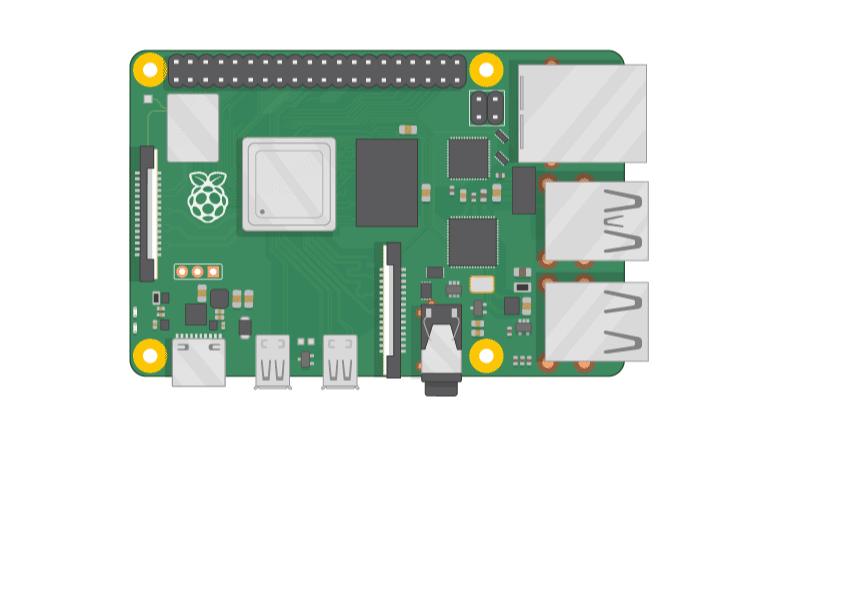
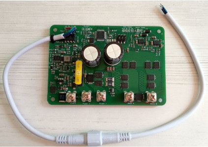

# What do you need?

!!! note "Raspberry Pi or desktop/laptop computer?"

	OpenPlotter is optimized to be used on [Raspberry Pi](https://www.raspberrypi.com) computers, but you can also install OpenPlotter on any desktop or laptop computer running Linux Debian or any derivative like Ubuntu, Mint ... Some OpenPlotter apps that are used to manage some sensors connected via GPIO will not be available when installed on desktop and laptop computers. See a list [here](downloading.md#desktop-and-laptop).

In the [downloading](downloading.md) and [installing](installing.md) chapters you will learn how to get the software, let's see here what hardware we need.

## Basic hardware

If you want to take full advantage of all the capabilities of OpenPlotter, your choice should be to install it on a Raspberry Pi.

Although a Raspberry Pi model 3 can run OpenPlotter, we only recommend the **Raspberry Pi model 5 and 4** in any of its RAM configurations or a Raspberry Pi 400 unit. Raspberry Pi Zero, 1 or 2 models are not suitable to run OpenPlotter.

You will also need a keyboard, a mouse, a power supply, a microSD card and a monitor. Read this helpful guide for details on each item: [https://projects.raspberrypi.org/en/projects/raspberry-pi-setting-up](https://projects.raspberrypi.org/en/projects/raspberry-pi-setting-up). You can ignore the chapter *Set up your SD card* because here we will teach you how to put OpenPlotter on the SD card or a solid state drive (SSD).

!!! note "SD card or SSD?"
	An SD card simplifies the system but the performance of an SSD is higher. You can try an SD card first and then improve your installation by replacing it with an SSD. With the appearance of the Raspberry Pi 5 it is now very easy to add an SSD and there is even an official device.

	- [shop.pimoroni.com/products/nvme-base](https://shop.pimoroni.com/products/nvme-base)
	- [raspberrypi.com/products/m2-hat-plus/](https://www.raspberrypi.com/products/m2-hat-plus/)

## Recommended hardware

This is the hardware that we have verified to work perfectly with OpenPlotter. We have been directly involved in the design or manufacture of some of these pieces of hardware.

### Monitors

OpenPlotter is designed to be used on monitors with a minimum resolution of 800x480 and 7” in size.

Any HDMI-connected monitor that can handle this resolution, or any higher, will work just fine, but brightness on monitors that are connected via the DSI display port can also be controlled via software.

!!! warning 
	We do not recommend touchscreens that require drivers because every time the Linux kernel is updated (almost every month), you will have to reinstall the driver and the manufacturer may stop distributing them over time.

The monitor that meets all these qualities is the [official monitor for Raspberry Pi](https://www.raspberrypi.com/products/raspberry-pi-touch-display) and its clones. We have a special edition of OpenPlotter for these touchscreens. These monitors typically have a brightness of 250/300 cd/㎡ and that means they need to be installed indoors. For outdoor installations, you need a sun-readable monitor with at least 1000 cd/㎡ and waterproof.

### MacArthur HAT

After a few years of developing software for OpenPlotter, we have identified exactly what we need in terms of hardware to achieve our goals and the result is the **MacArthur HAT** (Hardware Attached on Top), an add-on board for Raspberry Pi running OpenPlotter. With this HAT we want to get the fully open-source boat to free ourselves from dependence on big companies and make our boats more respectful with the environment.

Its main function is to be able to communicate with any old or new marine electronic device using the proprietary and closed protocols **Seatalk1**, **NMEA 0183** or **NMEA 2000** and the free and open protocol **Signal K**.

* More info: [MacArthur HAT documentation](https://macarthur-hat-documentation.readthedocs.io/en/latest/)

### AIS receivers/transponders

You can connect the AIS receiver/transponder you already have on the boat or you can choose from some open source solutions. We recommend the **dAISy HAT** (receiver) and the **MAIANA AIS transponder** (receiver/transponder).

* More info: [Connecting the dAISy HAT](../serial/connectingdAISy.md)

* More info: [MAIANA AIS transponder](../maiana/maiana_app.md)

### Autopilot

Pypilot is an open source autopilot for your boat and is fully integrated into OpenPlotter.

* More info: [Pypilot](../pypilot/pypilot_app.md)

### IMU

Adding an Inertial Measurement Unit (IMU) you can get heading, heel and trim data. OpenPlotter currently supports the following I2C-connected IMU models:

- **ICM-20948 (recommended)**
- **MPU-9250**
- **MPU-9255**
<!-- -->
- More info: [Configure an IMU with OpenPlotter Pypilot app](../pypilot/imu.md)

- More info: [Calibrating the compass](../pypilot/calibration.md)
