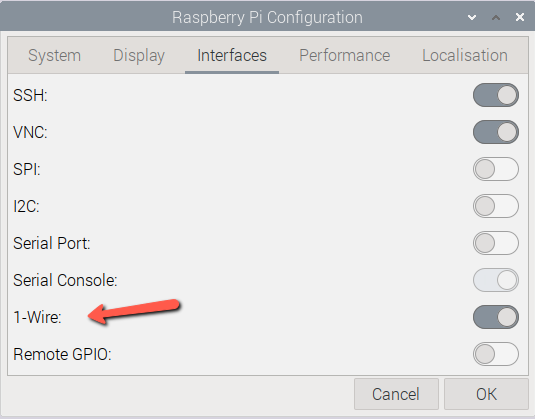
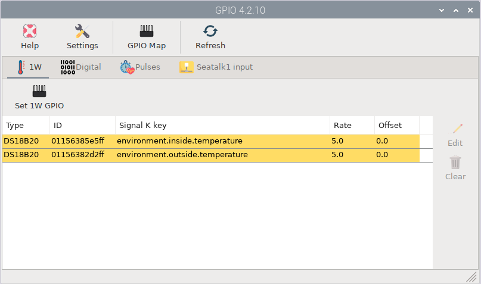
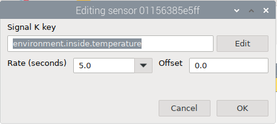
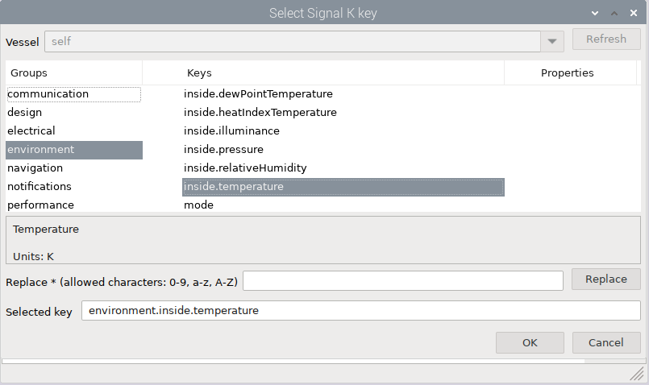
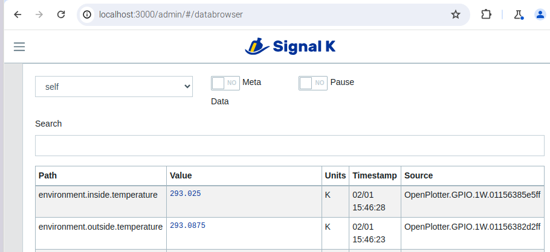

# GPIO
Before starting, make sure to enable the *1-Wire* interface on the Raspberri PI Configuration app.

To start using GPIO sensors like 1W 18B20 temperature sensors, you will need to install the OpenPlotter GPIO app.  OpenPlotter apps are installed from the OpenPlotter -> Settings application.  Click *Refresh* to verify the installed Apps.  By default GPIO is not installed so select it and click *Install*.  After installation, you will now see the GPIO app in the OpenPlotter menu.

When you open the GPIO app, you will now see your 1-Wire sensors listed.  You will need to edit them to add the correct Signal-K key name.  The names have a specific format and the *Edit* button will assist you with creating the correct key name.  

It is important to use a valid key name so that Signal K will utilize the correct unit of measure.

After you have added a Signal K key, you should see your sensor listed in the Signal K *Data Browser*.

