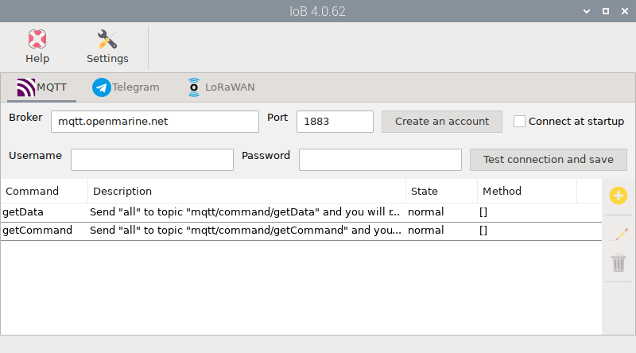

# Internet Of Boats

Install this app from the  *Settings* app and open it by clicking  `IoB` under `Main -> OpenPlotter` or typing this in a terminal:

```console
openplotter-iob
```



 ``Help`` opens an offline copy of this documentation in a browser and  ``Settings`` opens the main app.

Unfortunately we cannot always be close to our boats and being able to receive and send information to them can be crucial for their safety. Below are some situations where communicating with your boat might be helpful:

- Receive live weather information and assess whether your boat is ready for it.
- Check for water in the bilge and activate the pump remotely.
- Are the batteries charged?
- How are the water and fuel tanks?
- Is it connected to shore power?
- A door or window has been opened!
- Is the beer cold yet?
- ...

There are many commercial solutions for this today, but they are not cheap equipment and you will also have to pay for an Internet connection, intermediate servers or a monthly fee for the service. Furthermore, since most of them are closed and proprietary systems, we never know what data is sent or what is done with it.

OpenMarine offers you a free and open infrastructure 24/7 having control of the entire process and using very inexpensive equipment. You will only need an internet connection from the marina's WiFi or mobile devices and in the case of LoRaWAN you do not even need internet.

This infrastructure is funded and maintained by OpenMarine with profits from the store and donations. To keep power consumption and costs to a minimum, it is designed as an on-demand information exchange and is not designed to support data stream. Every time you want information, you must ask your boat for it. Your boat will also alert you on its own when certain predefined alarms are triggered.

This way, thousands of users will be able to use the service for free, but it would be easily scalable to support more users or data stream if demand grew too much. In the following chapters we explain how to use the tools included in OpenPlotter to communicate with your boat remotely using OpenMarine's **Internet Of Boats** infrastructure:  

-  **MQTT**. Using this popular communication protocol, you can exchange data with your boat from any of the many mobile and desktop applications that support it.
<br><br>

-  **Telegram**. With this tool you can create your own Telegram bot to chat with your boat without any programming knowledge. If you have a Telegram group for your crew, you can also add the bot so everyone can chat with it.
<br><br>

-  **LoRaWAN**. The previous two options require your boat to be connected to internet, but this option does not. It uses the same network that IoT devices use and is extremely cost effective. Sending a message using the global Helium network costs $0.00000036 and has wide [coverage](https://world.helium.com/en/iot/coverage) but you can also build your own LoRaWAN hotspot and send data for free. Thanks to this technology, data can be sent even when sailing far from the coast. In open fields or over water, LoRaWAN devices have achieved ranges of 30 km (18.6 miles) or more.