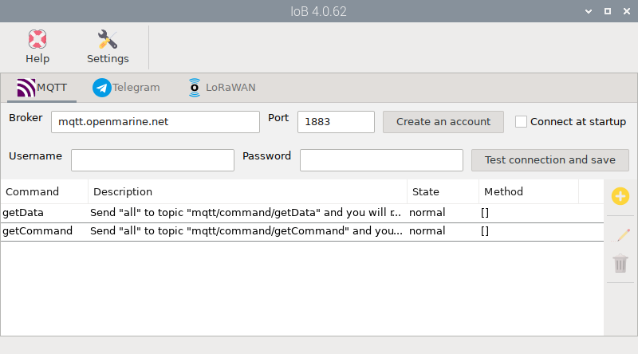
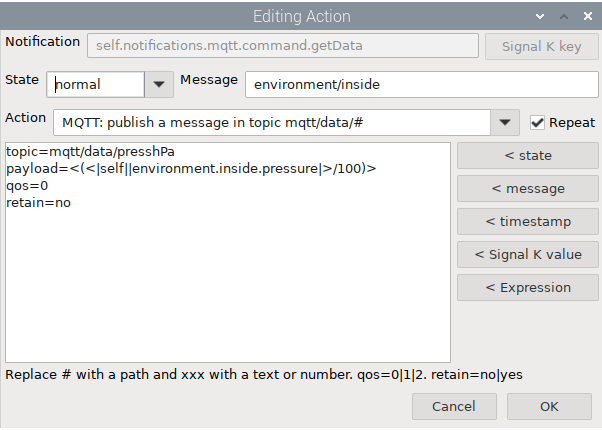

# MQTT

Before using MQTT in OpenMarine you need to know the basics of MQTT but do not worry if you find it a bit complex because we will explain step by step what you have to do.

Basically in an MQTT system several clients connect to a central server or broker and send messages to topics (publish) or receive messages from topics they are interested in (subscribe).

Topics are hierarchical strings (e.g., "home/livingroom/temperature"). You can use wildcards to subscribe to multiple topics:

- Single-level wildcard (+): Matches one topic level.
- Multi-level wildcard (#): Matches multiple topic levels.

When you publish a message to a topic, you can select the Quality of Service (QoS):

- QoS 0: At most once delivery (may lose messages)
- QoS 1: At least once delivery (confirms receipt, may duplicate)
- QoS 2: Exactly once delivery (ensures single delivery)

You can also define whether the last message (payload) published in a topic should be retained by the broker so that clients subscribed to that topic receive it as soon as they connect.

In the OpenMarine ecosystem, the clients are the OpenPlotter installation on your boat and the MQTT apps or programs installed on your mobile phone or home computer. The broker is our free 24/7 server. To send and receive data from your boat safely, we have organized the topics you can subscribe to and publish to, and the permissions for each of them.

The most important thing to remember is that OpenPlotter will execute commands that clients publish to the ***mqtt/command/+*** topic and publish the requested data to the ***mqtt/data/#*** topic for clients to receive.

The ***mqtt/command/+*** topic can only have one level (e.g., "mqtt/command/getData") but the ***mqtt/data/#*** topic can have nultiples levels (e.g., "mqtt/data/environment/inside/temperature").

The ***mqtt/command/+*** topic can only handle messages with QoS=0 and they cannot be retained, but the ***mqtt/data/#*** topic can handle any QoS and retain messages.

There are some predefined commands, but you can add your own commands and the actions they should trigger and even add more actions to the predefined commands. Let's see how all this is done step by step.

## Getting started

Open the  *IoB* app and select the  `MQTT` tab.



First, you will need a user account to connect to the OpenMarine broker. To do this, we will use the OpenMarine store user manager. If you have ever purchased something, you will already have a user account, and if not, you can create one by clicking `Create an account` or using this link: [shop.openmarine.net](https://shop.openmarine.net/login?create_account=1)


!!! note
	We are not particularly interested in this data, so if you never plan to buy anything from OpenMarine, you can lie about everything, including your email address. Just remember the email address and password you used.

Enter your new credentials, check `Connect at startup`, click `Test Connection and Save` and OpenPlotter will be ready to receive commands and send data:


### Setting up a client

Now we need to set a client to be able to communicate with OpenPlotter through MQTT and for this we will use the app  **IoT MQTT Panel** for [Android](https://play.google.com/store/apps/details?id=snr.lab.iotmqttpanel.prod) and [iPhone](https://apps.apple.com/pl/app/iot-mqtt-panel/id6466780124).

This application allows sharing dashboards between devices, so we have created a template containing all the examples included in this manual:


[Download it from here](img/IoTMQTTPanel.json) and open the app. Go to the `Connections` menu, select `Backup and Restore`, `Restore` and load the downloaded file:


Edit the connection `MyBoat` from the menu and add `mqtt.openmarine.net` in *Broker Web/IP address* field and your *Username* and *Password* in *Additional options*. Click `Save` and you should now be connected to the OpenMarine broker and ready to send commands and get data from your boat. Click on `Myboat` to access the dashboards:


## Commands

There are 2 predefined commands in OpenPlotter:

**getData:** Send *all* to topic *mqtt/command/getData* and you will receive a json message in topic *mqtt/data* with all the data for the boat at that moment. If you send a Signal K key instead of *all*, such as *environment/inside/temperature*, you will receive a message with only that data in topic *mqtt/data/environment/inside/temperature*:

```json
{
	"value":293.45,
	"$source": "OpenPlotter.I2C.BME680/688",
	"timestamp": "2025-01-31T18:55:24.124Z"
}
```
If you are only interested in the value of that Signal K key, send *environment/inside/temperature/value* and you will receive *293.45* in topic *mqtt/data/environment/inside/temperature/value*.


**getCommand:** Send *all* to topic *mqtt/command/getCommand* and you will receive the list of all defined commands in topic *mqtt/data/command*: 

```json
["getData","getCommand"]
```
If you send a command instead of *all*, such as *getData*, you will receive the description of that command in topic *mqtt/data/command*. This is especially useful when you have commands defined by yourself and you want to remember what they do.

Let's see the **getData** command in action. Go to the `Input data` panel and click on the `ALL DATA` button. In the bottom field, *My boat says:*, you will see a bunch of data in json format. That data is all the information about your boat that OpenPlotter just sent to you. Pretty cool, right?

To see how we created this button, go to the button menu (3 vertical dots) and click `EDIT PANEL`. As you can see we only had to publish `all` as *payload* in the `mqtt/command/getData` *topic*. Enter the *My boat says* field and you will also see that to see everything that OpenPlotter sends us we only have to subscribe that field to the `mqtt/data/#` *topic*.


Handling so much data can be complicated, so we are going to ask OpenPlotter for only some specific data. For the rest of the examples we have used an I2C temperature and pressure sensor that sends data to the Signal K keys *environment/inside/temperature* and *environment/inside/pressure*. It would be nice if you could do the same to follow the manual.

Click on the `INSIDE DATA` button and you will see that this time *My boat says*:

```json
{
  "pressure": {
    "meta": {
      "units": "Pa",
      "description": "Pressure in zone"
    },
    "value": 101967,
    "$source": "OpenPlotter.I2C.BME680/688",
    "timestamp": "2025-02-13T21:39:27.622Z"
  },
  "temperature": {
    "meta": {
      "units": "K",
      "description": "Temperature"
    },
    "value": 295.04999999999995,
    "$source": "OpenPlotter.I2C.BME680/688",
    "timestamp": "2025-02-13T21:39:27.622Z"
  }
}
```

This time the `INSIDE DATA` button publishes `environment/inside` as *payload* instead of `all` in the `mqtt/command/getData` *topic* and the client receives only this data:


Now we will see how to process this data and build nice panels, specifically Line Graphs to represent the evolution over time of temperature and pressure to be able to predict meteorological changes. To do this we need to extract the numerical values of each magnitude from the data in json format using jsonpath expressions. To extract the temperature value from the json data returned above we will use this jsonpath expression:

```json
$.temperature.value
```
jsonpath expressions must always start with **$** as it represents the root of the json data. Next, we will add all the items ordered hierarchically and separated by a period until we reach the item that contains the desired value.

Go to the *default units* panel settings to see how we have it set up. The panel is subscribed to the `mqtt/data/environment/inside` *topic* and we have enabled the `Payload is JSON Data` option and added the jsonpath expression for each magnitude we want to display in our chart:


In the next section we will see how to modify the predefined commands and create new ones. To finish this section, play with the `ALL COMMANDS` button and the `command` text field to see how the **getCommand** command works.

### Extra actions

So far we have created a nice panel with a graph that allows us to see the evolution of temperature and pressure. Since we are only interested in the relationship between these two magnitudes, this panel is already useful, but the data is in Kelvin and Pascal and we are used to Celsius and Hectopascal, so we need to modify these values before displaying them.

We will do this by adding some additional actions in OpenPlotter to also be executed when we request the value of *environment/inside*. You may have noticed that every time OpenPlotter receives a command via MQTT and publishes the requested data, it also generates notifications for these two events. In the image below you can see an example of this in the Signal K data browser:

[](img/commands0.png) 
*Click to enlarge*

This means we can catch these notifications and trigger custom  `Actions` using the  *Notifications* app. We have to create 3 actions:


All of them should catch the *Notification* `self.notifications.mqtt.command.getData` when its *State* is `normal` and the *Message* is `environment/inside`. In all of them you have to select the `MQTT: publish a message in topic mqtt/data/#` action and check `Repeat`.

MQTT publishing configurations are different for each action, but are built in the same way. A *topic* is entered for each and the *payload* value is built using a combination of the `< Signal K value` and the `< Expression` wildcards to convert temperature and pressure values to Celsius and Hectopascal. For the last action, the `< timestamp` wildcard is used to send the time of the measurement.





Finally, go back to the *IoT MQTT panel* app and verify that the *topics* that the *Temperature* and *Pressure* gauges and the *Timestamp* field are subscribed to are correct:


Click `GET INSIDE DATA` to check if everything is working properly. As you can see, this button is the same as the previous `INSIDE DATA` button, but now, thanks to the extra actions, we also receive custom data:


### Custom commands

Now we will see how to create our own commands. We will create a command to turn high or low a GPIO of our Raspberry Pi remotely using our mobile phone. Go to the  *IoB* app and click the  *MQTT* tab.

Create a new command `gpio6` and provide a description. Set `nominal` in *State* and uncheck `visual` and `sound`. This step is not strictly necessary, but it will help you remember what this command does and how it is used when you invoke it using the predefined getCommand command:


Next go to the  *GPIO* app, click the  `Digital` tab and create a GPIO output on GPIO6 by clicking  `Add output` button:


Once we have created the output in GPIO6, it will be available as an action in the  *Notifications* app, so the only thing left to do is to assign these new actions to our new MQTT command. Create 2 new actions (on/off) for the notification `self.notifications.mqtt.commands.gpio6` that generates our command. These actions will turn GPIO6 high and low and also create new notifications, so set *visual* to `yes` to also have a visual reference when testing your new command:


Finally, go back to the *IoT MQTT panel* app and check that everything is working correctly by clicking on `GPIO6 output`. Go into the panel settings and notice how we publish `on` and `off` in the `mqtt/commands/gpio6` topic to turn high and low the GPIO6 on the Raspberry Pi on our boat from home.


As an exercise, try creating new commands for the `REBOOT` and `SHUTDOWN` buttons. You will find two actions for this in the  *Notifications* app.

## Receive unrequested data

So far we have seen how to request data from OpenPlotter remotely and now we will see how to receive data without having to request it. Basically, this works by using the *MQTT: Publish a message to topic mqtt/data/#* action present in the  *Notifications* app and triggering this action using any of the supported methods, such as using the  *Signal K Zones* to set alarms on certain values.

But in this example we are going to use a GPIO input to receive the status of the pin on our remote client. You can use a momentary switch and connect it to *GPIO18* as shown in the image below:


Once the switch is wired, open the  *GPIO* app and in the  `Digital` tab, click on  `Add input`. In the next window, fill in the fields as shown in the images below:


Now open the  *Notifications* app and add 2 actions for the `self.notifications.GPIO18` notification and both states as shown in the images below. Pay attention to the *qos* and *retain* parameters. In this case, we want to make sure that the client receives the message (`qos=1`) and that the message is retained on the broker until the client connects (`retain=yes`).


You can now press the switch and you should receive the status on the client. Go to the `GPIO18 input` panel settings to check the topic you are subscribed to and the different payloads that trigger the statuses.


And that's it! Practice creating a new *Connection* in *IoT MQTT panel* and build your own dashboards.

## MQTT broker specifications


!!! important
	OpenMarine's MQTT broker has limitations in place to prevent attacks and abuse and to ensure that thousands of users can use the service without interruptions, delays or outages. If you make too many connections, send too many messages or send very large messages, the broker will block your messages and ultimately ban you indefinitely if this behavior is repeated. 

	These limitations are generous but be careful with your programmed actions because you may accidentally exceed them. Please contact us if you notice any unexpected behavior.

- **Address**: mqtt.openmarine.net

- **Port**: 1883

- **SSL**: No

- **Authentication**: username and password

- **Privacy**: only clients using the same user will be able to subscribe and publish to that user's topics

- **Allowed topics:**
	- ***mqtt/command/+***: publish and subscribe. QoS: 0. Retained messages: no
		- Examples of allowed
			- mqtt/command/x
			- mqtt/command/myCommand
		- Examples of not allowed
			- mqtt/command/myCommand/x
			- mqtt/x/command/myCommand
			- x/mqtt/command/myCommand
			- x/x/x

	- ***mqtt/data/#***: publish and subscribe. QoS: 0, 1 and 2. Retained messages: yes
		- Examples of allowed: 
			- mqtt/data/environment/inside/temperature
			- mqtt/data/x/x/x/x/...
		- Examples of not allowed: 
			- mqtt/x/data/environment/inside/temperature
			- x/mqtt/data/environment/inside/temperature
			- x/x/x

- **Max Packet Size**: 500 KB
- **Max Message Publishing Traffic**: 500 KB/second (Per Client)
- **Max Connection Rate**: 100/second (Global)
