# Configuring OpenPlotter

You can configure OpenPlotter to get AIS and GNSS data from a MAIANA transponder with just a few clicks. You will also learn how to enable transmission, configure the device, and update the firmware.

## Getting AIS and GNSS data

MAIANA is ready to rceive and send AIS and GNSS data out of the box, just power on the device and connect by USB or UART to OpenPlotter. We want to send MAIANA data to the Signal K server so that any program like OpenCPN can access AIS and GNSS data. We will do it easily using the  *Serial* app.

!!! note
	If connected via USB, skip the UART steps.

If you are connected by UART, first of all you need to enable the UART interface of your Raspberry Pi. Click  ``UART0`` and then click ``Yes``. Remember that enabling the UART0 interface will disable Bluetooth if you are in Raspberry Pi 3 or 4. You can use any of the UART interfaces that you have [available on your Raspberry Pi](../serial/serial_app.md#uart) by connecting to the appropriate pins.

Acknowledge the warning, and reboot the Raspberry Pi:

  
*Raspberry Pi model 3 and 4*

  
*Raspberry Pi model 5*

After enabling UART or just plugging in the USB and clicking  ``Refresh``, you will see a new device listed. Select this new device and provide a short name for the *alias* and select `NMEA 0183` under *data*. If it is connected by USB check *Remember device* and if it is connected by UART check *Remember port*. Click  ``Apply`` when done.

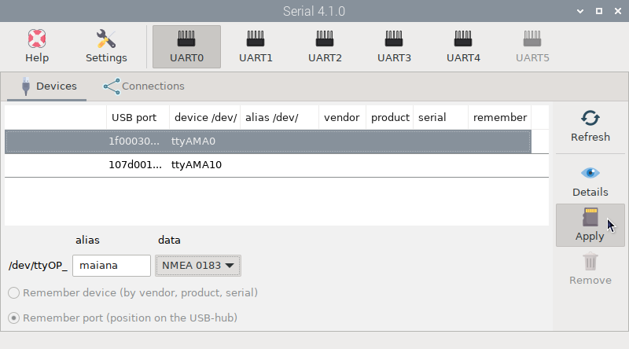

Go to the  *Connections* tab and select the new device you just created. Click  ``Add to Signal K`` and then click ``AUTO``. A connection will be created on the Signal K server for your device.

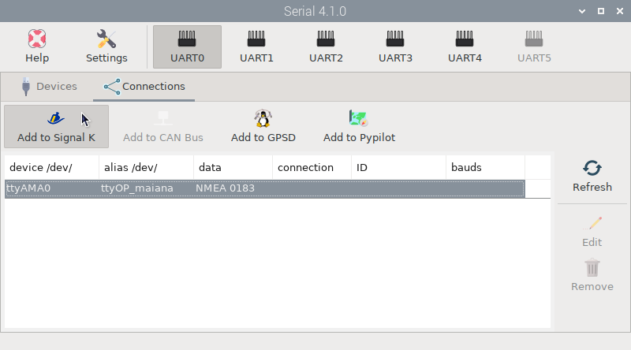

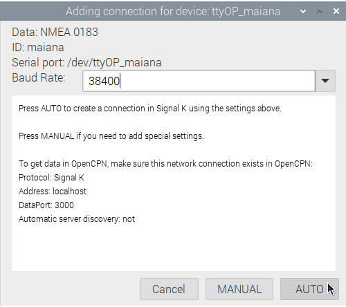

Make sure there is an OpenCPN enabled [connection to the Signal K server](../opencpn/skconnection.md) and your are done.

## Connecting to MAIANA

Using the  *MAIANA AIS transponder* app you can manage all the settings of your device. Open the  *Settings* app, select this app and click  `Install`.

Open the *MAIANA AIS transponder* app and select the connection we previously configured with the  *Serial* app by clicking on the ``MAIANA Signal K connection`` field:

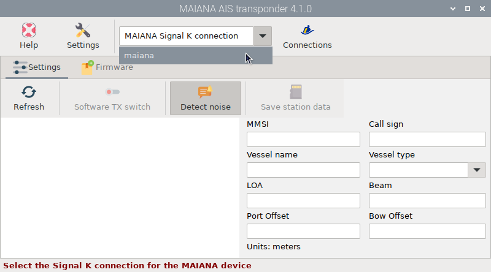

And that's it. All connections have been made and you will be able to communicate with MAIANA every time you open the  *MAIANA AIS transponder* app and the device is turned on. If you can not get a connection the first time, try again by clicking  ``Refresh``.

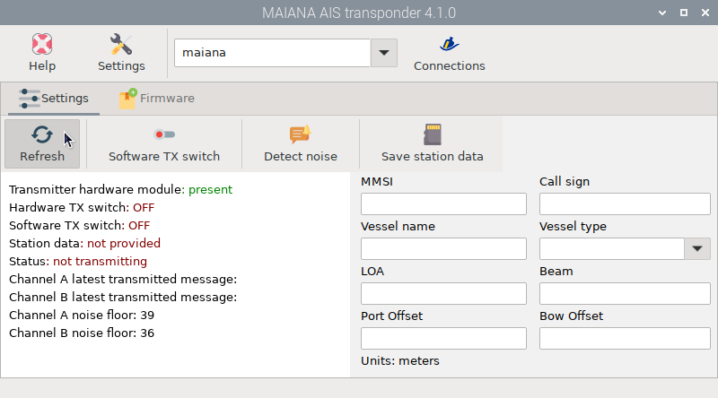

## Enabling transmission

If we want to enable transmission, we must provide the station data. Complete the form using this syntax for each field:

- ***MMSI***: you should have one for your boat already.
- ***Vessel name***: up to 20 alphanumeric characters, no punctuation. Use all caps.
- ***Call sign***: may be empty if you do not have one.
- ***Vessel type***: this is the numeric type of the vessel, see below.
- ***LOA***: length in meters (integer only).
- ***Beam***: width in meters (integer only).
- ***Port Offset***: meters from the port side where the unit is located.
- ***Bow Offset***: meters from the bow where the unit is located.

For vessel type, here are some numeric values that apply to class B transponders:

- 30 - Fishing
- 34 - Diving
- 36 - Sailing
- 37 - Pleasure craft

Click  ``Save station data`` when you are done:

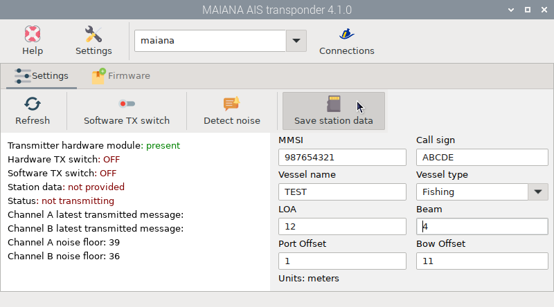

You will see that the value of *Station data* has changed to *provided* in green:

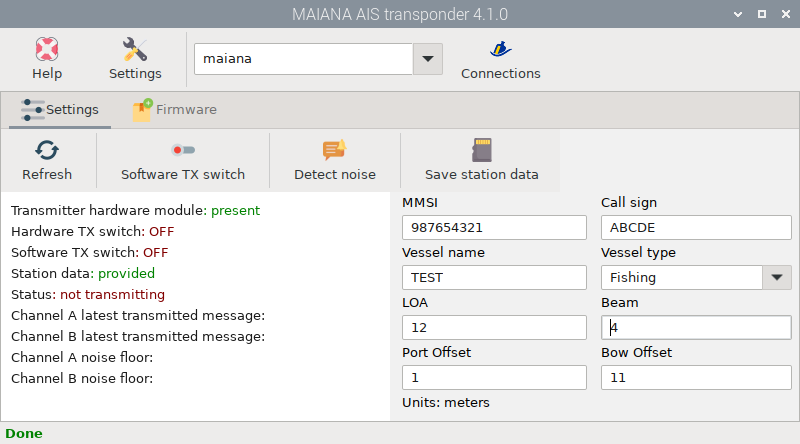

There are 2 switches to turn on/off transmission:

- **Hardware**: There is a physical switch on all the adapters. The breakout board also has a pin for this. This switch has priority over the Software switch.

- **Software**: You will find a button *Software TX switch* in  *MAIANA AIS transponder* app.

This is the relation between the two states of these switches:

| Hardware | Software | TX  |
|----------|----------|-----|
| ON       | ON       | ON  |
| ON       | OFF      | OFF |
| OFF      | X        | OFF |

Turn on your hardware switch, click  ``Refresh`` and you will see that the value of *Hardware TX switch* has changed to *ON* in green:

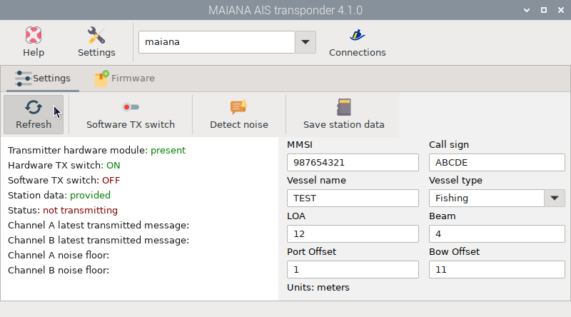

Now click  ``Software TX switch`` and you will see that the value of *Software TX switch* has changed to *ON* in green and the value of *Status* has changed to *transmitting* in green:

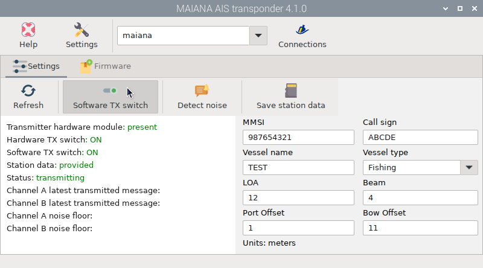

Congratulations, you are already transmitting!

## Notifications actions

If you have the  *Notifications* app installed, you will see two new actions added to the list to automatically turn the software TX switch on and off upon receiving a specific notification:

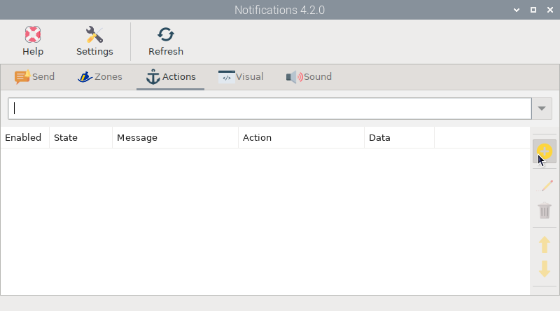

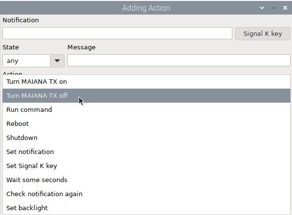

## Detecting EMI

MAIANA constantly checks for noise floor on both channels to detect any electromagnetic interference (EMI) near your device. If you enable  ``Detect noise`` and the noise level is higher than 64, an alert notification will be sent to the Signal K server.

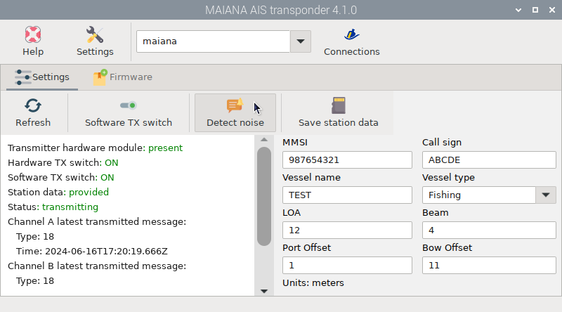

If you have the *Notifications* app installed, you will see an alert window like this one:

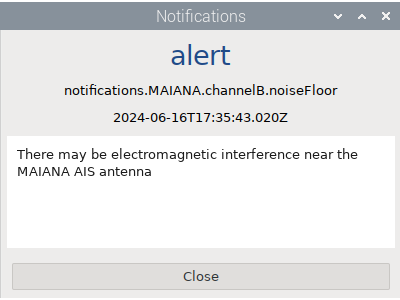

## Updating firmware

You will receive your MAIANA base kit with the latest stable firmware installed. Go to the  *Firmware* tab and click  ``Refresh`` to see the version of your device:

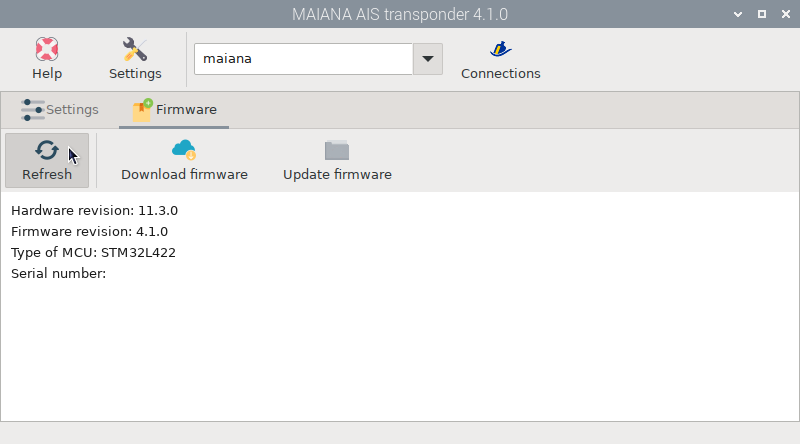

Click  ``Download Firmware`` to find the bin file that corresponds to your MCU and hardware revision from the project page:

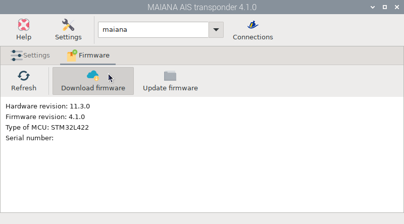

Ignore the last digit of your hardware revision -- it does not matter. So if you have board 11.3.0 with an STM32L422 processor, the right binary is maiana-stm32l422-hw11.3-fwXXX.bin where XXX is the latest revision you see here. If you already have this firmware on your board, there is no update:

Once the correct file is downloaded click ``Update firmware`` to start the firmware update process:

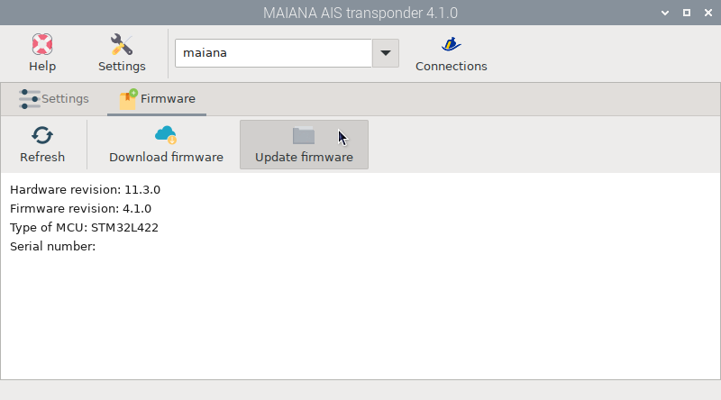

Select the file, click ``Open`` and finally ``Yes``:

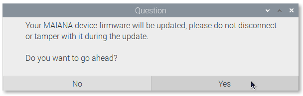

The system will stop the Signal K server to make sure it can take control of the device and load the new firmware. When done, both the Signal K server and the device will reboot:

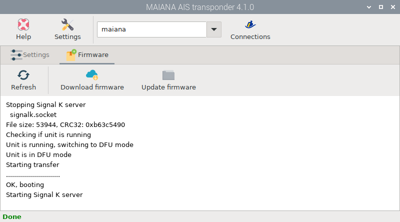
