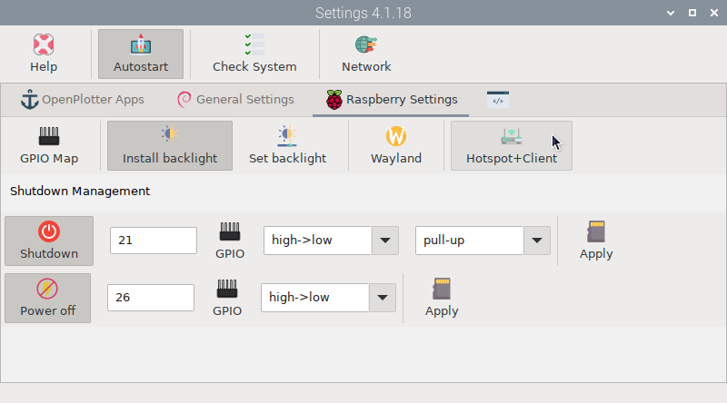
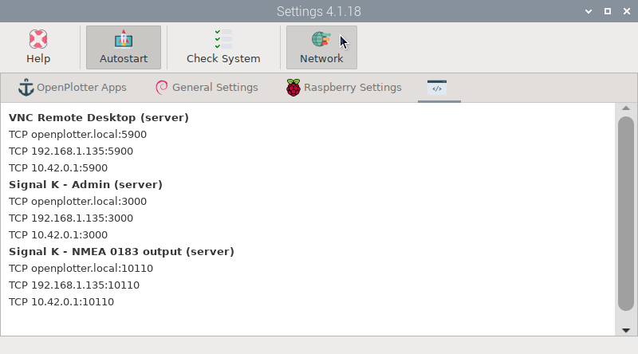

# Network 

We have kept this chapter for historical reasons. The *OpenPlotter Network* application present in earlier versions of OpenPlotter has been removed since *Raspberry Pi OS* added the *Network Manager* program and now almost all *OpenPlotter Network* functions can be done there. Some other functions have been moved to the  *Settings* app.

Now, to turn the Raspberry Pi internal WiFi device into an access point and a client simultaneously, you need to go to the `Raspberry Settings` tab of the  *Settings* app and click on  `Hotspot+Client`.

To find out what IPs, addresses and ports the OpenPlotter apps use, click on  `Network`.

The rest of the operations such as connecting as clients to access points, creating dedicated access points, connecting to VPN... are now carried out with the *Network Manager* program and are accessed by clicking on the icon 

