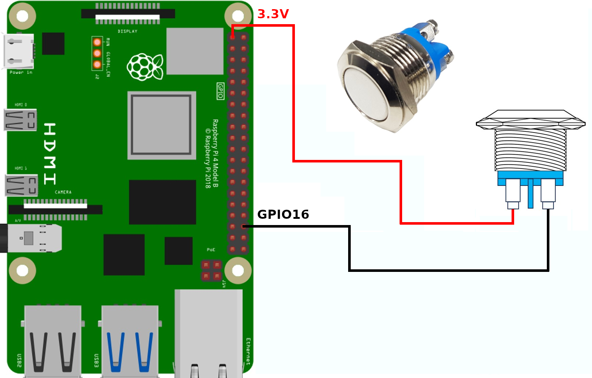
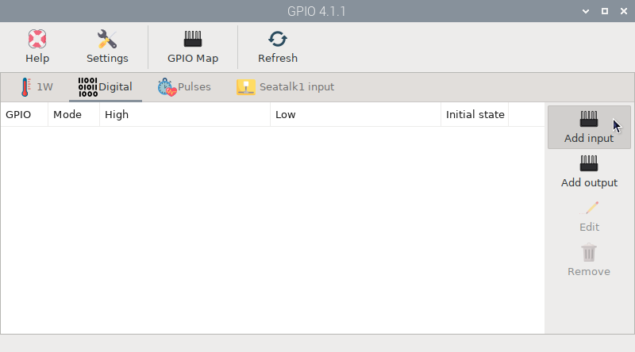
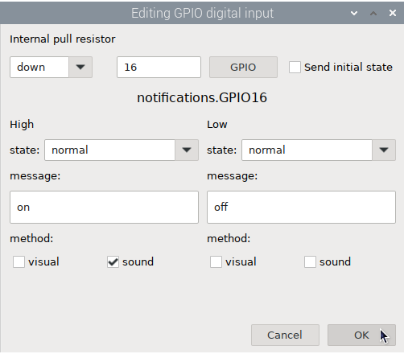
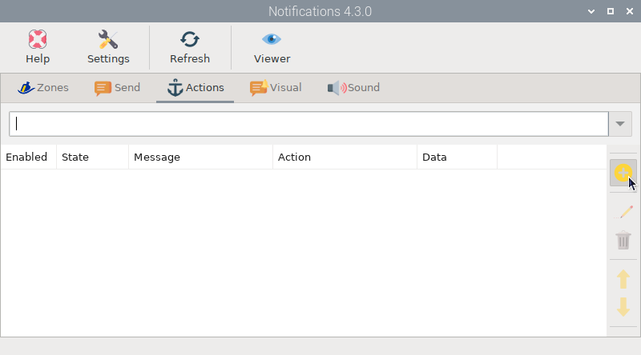
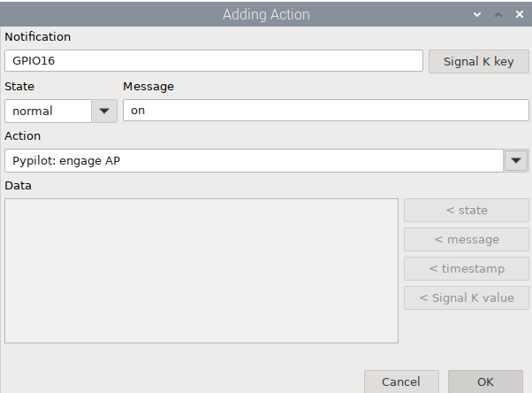
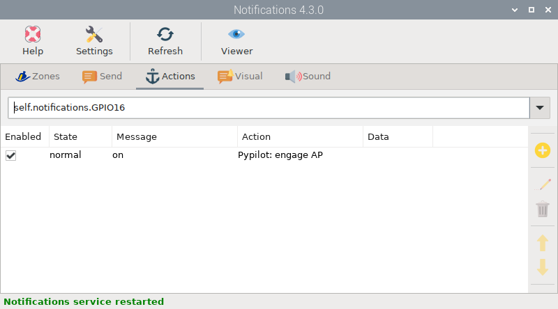
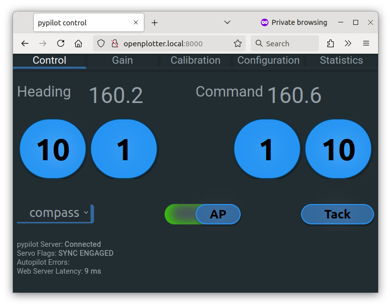

# Examples of actions

##  Engage pypilot using a GPIO button

You can use a momentary switch and connect it as shown in the image below:

For this example it is necessary to have the  Pypilot,  *GPIO* and  *Notifications* apps installed and updated to their latest versions.

Once the switch is wired, open the  *GPIO* app and in the  `Digital` tab click on  `Add input`.

In the next window, fill in the fields as shown in the image below. Make sure that the *Send initial state* option is not checked, as we do not want the autopilot to engage when turning on the system in case the switch has been accidentally closed. We do not need to set up any visual method for the notification, but perhaps it would be nice to have an audio:

Finally open the  *Notifications* app and in the  Actions tab click  Add:

In the next window fill in the fields as shown in the image below, press `OK` and you are done!

By pressing the momentary switch you will be able to verify that the autopilot is engaged in the pypilot *Web interface* because the AP icon moves to the right and turns green as shown in the image below:

To disengage the autopilot, you can use another momentary switch and repeat the process, but this time using another GPIO, for example GPIO8, and selecting `Pypilot: disengage AP` in the *Actions* field instead of `Pypilot: engage AP`.

You can also use a two-state switch (on/off) and use only one GPIO, but it could be confusing if when you turn off the system the switch is on and when you turn on the system the autopilot is not engaged. Enabling *Send initial state* would cause the autopilot to engage in this case, but could create dangerous situations.