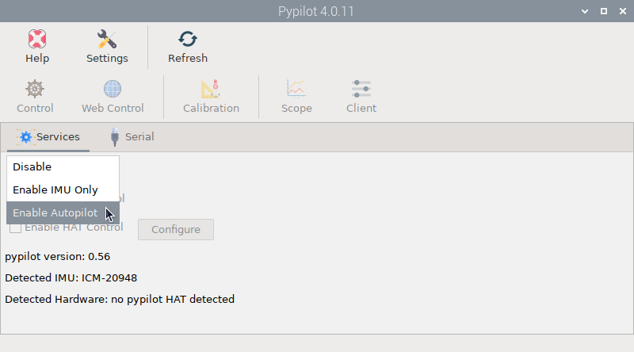
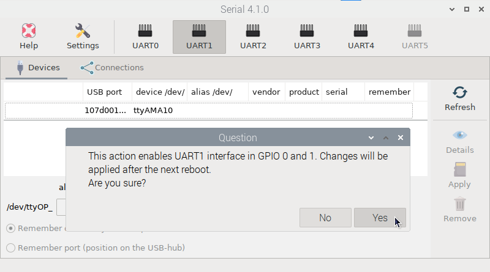
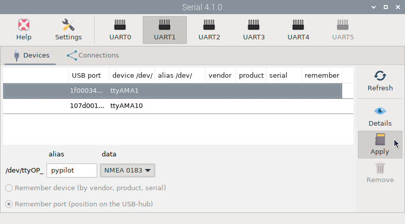
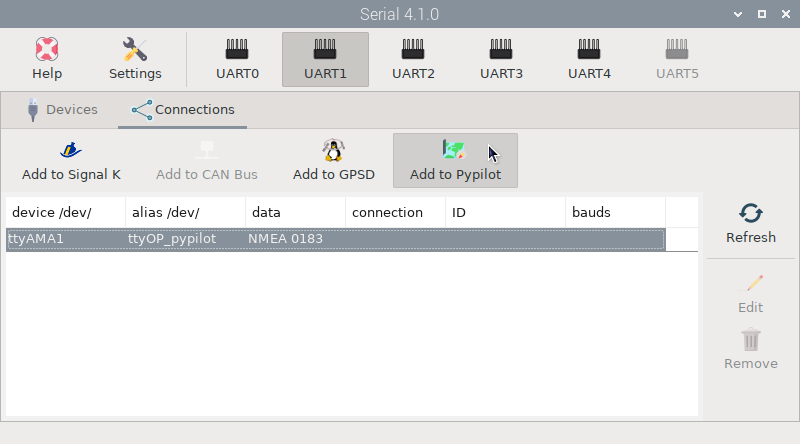
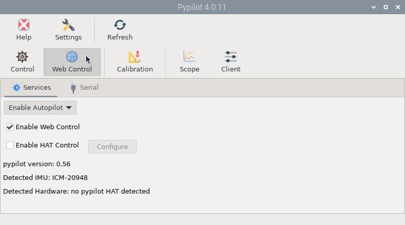

# Autopilot mode

Install this app from the  *Settings* app and open it by clicking  `Pypilot` under `Main -> OpenPlotter` or typing this in a terminal:

```console
openplotter-pypilot
```

 ``Help`` opens an offline copy of this documentation in a browser and  ``Settings`` opens the main app.

Enable *Autopilot* mode in the  `Services` tab **only** if you are using a Pypilot motor controller:



First of all you need to  [calibrate](calibration.md) the IMU.

Next you need to tell pypilot where the motor controller is connected. In the following example we are going to use the UART1 interface in Raspberry Pi 5 (UART2 in Raspberry Pi 4) to free up UART0 so it can be used by other devices. Go to the  *Serial* app and click the  `UART1` button, acknowledge the warning and reboot:



After the reboot, launch the  *Serial* app again. On the  `Devices` tab, you should now see a new entry. Select the line with ttyAMAx, give it an *alias* (for example pypilot) and select `NMEA 0183` from the *data* dropdown, then press  `Apply`:



Finally we need to connect the *ttyOP_pypilot* device to Pypilot. Switch to the  ``Connections`` tab, select the *ttyOP_pypilot* device and click   ``Add to Pypilot``:



In the next window click ``AUTO`` and that is it. The motor controller will be ready to receive orders from Pypilot.

You can also define the motor controller in the  serial tab of the  *Pypilot* app, but we recommend you do it using the above method.

Check `Enable Web Control` to control the autopilot via the  `Web Interface`. You can also access the  `Graphical User Interface` from here. Check `Enable HAT Control` only if you are using a Pypilot HAT:



The  `Scope` tool is a chart viewer that represents all the data handled by pypilot. The  `Client` tool also contains all this data and allows editing some of it. Both tools will be very useful for debugging the system.

## Configure LCD Keypad, remotes and custom buttons

Coming soon.

## Basic controls

In all software and hardware control panels you will find the usual elements found in all autopilots:

- **AP**: The AP button is the equivalent of the physical button panel known from boat autopilots. When AP is green, the autopilot is engaged and when the AP button is red, the autopilot is in standby mode.

- **Heading**: [Heading - Command] On all control interfaces you will see two numeric values from 0 to 360 expressed in degrees. One of them is the current heading, which can be calculated differently depending on the selected heading mode, and the other is the command heading, which is the desired heading. When AP is on and green, pypilot will steer until the current heading is similar to the command heading.

- **<< < > >>**: [-10 -1 1 10] When AP is in standby mode you will see four arrow buttons which can be used to align your actuator with your rudder so you can engage it and if you are lazy you can also steer the boat with them. When AP is engaged, these buttons will have numerical values -10, -1, 1 and 10 to add those amounts in degrees to the command heading.

- **Heading Mode**: [Compass - GPS - NAV - Wind - True Wind] In Compass mode the current heading is based on magnetic north. In GPS mode the current heading is based on true north. In NAV mode if an external plotter such as OpenCPN is sending autopilot bearing messages (APB) to the autopilot, it will adjust the heading command to follow them. In Wind mode the current heading is the direction the wind comes from relative to the bow and in True Wind mode the current heading is the direction the wind comes from relative to the true north.

- **Tack**: [port - starboard] Sailing with a limited crew sometimes requires a system to automate tacking. Clicking the *Tack* button initiates the maneuver to port or starboard using the predefined settings:

	- ap.tack.angle: In wind mode it is automatically determined from current course. Unit is degrees.

	- ap.tack.delay: How many seconds to wait to tack after hitting tack button.

	- ap.tack.rate: How quickly to tack. Unit is degrees/sec.

	- ap.tack.threshold: When to revert back to normal filter. Unit is percentage. Typically half the tack angle but adjusting this would be useful to prevent overshoot.

As we have already said, Pypilot is more powerful than any commercial tool and will allow you to fine-tune the autopilot to any boat and any sea condition using advanced settings such as [Gains](https://pypilot.org/doc/pypilot_user_manual/#tuning-gains) or [Servo parameters](https://pypilot.org/doc/pypilot_user_manual/#configuring-parameters).

