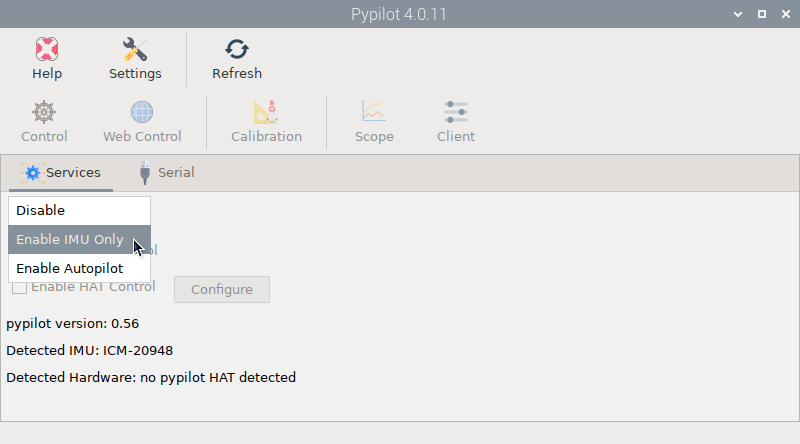
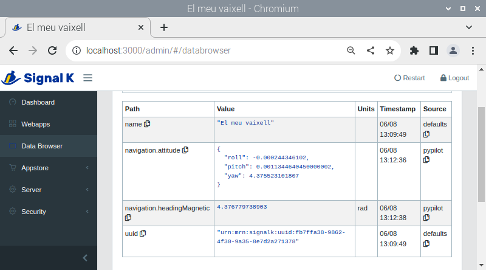

# IMU Only mode

Install this app from the  *Settings* app and open it by clicking  `Pypilot` under `Main -> OpenPlotter` or typing this in a terminal:

```console
openplotter-pypilot
```

 ``Help`` opens an offline copy of this documentation in a browser and  ``Settings`` opens the main app.

Enable *IMU Only* mode in the  `Services` tab if you are not using an autopilot and are only interested in adding an Inertial Measurement Unit (IMU) for heading, heel and trim data. Pypilot currently supports the following I2C-connected IMU models:

- ICM-20948 (recommended)
- MPU-9250
- MPU-9255.

The IMU should be automatically detected and displayed in the  `Services` tab:



You do not need to do anything else to start receiving heading and attitude data on the Signal K server:



!!! important
	You must  [calibrate](calibration.md) the IMU before you can obtain reliable heading data.