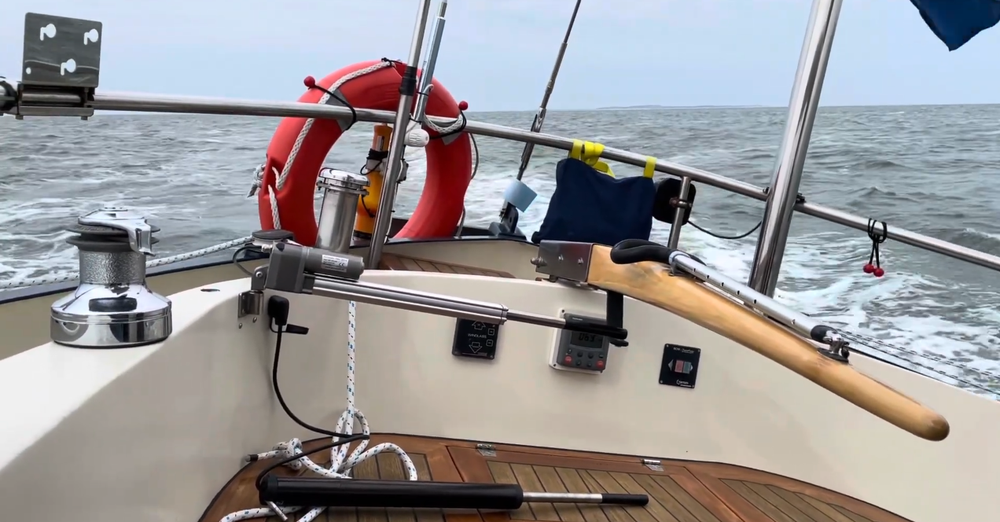
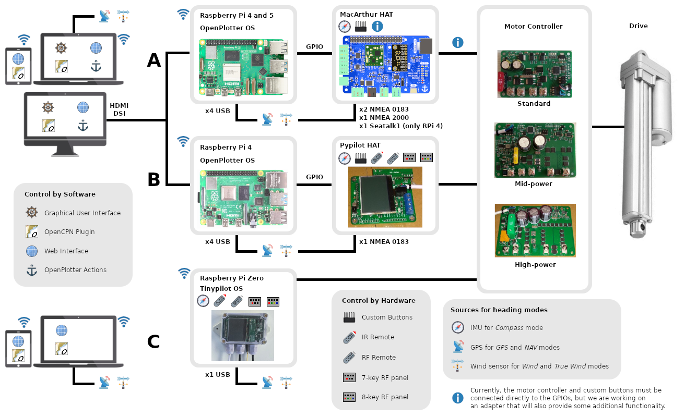
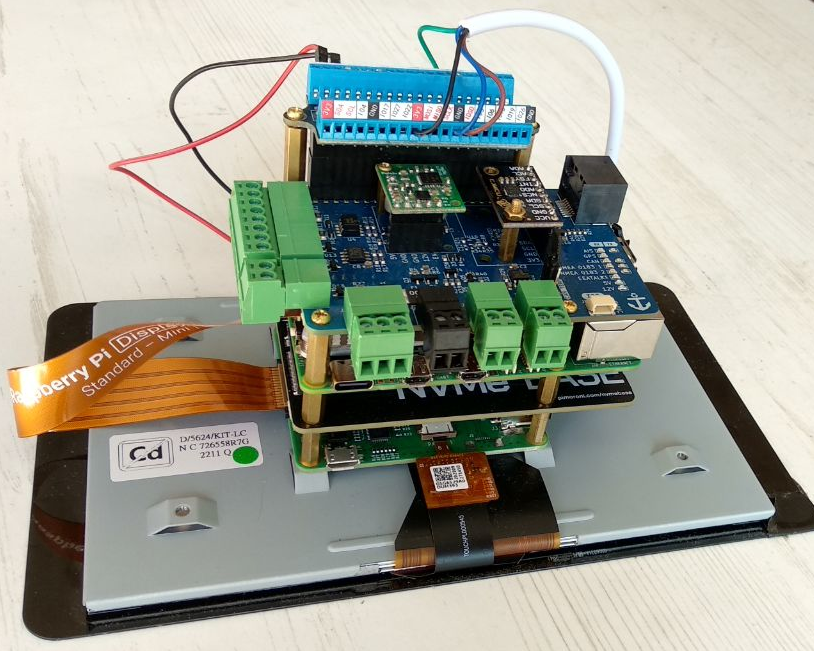
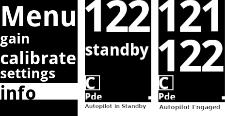
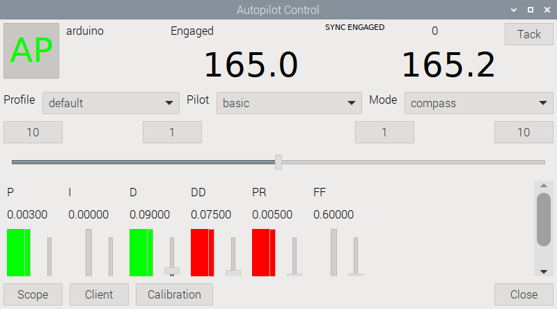
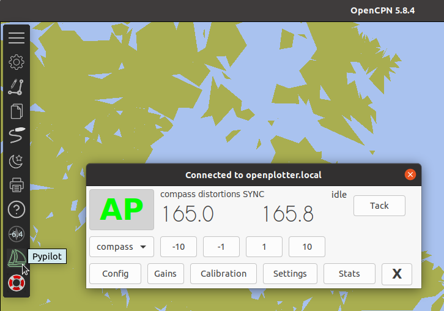
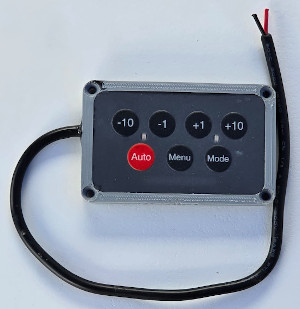
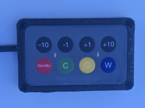

# Pypilot

Pypilot is the best autopilot application for your boat. In some aspects it is even superior to current commercial applications. It is completely open source and highly customizable. Its modular design allows it to be adapted to any boat, even by recycling parts of old installations.

Basically you need the following parts:

- A computer to install the pypilot software.

- An Inertial Measurement Unit (IMU) to provide heading data.

- An optional GPS and wind data source for alternative heading modes.

- A monitor connected to the computer or some remote device to control the autopilot by software.

- Some additional hardware to facilitate the connection of the computer to the motor controller and the devices to control the autopilot by hardware. There are multiple options here.

- The right motor controller for your drive.

- The drive, linear actuator or hydraulic system to operate the rudder.

!!! note
	You can find all these elements except the drives and the Raspberry Pi in the official [**pypilot Shop**](https://pypilot.org/opencart/) (US) and in the [**OpenMarine Shop**](https://shop.openmarine.net/29-pypilot) (Catalonia).

## Where to start

In this case we have to start from the end, **the drive**. Your boat may already have an autopilot and the electronics may no longer work, but the motor still does. If the motor also does not work, you can try purchasing a replacement with the same specifications, as that motor was likely already sized for your boat.

Any type of 12/24 volt reversing drives up to 30 amps are supported. You can test the drive by applying power directly to it and ensure the rudder moves in both directions by switching the wires (polarity). Some systems have separate (smaller) wires for a clutch output which may need power to engage the drive.

If your boat does not have a working drive or you want to start from scratch, you will need to choose a drive that is suitable for your boat and your sailing plan. Pypilot typically drives a brushed DC motor that moves the rudder from -30 to +30 degrees in 6-8 seconds, however faster is usually better and slower is usually worse. You can find a variety of actuators online and suggestions on the [actuators guide](https://pypilot.org/actuators/).

Once you have chosen which motor you are going to use you must acquire **the appropriate motor controller**:

- The *standard pypilot motor controller* drives a continuous output of up to 7A (15A peak) and 12V.
- The *mid-power pypilot motor controller* drives a continuous output of up to 15A (25A peak) and 12/24V.
- The *high-power pypilot motor controller* drives a continuous output of up to 30A (50A peak) and 12/24V.

**The rest of the necessary elements** depend on how you want to integrate pypilot into your boat and how you want to control the autopilot. The most common options are shown in the image below. You can run pypilot fully integrated into your current OpenPlotter installation (option **A**) or run pypilot integrated into OpenPlotter as well but using the *Pypilot HAT* to get a more compact and simple system (option **B**). Finally, you can also use the [*pypilot computer*](https://pypilot.org/autopilots/) to have a standalone autopilot running its own OS (option **C**).

 
*Click to enlarge*

!!! note
	This manual focuses on options **A** and **B** because they are based on OpenPlotter. To implement option **C** and obtain general and basic information about pypilot we recommend the [official pypilot manual](https://pypilot.org/doc/pypilot_user_manual/).

## Option A

The minimum elements in this case are a Raspberry Pi 4 or 5 and the  IMU connected by I2C. Pypilot currently supports the following IMU models:

- ICM-20948 (recommended)
- MPU-9250
- MPU-9255.

You can also use a [MacArthur HAT](https://macarthur-hat-documentation.readthedocs.io/en/latest/) to easily connect the IMU and receive  wind and  GPS data from your boat via its NMEA 0183, NMEA 2000 and Seatalk1 connections.

You can control the autopilot using all the available software options and by connecting custom buttons via  GPIO to control the autopilot via hardware. These buttons are defined using the  *OpenPlotter Actions* explained later.

!!! important
	Currently, the motor controller and custom buttons must be connected directly to the  GPIOs, but we are working on an adapter that will also provide some additional functionality. In the meantime, to reliably connect the wires to the GPIOs, we recommend using a [screw terminal](https://shop.openmarine.net/home/29-gpio-screw-terminal-board.html) like the one seen in the image below (in blue):

	 
	*Touchscreen + SSD + Raspberry Pi 5 + MacArthur HAT + power and IMU modules + screw terminal*

## Option B

In this case you only need a Raspberry Pi 4 and a [Pypilot HAT](https://pypilot.org/opencart/index.php?route=product/product&path=62&product_id=56).

!!! important
	The pypilot developer is working on making it possible to use a Raspberry Pi 5 with the Pypilot HAT as well.

You can also control the autopilot using all the available software options but this HAT offers more hardware control possibilities. The Pypilot HAT features an  IMU, direct connection to the motor controller, a NMEA 0183 input for  GPS or  wind data, an IR and RF receiver for     remote controls,  pins for connecting customizable buttons, and an LCD display to configure pypilot and display the current and commanded heading:

## Devices for heading modes

Pypilot supports various modes for holding a course. *Compass* mode is the most basic mode and should always be supported because of the  IMU. Other modes may fall-back onto compass mode if data is unavailable, and it provides a means of holding the boat facing a particular magnetic heading. When starting to use pypilot it is best to try this mode and ensure it is working correctly, because other modes typically rely on the compass to work correctly as well.

For *GPS* and *NAV* modes we need a  GPS data source and for *Wind* and *True Wind* modes we need a  wind speed and angle data source. These modes are explained later. These data sources are probably already present on your boat in one of the different formats available. To give access to them to pypilot you have several possibilities.

- By connecting a USB - RS422 (NMEA 0183), USB - CAN (NMEA2000) or USB - Seatalk1 adapter to the Raspberry Pi.

- By using the MacArthur HAT since it has connections for the 3 formats (at the moment Seatalk1 is only available for Raspberry Pi 4).

- Using the RS422 (NMEA 0183) connection of the Pypilot HAT.

- From remote devices connected via Wifi. Pypilot runs a TCP server connection on port 20220 that listens for NMEA 0183 data. It is possible to simply make a TCP client connection to this port in a program such as OpenCPN running remotely, however the  OpenCPN plugin for pypilot has an option to automatically detect pypilot and make the connection automatically. If enabled a duplicate connection should not be made. If it is not possible to connect as a TCP client to the pypilot TCP server, there is also a way to force pypilot to connect as a client to a remote TCP server in the *Configuration* tab of the pypilot  Web Interface.

## Control by Software

All software interfaces can be used in parallel and have all the options you would normally find on any autopilot and even more.

###  Graphical User Interface

You can access this virtual control panel only from the system running OpenPlotter and pypilot by clicking the  `Control` icon in the  *Pypilot* app.

###  Web Interface

You can access this virtual control panel from the system running OpenPlotter and pypilot by clicking the  ``Web Control`` icon in the  *Pypilot* app or by typing the address *https://localhost:8000* in the browser. Before you can use this interface you need to activate it in the  *Services* tab, checking the ``Enable Web Control`` option.

You can also use this interface remotely from any device connected to the same network as your OpenPlotter system by typing the address *https://openplotter.local:8000* in the browser.

###  OpenCPN plugin

You can access this virtual control panel from the system running OpenPlotter and pypilot or from any device connected to the same network by installing and enabling the *pypilot* plugin in OpenCPN. Before you can use this interface, you must connect pypilot by clicking ``Config`` and supplying the *host*. The *host* is *localhost* when your pypilot instance runs on the same system as OpenCPN or *openplotter.local* when your pypilot instance runs on another system on the same network.

###  OpenPlotter Actions

OpenPlotter includes a system of defined actions that respond to notifications sent by other applications or services. Each OpenPlotter app we install may add some new actions and this is the case with pypilot app. This is the list of pypilot controls defined as actions in OpenPlotter:

- Engage AP
- Disengage AP
- Command (+x, -x, or a fixed value)
- Tack starboard
- Tack port
- Tack cancel

These actions can be triggered by notifications sent by buttons or sensors connected to the GPIO, OpenCPN or other programs, from the terminal, from any threshold defined on any Signal K key... the possibilities are endless.

In the **Notifications** chapter you can see an example of a  [momentary GPIO button to engage or disengage the autopilot](../notifications/examples_actions.md#engage-pypilot-using-a-gpio-button).

## Control by Hardware

Using the Pypilot HAT expands the possibilities of controlling the autopilot using custom buttons, LCD keypads and remote devices. The function of the buttons on each of these elements can be reconfigured as shown in the chapter [Configure LCD Keypad, remotes and custom buttons](autopilot.md#configure-lcd-keypad-remotes-and-custom-buttons).

There are some remote control designs specifically for pypilot that have some major improvements. First, they are either fully potted or waterproof. These designs have keypads designed for autopilot use with +10 +1 -1 -10 buttons. They send alternate codes and buffer presses to allow for quick key presses without losing codes. They send stop codes to ensure good timing for manual control. They support multiple key presses (ex: tacking by pressing +10 and +1) and can also change channels to avoid interfering with nearby vessels with pypilot (by holding down the +10 and -10 buttons and selecting a channel). Other remotes may be much lower in cost, but do not include these features.

###  Custom Buttons

In the previous section  *OpenPlotter Actions* we have already seen how buttons connected directly to the GPIO can be customized. When using the Pypilot HAT we can add a keypad to control the LCD options and the autopilot by soldering buttons to the holes labeled *Tack*, *-10*, *+10*, *-1*, *+1*, *Select*, *Menu* and *Auto*.

###  IR Remote

This is a cheap infrared remote control and requires the remote to see the IR sensor on Pypilot HAT. Sometimes it works from reflections (bounce off wall) as well. It maybe useful as a backup remote and is easier than wiring buttons directly. 

###  RF Remote

The most common remote used with PyPilot is the 433MHz one. These are commonly used for garage door openers and other applications. This prevents interference with wifi and bluetooth, but more importantly provides a reliable and consistent signal with low latency to control the pilot. There are many inexpensive 433MHz remotes (with psk encoding) available online, but they are not technically completely waterproof.

###  7-key RF panel

This control panel operates on 12/24 volts and offers standard +10 +1 -1 -10 keys. The *Auto* key toggles the pilot engage. The *Menu* key allows access to the LCD menu interface. The *Mode* key switches to the next available heading mode. Because of these features, this keypad is designed to be mounted close to the Pypilot HAT LCD screen. It is possible to reprogram the keys (for example: *Auto* to engage and *Menu* to disengage), but the other control panel is better suited for use when the screen is not visible.

###  8-key RF panel

This control panel also operates on 12/24 volts and offers the standard +10 +1 -1 -10 keys. Instead of toggling engage, it offers a *Standby* button that always disengages the pilot. The C, G, and W buttons enable the pilot in Compass, GPS, and Wind modes. Pressing C and G at the same time enters NAV mode, and G and W at the same time enters True Wind mode.