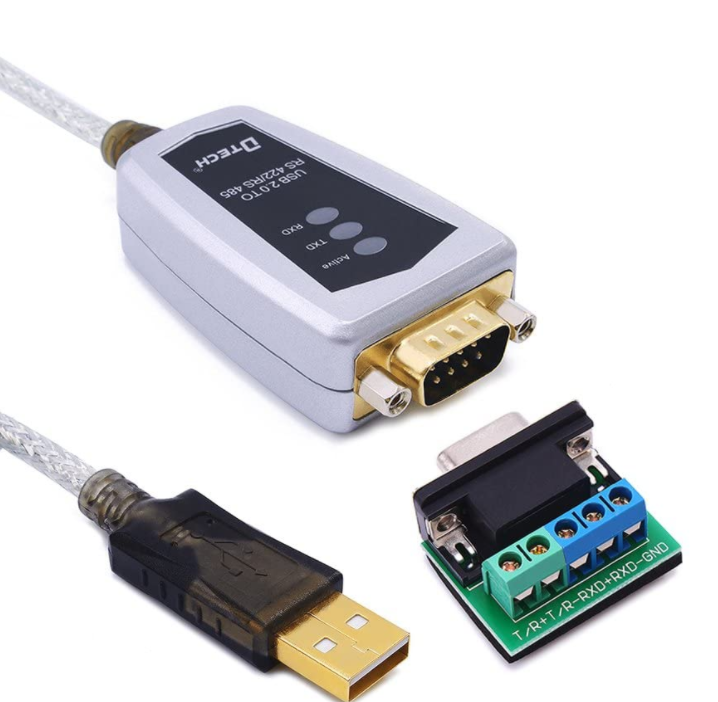
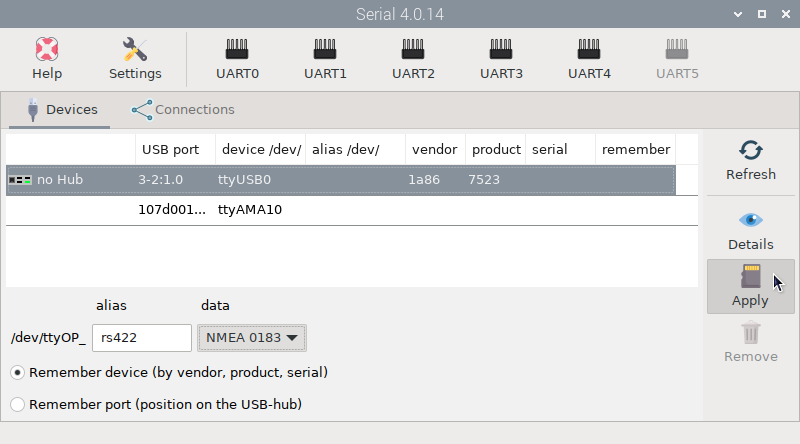
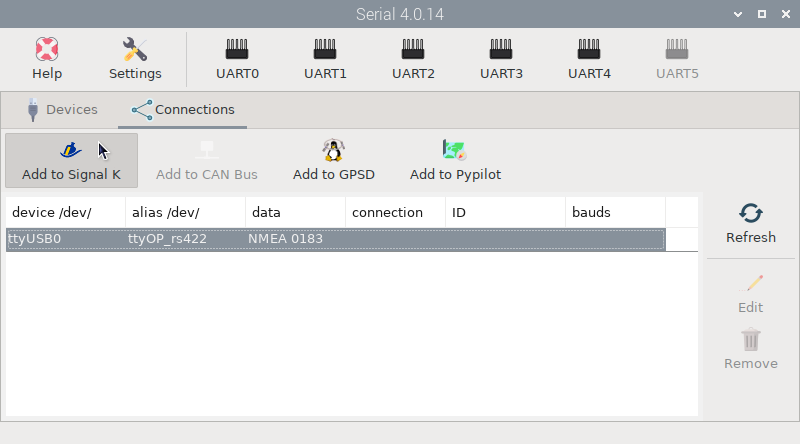
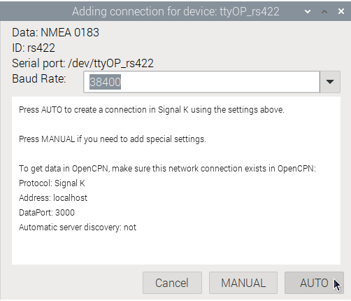
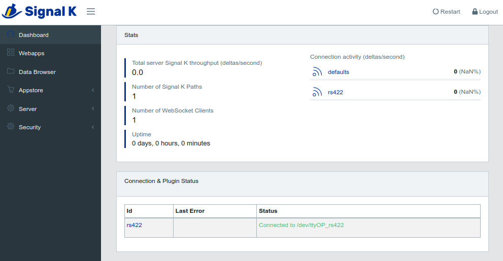

# Connecting a USB RS422 converter

You probably still have some devices onboard that use the old NMEA 0183 protocol. Most commercial plotters collect data from all onboard devices and send it through an RS422 output. To connect these devices to OpenPlotter, you need any inexpensive USB-RS422 converter. 

## Wiring

Typical RS422 device looks like the one below:

There are normally 4 or 5 connections: ``TX+``, ``TX-``, ``RX+``, ``RX-``, ``GND``.

!!! imnmportant
	Normally you do not need GND and you would connect TX of the chart plotter/VHF etc to the RX of the RS422 to USB device and vice versa. However, there is little consistency between different devices as to what is possitve and what is negative - so if the TX+ connected to the RX+ does not work, try connecting to the RX-.

## Input data

To obtain data from these converters, follow the same steps as for connecting the [USB GPS](connectingGPS.md) in the example of the previous chapter of this section. Below are the summarized steps.

In  ``Devices`` tab, enter an ``alias`` and select *NMEA 0183* in ``data``:

In  ``Connections`` tab, create a Signal K connection:

Consult your device manual to find the ``Baud Rate``, if you can not find it then usually, if the device is older and pre-AIS the Baud Rate may be 4800, later devices that may have or accept AIS will be 38400.

Check the Signal K connection has been made:

And check OpenCPN to make sure there is a [connection to the Signal K server](../opencpn/skconnection.md).

You should now be ready to get NMEA 0183 data from your boat.

## Input + output data

Now that you are getting NMEA 0183 data from your boat, you may also want to send some NMEA 0183 data generated in OpenPlotter to your boat. The classic case is to let OpenCPN control your autopilot. Let's see how to send data to the autopilot using the same USB RS422 converter.

When you activate a route in OpenCPN, NMEA 0183 *RMB* and *APB* sentences begin to be generated. As usual we need to send this new data to the Signal K server and you can do this by creating a UDP client connection. Select ``Network``, *Protocol*: `UDP`, ``Address``: *0.0.0.0*, *DataPort*: `10119` (or any unused UDP port on your system), uncheck ``Receive input on this Port``, check ``Output on this port`` and transmit only sentences `RMB` and `APB` in *Output filtering*:

!!! warning
	Allowing only *RMB* and *APB* sentences in the output is important to avoid data loops in your system.

Now you have to create a connection in Signal K server to get *RMB* and *APB* data from OpenCPN. Login to the Signal K server, go to `Server -> Data Connections` and click on ``Add``. Set *Data Type*: `NMEA 0183`, *ID*: `opencpn`, *NMEA 0183 Source*: `UDP`, *Port*: `10119` (or whatever you have set in OpenCPN), *Input Event*: `autopilot` and click ``Apply``:

Finally, you need to edit the connection you configured for your USB RS422 device input data to specify what data should be sent to your boat. Go to `Server -> Data Connections` and click on your device connection, in this case ``rs422``. Set *Output Events*: `autopilot` and click ``Apply``:

``Restart`` Signal K server and you are done. Activate a route in OpenCPN and you will start sending data to your autopilot.

!!! note
	To better understand how events work on the Signal K server, see the chapter [NMEA 0183 multiplexing](../signalk/multiplexing.md).