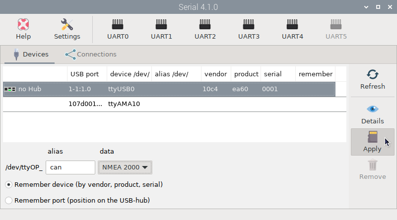
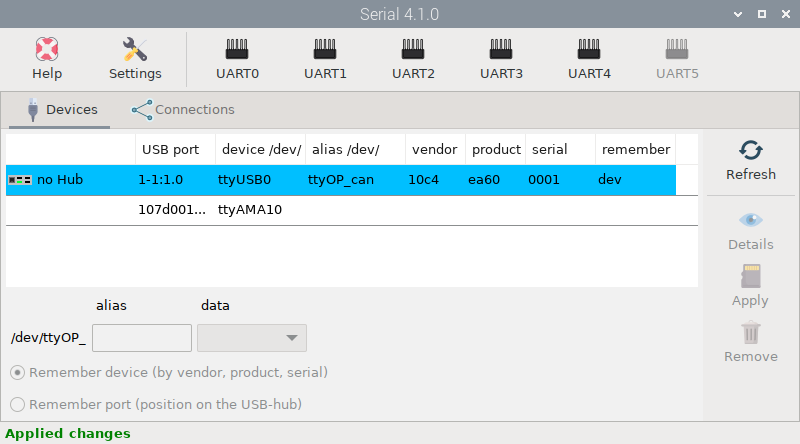
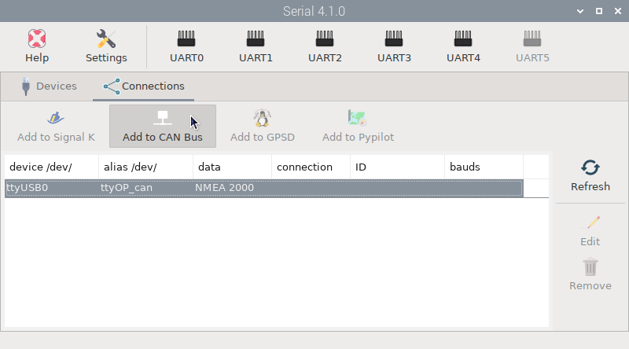
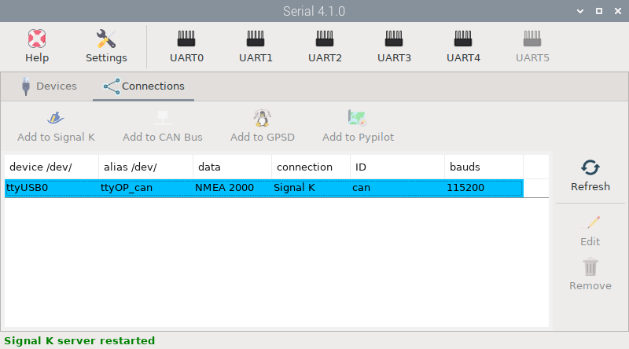
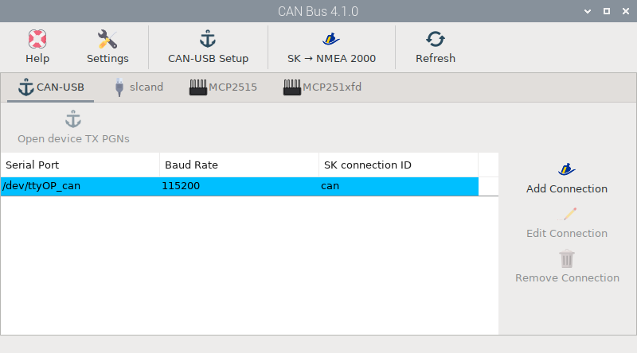
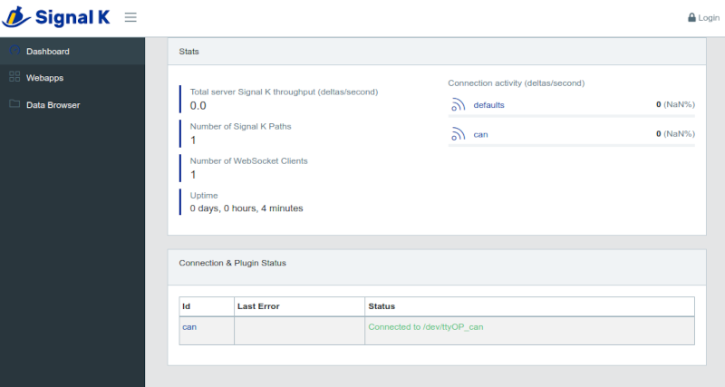

# Connecting a USB CAN converter

This tutorial is for any NMEA 2000 converter that can connect via USB such as the *Actisense NGT-1*, the *OpenMarine CAN-USB Stick* (discontinued) and any *slcand* device.

To get data from your NMEA 2000 network you have to select the device, enter an *alias* and select `NMEA 2000` in *data* field. Finally press  ``Apply`` and the device will be marked blue:

Then go to  ``Connections`` tab, select the device and click  ``Add to CAN Bus``:

If you are using a *slcand* device click on ``MANUAL`` and go to [Input data by slcand](../can/slcand.md) chapter to learn how to configure these devices.

If you are using an *Actisense NGT-1* or an *OpenMarine CAN-USB Stick* device (discontinued), select the *Baud Rate* (usually `115200`) and click on `AUTO`.

The device will be marked blue and you are done:

Open the  *CAN Bus* app to confirm that the device has been added to the  *CAN-USB* tab:

And go to Signal K server to confirm that the connection has been made:

Check OpenCPN to make sure there is a [connection to the Signal K server](../opencpn/skconnection.md) and you are getting data from your NMEA 2000 network.

!!! note
	To learn how to send data through your NMEA 2000 converter, see the chapter [Output data](../can/output.md).