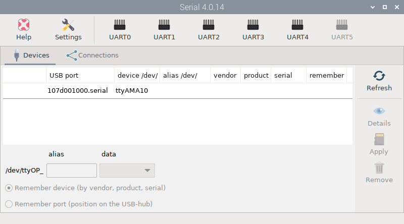
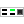
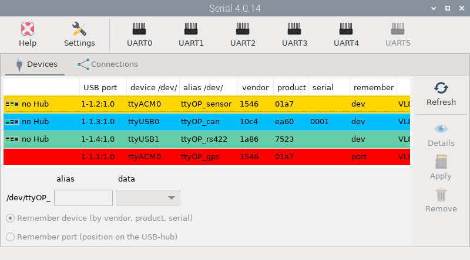
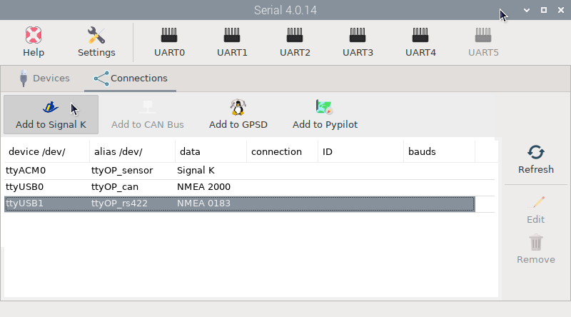
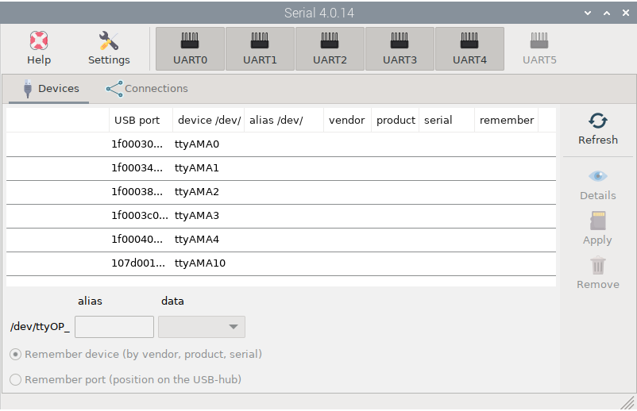
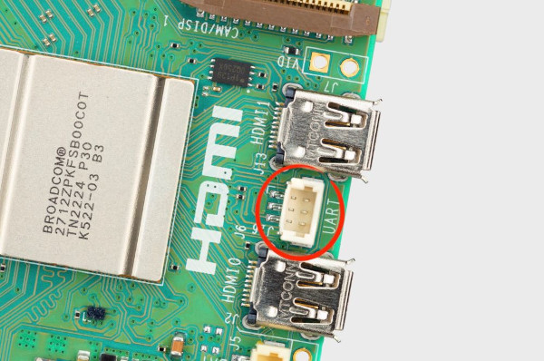

# Managing serial devices

Install this app from the  *Settings* app and open it by clicking  `Serial` under `Main -> OpenPlotter` or typing this in a terminal:

```console
openplotter-serial
```



 ``Help`` opens an offline copy of this documentation in a browser and  ``Settings`` opens the main app.

When you connect a USB device or any serial device to Linux, it is named as: /dev/ttyUSB0, /dev/ttyACM0, /dev/ttyS1... If any program needs to get data from this device, you have to provide this name in the settings of the program. But there is a problem, this name is not tied to your physical device, so it could be that the system gives it a different name on the next reboot and your program points to a wrong device.  *Serial* app allows you to define an alias for your device that will always be tied to it even after unplugging it.

This app will detect any serial device connected to the system. Press  ``Refresh`` when plugging or unplugging a device to update the list of detected devices. Click on  `Details` to receive more information about the selected device.

On the  ``Devices`` tab, you can define your devices by providing the alias, defining the type of data this device manages, and choosing how this device should be remembered: by its vendor, product, and serial number, or by the port where it is plugged in.

You should use ``Remember port`` only if 2 or more of your devices have the same vendor, product and serial or if they do not have any of these identifiers at all. For Raspberry Pi, the first column in the list will show you which USB port your device is connected to  and if you are using a HUB.

Devices are marked in different colors:

- white: not defined yet.
- green: defined as NMEA 0183 device.
- blue: defined as NMEA 2000 device.
- yellow: defined as Signal K device.
- red: the device is missing.



Using the  ``Connections`` tab you can easily configure some programs to obtain data from your device. Depending on the type of data you set when defining the alias, some supported programs will be enabled in the toolbar when selecting devices. 



In the rest of this section, you will learn how to define and connect different devices using examples.

##  UART

On Raspberry Pi you can also connect serial devices to the GPIOs. Depending on your Raspberry Pi model, you will have more or fewer UART interfaces available or they will be named differently.


To enable any available UART interface, press  ``UART0``, ``UART1``, ``UART2``, ``UART3``, ``UART4`` or ``UART5`` and after reboot, you will see a new ``ttyAMA...`` device:


*Raspberry Pi model 5 with all UART interfaces enabled*

!!! note
	In Raspberry Pi model 5 you will see a device called **ttyAMA10**, that corresponds to the new UART debug adapter of the board.

	

### Raspberry Pi 3

| Interface | RX GPIO | TX GPIO | RX pin | TX pin | 
| --------- | ------- | ------- | ------ | ------ |
| UART0     | 15      | 14      | 10     | 8      |

On Raspberry Pi 3, the Bluetooth interface and the UART0 interface share the same port. Bluetooth is enabled and UART0 is dissabled by default. If you enable UART0, Bluetooth will be disabled. 

### Raspberry Pi 4

| Interface | RX GPIO | TX GPIO | RX pin | TX pin | 
| --------- | ------- | ------- | ------ | ------ |
| UART0     | 15      | 14      | 10     | 8      |
| UART2     | 1       | 0       | 28     | 27     |
| UART3     | 5       | 4       | 29     | 7      |
| UART4     | 9       | 8       | 21     | 24     |
| UART5     | 13      | 12      | 33     | 32     |

On Raspberry Pi 4, the Bluetooth interface and the UART0 interface share the same port. Bluetooth is enabled and UART0 is dissabled by default. If you enable UART0, Bluetooth will be disabled. 

### Raspberry Pi 5

| Interface | RX GPIO | TX GPIO | RX pin | TX pin | 
| --------- | ------- | ------- | ------ | ------ |
| UART0     | 15      | 14      | 10     | 8      |
| UART1     | 1       | 0       | 28     | 27     |
| UART2     | 5       | 4       | 29     | 7      |
| UART3     | 9       | 8       | 21     | 24     |
| UART4     | 13      | 12      | 33     | 32     |

On Raspberry Pi 5, the Bluetooth interface and the UART0 interface are independent.