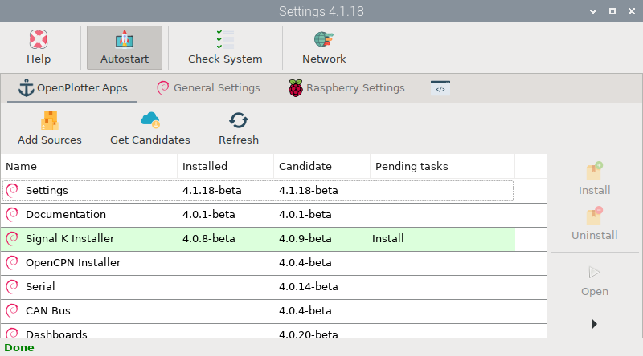
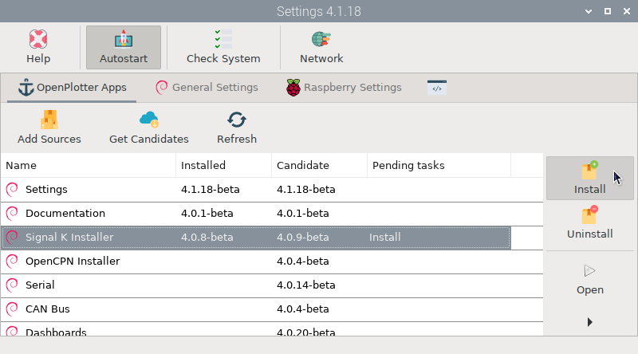
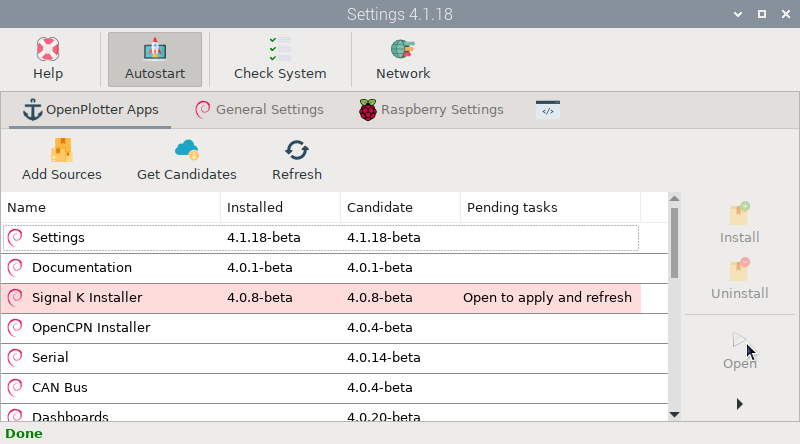
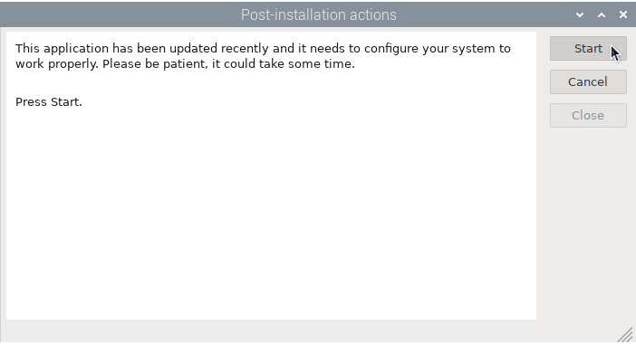

#  OpenPlotter Apps

OpenPlotter apps versions consist of 3 digits separated by periods (a.b.c), a code name and a development state:

- **a**: This is the OpenPlotter version the app belongs. This value will change only when a new Debian version is released.
- **b**: This value will change when major updates like new features have been added.
- **c**: This value will change when minor updates like fixed bugs or translations have been added.
- **codeName**: Name to identify the OpenPlotter version (a).
- **state**: 
	- **Alpha**: new features need to be added.
	- **Beta**: all features have been added, but need to be tested.
	- **Stable**: all functions should work properly.

##  Add sources

The sources of the OpenPlotter apps repositories should be added once at the beginning and then only if you see the *missing source* message in any of the OpenPlotter apps.

##  Get Candidates

From time to time, you should check if there are new versions of OpenPlotter apps in the remote repositories to enjoy new features and correct errors. If there is a new version of an installed app, it will be shown in green:

##  Refresh

Run this option when you want to know the status of your apps. This option only compares versions locally and checks for pending tasks. To compare versions in the remote repositories click  ``Get Candidates``.

##  Install

To install a new version of any app select the item in the list and click this button. If the updated app was running while the installation, you will have to close and open it again to see changes.

!!! important
	It is highly recommended to install and update OpenPlotter apps from  *Settings* app because often the installation process involves extra changes to the system that will be carried out automatically. If you install the apps manually from a terminal or they are updated automatically due to a general system update, they will be marked in pink to indicate that there are pending actions:

	

	These extra actions will be executed the first time you open the app:

	

##  Uninstall

To uninstall any app select the item in the list and click this button. It is also important to uninstall OpenPlotter apps from  *Settings* to undo the changes in the system.

##  Open

If you have trouble locating and opening OpenPlotter apps installed on your system, you can open them from here.

##  Change Log

Select any app and click this button to see all changes across versions.
