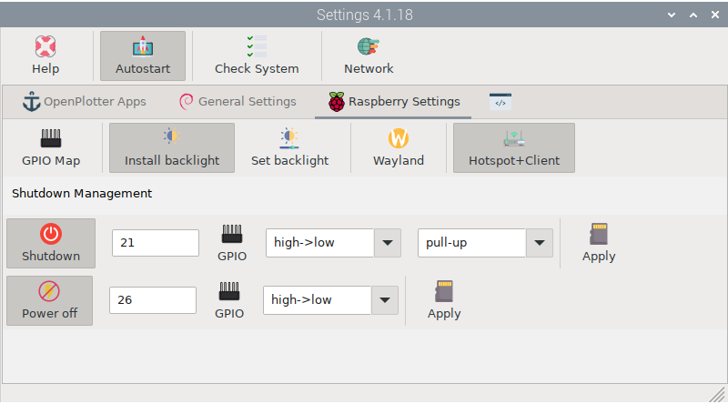
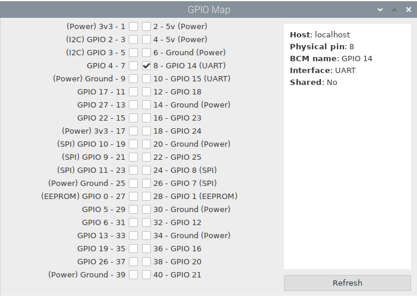
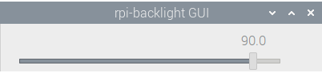
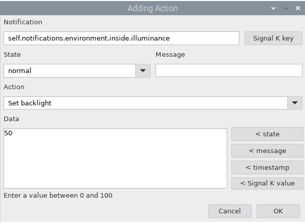

#  Raspberry Settings

##  GPIO Map

Some apps will report which GPIO they are using and you can check it here. Checking a GPIO will return useful information about its usage.

##  Install backlight

Brightness on monitors that are connected via the DSI display port can be controlled by software. If you have a DSI touchscreen as the [official monitor for Raspberry Pi](https://www.raspberrypi.com/products/raspberry-pi-touch-display) or any of its clones, you can install the necessary software to control brightness by clicking  ``Install backlight`` button.

##  Set backlight

After installing the required software, you will have access to a graphical interface to set the brightness using a slider.

If you have the  *Notifications* app installed, you will see a new action added to the list to automatically set the backlight value upon receiving a specific notification:

##  Shutdown

You can use any GPIO on the Raspberry to set a shutdown botton. Click  ``GPIO`` to choose a GPIO, usually GPIO 21 at pin 40. Select a GPIO ``Transition`` to trigger the shutdown, *high->low* or *low->high*. Select an internal pull resistor, *pull-up* and *pull-down*, or *off* if you use an external pull resistor. Click  ``Apply`` to save settings and changes will be applied after the next reboot.

##  Power off

You can use any GPIO on the Raspberry to notify an external circuit that it can safely cut power. Click  ``GPIO`` to choose a GPIO, usually GPIO 26 at pin 37. Select a GPIO ``Transition`` to trigger the power off, *high->low* or *low->high*. Click  ``Apply`` to save settings and changes will be applied after the next reboot.
