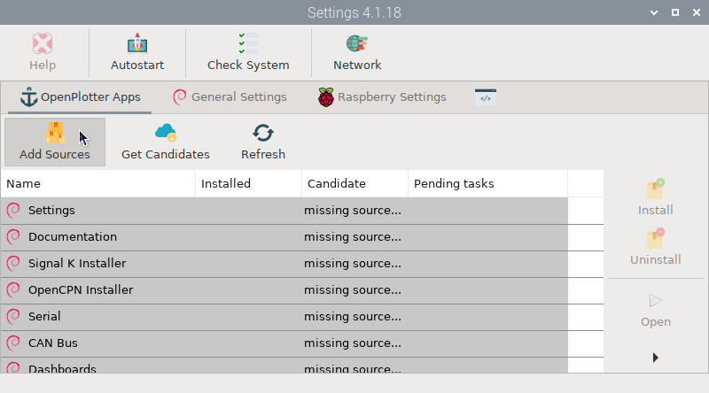
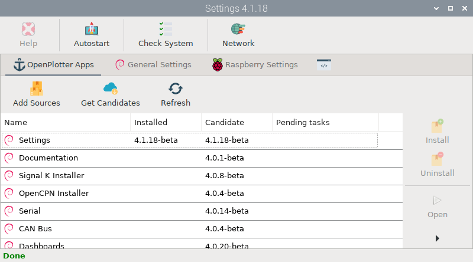
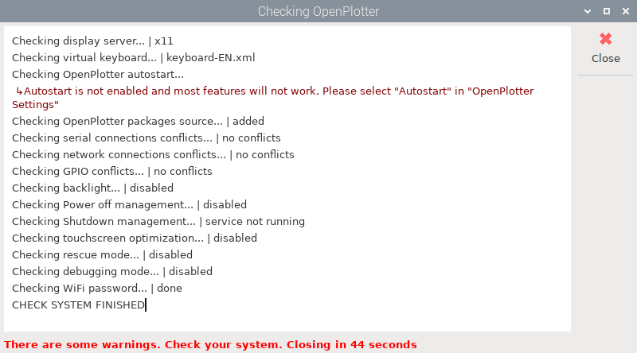

# Settings

To run this app, click  `Settings` under `Main -> OpenPlotter` or type this in a terminal:

```console
openplotter-settings
```

This is the main OpenPlotter app. You need it to install the rest of the apps. If you are using any of the OpenPlotter images for Raspberry Pi, the sources for the repositories where the OpenPlotter apps live will be installed and working, but if you are installing OpenPlotter from scratch you will see something like this:



To install the sources, click  ``Add sources`` and then click  ``Get Candidates``. You will see the result of each process in the   output tab. After adding the sources you are ready to install the rest of the apps:



##  Help

This button will be disabled until you install the *Documentation* app. After installation, the button will be enabled and clicking on it will open an offline copy of this documentation in a browser.

##  Autostart

!!! important
	This button should always be checked.

Allows self-diagnosis at startup of all OpenPlotter apps and some important settings. It will also trigger some programs and tools configured to run at startup.

##  Check System

By clicking this button, you can run the self-diagnosis at any time. Each OpenPlotter app installed will add new processes to diagnose its operation. If something does not work as expected, a red message will show the problem and the solution:



This process runs automatically at startup and it is also the time when some important internal OpenPlotter processes are started.

##  Network

Click this button to find out what IP, addresses and ports OpenPlotter is using.
