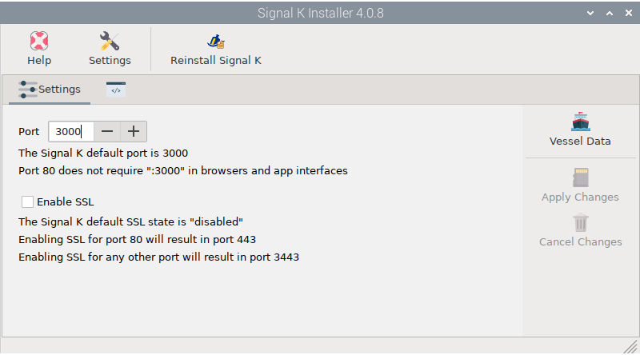
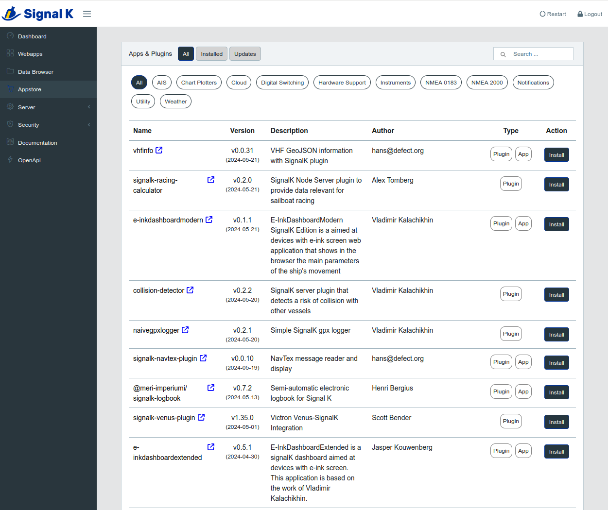

# Signal K Installer

Install this app from the  *Settings* app and open it by clicking  `Signal K Installer` under `Main -> OpenPlotter` or typing this in a terminal:

```console
openplotter-signalk-installer
```



 ``Help`` opens an offline copy of this documentation in a browser and  ``Settings`` opens the main app.

##  Reinstall Signal K

After installing the  *Signal K Installer* app, the Signal K server should be also installed and you do not have to do anything else to start using it. We add this option in case you need to reinstall the server from scratch if it ever becomes unstable. 

!!! caution
	Reinstalling the signal K server will remove the current plugins, login credentials and settings.

##   Settings

 *Signal K Installer* app installs the server using port 3000 by default. To access the web administration panel of the Signal K server, you can use this URL from the browser included in OpenPlotter:

```console
http://localhost:3000
```

Or this one from a browser running on any computer connected to the same network:

```console
http://openplotter.local:3000
```

If you set the port 80 instead the default port 3000, the URLs would be:

```console
	http://localhost
	http://openplotter.local
```

You can change the port or enable SSL at any time without losing your current settings. Use  ``Apply`` to save changes or  ``Cancel`` to reload current settings.

Click  ``Vessel Data`` to set some important data of your boat like name, MMSI, call sign, draft ... You need to login to access this section of the web administration panel.

## Logging in

When you first enter the Signal K web administration panel, it will ask you for a *name* and *password* to create an administrator account:


Once you do that you will be offered the login page:


You can add/delete users and change passwords under `Signal K administrator -> Security -> Users`.

## More info

To know how data is managed in OpenPlotter you should read the chapter [How does it work?](../description/how_does_it_work.md) in the *Description* section.

On the official [Signal K site](https://signalk.org/) you will find a lot of valuable information.

In recent versions of the Signal K server, documentation has been introduced in `Signal K administrator -> documentation`

There are more than [270 plugins](https://www.npmjs.com/search?q=signalk-node-server-plugin) and more than [60 apps](https://www.npmjs.com/search?q=signalk-webapp) to extend the Signal K server features. Go to `Signal K administrator -> Appstore`. to install them:


