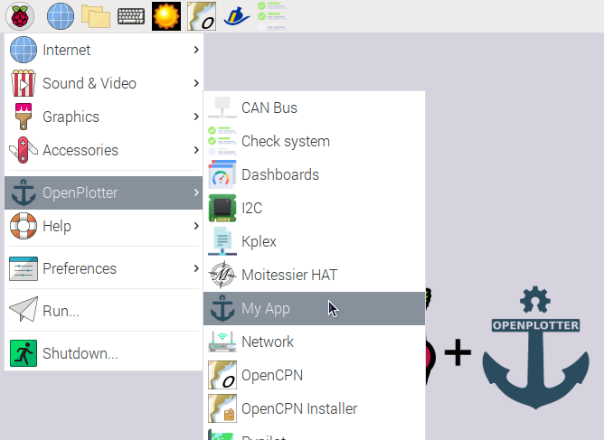
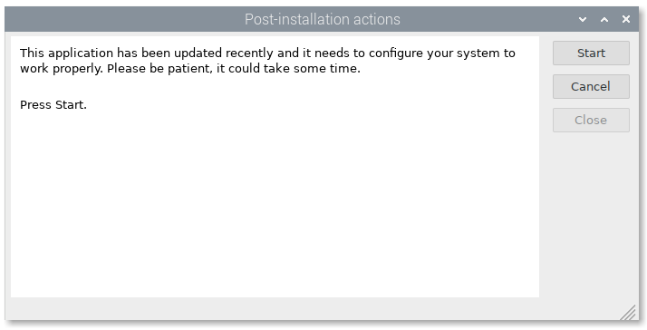
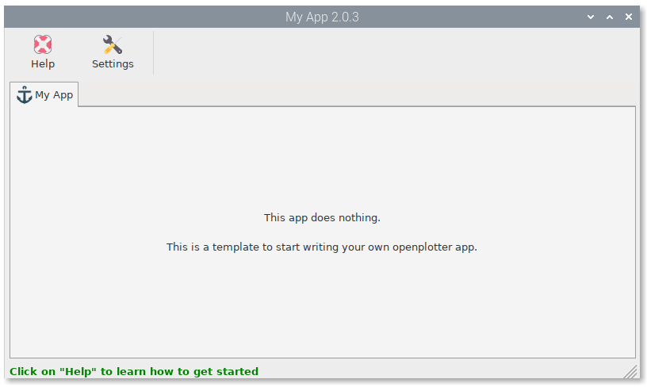
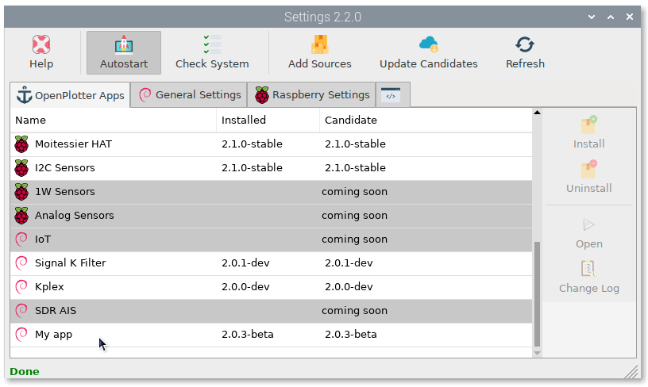

External Apps
#############

OpenPlotter contains a lot of useful apps but you can create your own apps too. External apps can share OpenPlotter resources but are autonomous and independent.

We have created an example of an external app called *My App* that can be used as a template for your app.

.. _installing-myapp:

Installing *My App*
*******************

:download:`Download <https://cloudsmith.io/~openplotter/repos/openplotter-external/packages/>` the latest version of *My App* and double-click the deb file.

After installing go to :menuselection:`Menu --> OpenPlotter` and click on ``My App``.

Most apps must perform some tasks for proper operation before being used. Click on ``Start``.

After finishing the post installation tasks, try to open the app again.

*My App* is installed correctly and from this moment it will appear in the list of OpenPlotter apps that will be updated when a new version is published.

Creating your app from *My App* template
****************************************

OpenPlotter apps must be written in python 3 and must be distributed as Debian packages.

First of all you need a repository to upload and distribute your app. You can use any Debian repository but we recommend https://cloudsmith.io because it is really easy for newbyes.

- Create an account in Cloudsmith.

- Create a repository in Cloudsmith and select "GNU Public General License v3.0" and "Open-Source". Your repository should look like this: https://cloudsmith.io/~openplotter/repos/openplotter-external/packages/

- To get the source of your new repository replace *myname* and *myrepository* by your data and type this in a browser:

.. parsed-literal::

	https://dl.cloudsmith.io/public/myname/myrepository/cfg/setup/config.deb.txt?distro=debian&codename=buster

- You will get a file that contains your source. Save it, you will need it later.

- Download the GPG key file you will find in the section *Signing Keys* of your repository. Save it, you will need it later.

Go to the *My App* `GitHub page <https://github.com/openplotter/openplotter-myapp>`_ and click on ``Use this template``. Provide a name for your new app and the project will be forked. It is recommended that you use the prefix *openplotter-* for your app name.

Browse the code of your fork of *My App*. There are comments on every piece of code you should change to customize your new app. Use the source and the GPG key files when required.

Packaging your app
******************

After you have customized your app, you have to create a Debian package to test. To build deb packages you need to sign them with your GPG key. `Follow this manual <https://packaging.ubuntu.com/html/getting-set-up.html#create-your-gpg-key>`_ to get a GPG key using the same email you have in the file debian/changelog of your customized *My App*.

Once you have a GPG key installed in your computer you can create deb packages typing this in the root folder of your fork of *My App*:

.. parsed-literal::

	dpkg-buildpackage -b

To increase the version of your app you have to edit the file *openplotterMyapp/version.py* and the file *debian/changelog*.

.. attention::
	Versions in *openplotterMyapp/version.py* and *debian/changelog* must always match.

.. tip::
	To help you edit the changelog file, type this in the root folder of your fork of *My App*:

	.. parsed-literal::

		dch

Uploading your app to your repository
*************************************

Go to your Cloudsmith repository and select ``Upload`` for Debian. Then click on ``Upload Debian Package``. In the next window click on ``Upload File`` to select the deb file from your computer and select the ``Distribution``. OpenPlotter 2 works for *debian/buster - Debian - 10 (Buster)*.

Distributing your app
*********************

You are done. Send the URL of your repository to your users to download and install your deb file. Write a short manual to install your app just like the :ref:`first section of this page <installing-myapp>`.

Once installed your package can be updated from openplotter-settings app or typing:

.. parsed-literal::

	sudo apt update
	sudo apt install openplotter-myapp
