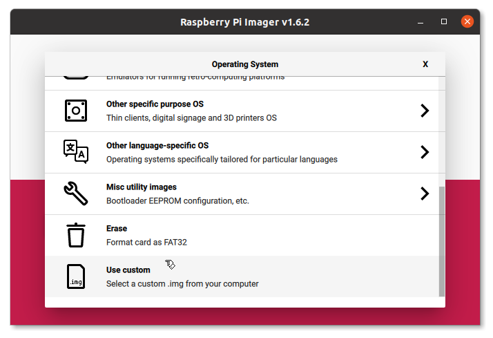
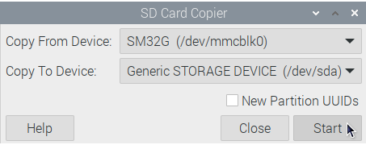

.. _getting_started_installing:

Installing
##########

Raspberry Pi images
*******************

You only need a micro SD card (minimum 8GB, recommended 16GB) and a computer with an SD card reader.

- Download your preferred OpenPlotter edition from the :ref:`Raspberry Pi images<downloading>` section in *Downloading* chapter.

- Download and install the :download:`Raspberry Pi Imager <https://www.raspberrypi.org/software/>` program for your OS. 

- Put the SD card you will use with your Raspberry Pi into the SD card reader and run *Raspberry Pi Imager*.

- Click on ``CHOOSE OS`` and then on ``Use custom``:

- Select the file of your OpenPlotter edition (you do not need to unzip it).

- Click on ``CHOOSE STORAGE`` and select your SD card.

- Click on ``WRITE`` and take a coffe.

- Remove the SD card from the reader, insert it into the Raspberry Pi and you are done.

After the first boot you can customize and localize your system changing some important settings like password or system language. You can also change these settings later in :menuselection:`Main --> Preferences --> Raspberry Pi configuration`.

.. danger::
	You MUST change the default password for the user *pi*. Otherwise, anyone will be able to access your system easily.

If you are using the **OpenPlotter Headless** edition, you should see the SSID of the access point after a few seconds of inserting the SD into the Raspberry and turning it on.

These are the access data to connect remotely to OpenPlotter when you use this headless edition:

+--------------------+-------------------------------------+
| **Access Point**   | :SSID: openplotter                  |
|                    | :Password: 12345678                 |
+--------------------+-------------------------------------+
| **IP**             | :IP: 10.10.10.1                     |
|                    | :Address: openplotter.local         |
+--------------------+-------------------------------------+
| **SSH**            | :Command: ssh pi\@openplotter.local |
|                    | :Password: raspberry                |
+--------------------+-------------------------------------+
| **Remote desktop** | :Address: openplotter.local         |
|                    | :Port: 5900                         |
|                    | :User: pi                           |
|                    | :Password: raspberry                |
+--------------------+-------------------------------------+

.. danger::
	You must change the default access point password using the *OpenPlotter Network* app. Otherwise, anyone will be able to access your system easily.

.. note::
	Using **OpenPlotter À la Carte** edition you will be able to configure all these parameters and more by filling in a form before downloading your custom OpenPlotter.

.. _backups:

Backups
=======

Once you are satisfied with your final setup, it is highly recommended to make a backup to replace the SD card in case it gets damaged. This is especially recommended if we have installed a paid nautical chart because if we have to reinstall the system, we will surely lose the license.

Raspberry Pi OS incorporates an excellent application to make a backup of the entire SD card called *SD Card copier* that you can find in :menuselection:`Main --> Accessories`

You will need to connect an external USB card reader with a new SD card the same size or larger than the internal one. In *Copy From Device* field you should select the internal card (something like */dev/mmcblk0*) and in *Copy To Device* field you should select the external card. The name of the external reader may vary, connect and disconnect the external reader several times to be sure which name appears and disappears.

.. important::
	DO NOT check the option *New Partition UUIDs*. Some programs require the original and the copy to be exactly the same in order to function properly.

.. _getting_started_installing_desktop:

Desktop and laptop
******************

First of all you have to install some dependencies. Open a terminal and type:

.. parsed-literal::

	sudo apt update
	sudo apt install python3-wxgtk4.0 python3-ujson python3-pyudev vlc

Now you have to install the *OpenPlotter Settings* app from the .deb file you will found at :ref:`Desktop and laptop<downloading_desktop>` in *Downloading* chapter

After downloading the .deb file, you can install it by double click or typing this in a terminal replacing *x.x.x-stable* by your version:

.. parsed-literal::

	sudo dpkg -i openplotter-settings_x.x.x-stable.deb

And that's all. Open *OpenPlotter Settings* app typing this in a terminal:

.. parsed-literal::

	openplotter-settings

You have to install the rest of OpenPlotter apps from this app. Read the :ref:`Settings<settings>` chapter to learn how.

Every time OpenPlotter needs to perform an action that requires administrator permission, it will ask for the password. To avoid having to continuously enter your administrator password you can add your user to the *sudoers* list. Do this only if you know what you are doing:

.. parsed-literal::

	sudo visudo

Add this line to the end of the document replacing *myuser* by your user name and save:

.. parsed-literal::

	myuser ALL=(ALL) NOPASSWD: ALL
