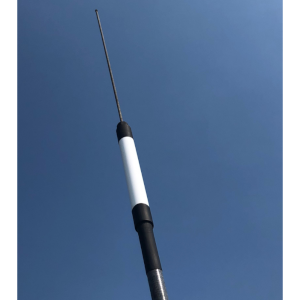
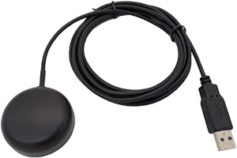

What do you need?
#################

.. admonition:: Raspberry Pi or desktop/laptop computer?

	OpenPlotter is optimized to be used on `Raspberry Pi <https://www.raspberrypi.com>`_ computers, but you can also install OpenPlotter on any desktop or laptop computer running Linux Debian or any derivative like Ubuntu, Mint ... Some OpenPlotter apps that are used to manage some sensors connected via GPIO will not be available when installed on desktop and laptop computers. See a list :ref:`here<downloading_desktop>`.

In the :ref:`downloading<downloading>` and :ref:`installing<getting_started_installing>` chapters you will learn how to get the software, let's see here what hardware we need.

Basic hardware
**************

If you want to take full advantage of all the capabilities of OpenPlotter, your choice should be to install it on a Raspberry Pi.

Although a Raspberry Pi model 3 can run OpenPlotter, we only recommend the `Raspberry Pi model 4 <https://www.raspberrypi.com/products/raspberry-pi-4-model-b>`_ in any of its RAM configurations or a `Raspberry Pi 400 unit <https://www.raspberrypi.com/products/raspberry-pi-400-unit/>`_. Raspberry Pi Zero, 1 or 2 models are not suitable to run OpenPlotter.

You will also need a keyboard, a mouse, a power supply, a microSD card and a monitor. Read this helpful guide for details on each item: https://projects.raspberrypi.org/en/projects/raspberry-pi-setting-up

.. image:: img/pi-plug-in.gif

Recommended hardware
********************

This is the hardware that we have verified to work perfectly with OpenPlotter. We have been directly involved in the design or manufacture of some of these pieces of hardware.

Monitors
========

OpenPlotter is designed to be used on monitors with a minimum resolution of 800x480 and 7” in size.

Any HDMI-connected monitor that can handle this resolution, or any higher, will work just fine, but brightness on monitors that are connected via the DSI display port can also be controlled via software.

If the monitor is touchscreen, we recommend the data input via I2C to simplify installations. We do not recommend touchscreens that require drivers.

The monitor that meets all these qualities is the `official monitor for Raspberry Pi <https://www.raspberrypi.com/products/raspberry-pi-touch-display>`_ and its clones. We particularly recommend `this clone <https://www.waveshare.com/8inch-DSI-LCD.htm>`_. We have a special edition of OpenPlotter for these touchscreens. These monitors typically have a brightness of 250/300 cd/㎡ and that means they need to be installed indoors. For outdoor installations, you need a sun-readable monitor with at least 1000 cd/㎡ and waterproof.

MacArthur HAT
=============

.. image:: https://raw.githubusercontent.com/OpenMarine/MacArthur-HAT/main/images/macarthur-diagram.png
    :alt: MacArthur HAT features

After a few years of developing software for OpenPlotter, we have identified exactly what we need in terms of hardware to achieve our goals and the result is the **MacArthur HAT** (Hardware Attached on Top), an add-on board for Raspberry Pi 4 running OpenPlotter v3. With this HAT we want to get the fully open-source boat to free ourselves from dependence on big companies and make our boats more respectful with the environment.

Its main function is to be able to communicate with any old or new marine electronic device using the proprietary and closed protocols **Seatalk1**, **NMEA 0183** or **NMEA 2000** and the free and open protocol **Signal K**.

:More info: :ref:`MacArthur HAT<macarthur>` 

AIS receivers/transponders
==========================

You can connect the AIS receiver/transponder you already have on the boat or you can choose from some open source solutions. We recommend the **dAISy HAT** (receiver) and the **MAIANA AIS transponder** (receiver/transponder).

:More info: :ref:`Connecting the dAISy HAT<dAISy>` 

:More info: :ref:`MAIANA AIS transponder<maiana>` 

Autopilot
=========

**Pypilot** is an open source autopilot for your boat and is fully integrated into OpenPlotter.

:More info: :ref:`Pypilot<pypilot>` 

Alternative hardware
********************

USB GPS receiver
================

This is the cheapest way to get position, speed and course data. Most devices on the market will work in OpenPlotter without the need for drivers.

:Example: :ref:`Connecting a USB GPS receiver<connectingGPS>` 

RS422 converters
=================

.. image:: img/rs422.jpg

NMEA 0183 communication protocol was designed to run over the RS422 serial interface, which can support a single talker and up to 10 listeners and data rates as high as 10 mbit/sec. RS422 converters in boats are typically used to get or send data to your instruments. You can find USB converters or some Raspberry Pi HATs to connect to the GPIO header.

:Example: :ref:`Connecting a USB RS422 converter<connectingRS422>` 

CAN converters
==============

NMEA 2000 communication protocol was designed to run over a Controller Area Network (CAN bus). This is a robust vehicle bus standard designed to allow microcontrollers and devices to communicate with each other's applications without a host computer. You can find USB converters or some Raspberry Pi HATs or modules to connect to the GPIO header.

:Example: :ref:`Connecting a USB CAN converter<serialCAN>`

:Example: :ref:`Connecting a GPIO CAN converter<gpioCAN>`