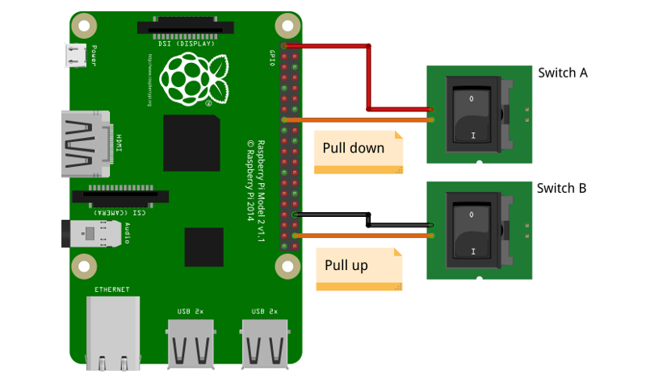
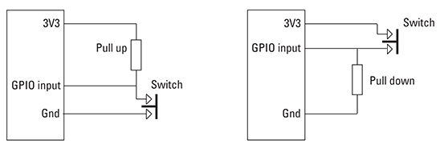
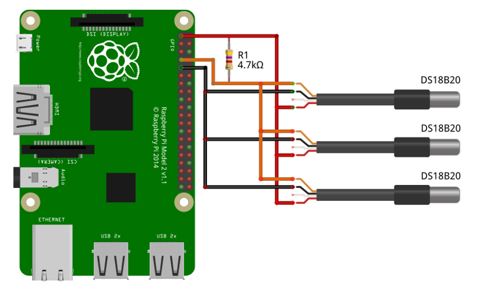

GPIO
####

To be added

Connecting to Signal K server
*****************************

To be added

Connecting sensors
******************

There are some considerations to take into account when connecting this type of sensor to our board. Most of them need an element called a pull up or pull down resistor.

In electronic logic circuits, a pull up resistor or pull down resistor is a resistor used to ensure a known state for a signal. It is typically used in combination with components such as switches and transistors, which physically interrupt the connection of subsequent components to ground or to VCC. When the switch is closed, it creates a direct connection to ground or VCC, but when the switch is open, the rest of the circuit would be left floating (i.e., it would have an indeterminate voltage). For a switch that connects to ground, a pull-up resistor ensures a well-defined voltage (i.e. VCC, or logical high) across the remainder of the circuit when the switch is open. Conversely, for a switch that connects to VCC, a pull-down resistor ensures a well-defined ground voltage (i.e. logical low) when the switch is open. 

Fortunately, the Raspberry Pi incorporates internal resistors that can be defined by software and you can directly connect the sensors to the pins of the Raspberry Pi.

Internal pull resistors
=======================

You can connect ``digital`` and ``pulse`` sensors using either external or internal pull resistors. To simplify your installation we recommend using internal pull resistors.

You have to connect one terminal of the sensor to any GPIO of your choice and you can choose between the GND pins or the 3.3V pins to connect the other sensor terminal. This is an example of 2 common switches connected in the two ways:

.. danger::
	Never connect a digital or pulse sensor to the 5V pin.

OpenPlotter will read the status of each sensor by sending 1 or 0 to the Signal K server according to how it has been connected and configured:

+------------+---------------------------+----------------------------+
|**Settings**|**connected to GPIO + GND**|**connected to GPIO + 3.3V**|
+------------+---------------------------+----------------------------+
| none       | external pull up resistor | external pull down resistor|
+------------+---------------------------+----------------------------+
|            |                           |                            |
| pull up    |.. image:: img/open.png    |                            |
|            |    :align: left           |                            |
|            |                           |                            |
|            |=  1                       |   No data                  |
|            |                           |                            |
|            |.. image:: img/closed.png  |                            |
|            |    :align: left           |                            |
|            |                           |                            |
|            |=  0                       |                            |
+------------+---------------------------+----------------------------+
|            |                           |                            |
| pull down  |                           |.. image:: img/open.png     |
|            |                           |    :align: left            |
|            |                           |                            |
|            |      No data              |=  0                        |
|            |                           |                            |
|            |                           |.. image:: img/closed.png   |
|            |                           |    :align: left            |
|            |                           |                            |
|            |                           |=  1                        |
+------------+---------------------------+----------------------------+

See the chapter dedicated to each type of sensor for more information about the configuration. 

External pull resistors
=======================

There are some cases where it is necessary to use external pull resistors. The pull resistor value can be from 4.7KΩ to 10KΩ depending on the sensor specifications. This is an example of the connection of both methods:

This is the case for most ``1W`` sensors. The internal pull resistor of the Raspberry Pi is around 50KΩ and is too high for the proper functioning of these sensors. The specifications indicate that you have to use a 4.7KΩ pull up resistor and that you can connect multiple sensors using a single resistor.

Multiple 1W sensors (DS18B20) connection example using a single pull up resistor:

.. danger::
	Never connect a 1W sensor to the 5V pin.

Seatalk-1
=========

To be added
