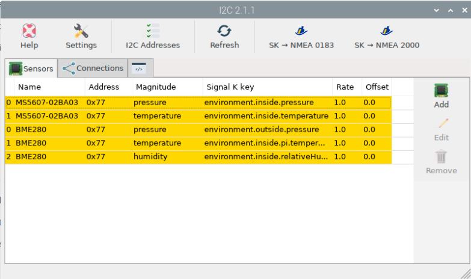
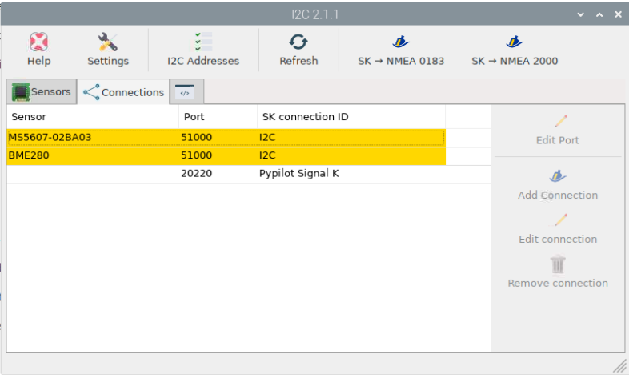

I²C
###

What is I²C?
------------

In a nutshell, I²C (Inter-Integrated Circuit) is a reliable, cheap, well-defined means of connecting sensors to OpenPlotter.

For details, refer to https://en.wikipedia.org/wiki/I%C2%B2C.

Setting up I²C on Raspberry
---------------------------

Install OpenPlotter I²C app
+++++++++++++++++++++++++++
Go into >Openplotter>Settings and then hit refresh.

In the list of openplotter Apps, go down to I²C Sensors and select then install.

Switching on I²C on your Raspberry
++++++++++++++++++++++++++++++++++
In the menu of Raspbian OS, go to >Preferences>Rasp Pi Config to start the Raspberry Config tool.

Select [5 Interfacing Options], and then enable I2C.

Once enabled, hit <Finish> and reboot your Raspberry. After reboot, I2C bus is enabled.

.. image:: https://www.raspberrypi.com/documentation/computers/images/raspi-config.png

Further information can be found on the official Raspberry website. [1]_

Powerdown(!) the Pi and install the sensor(s)
++++++++++++++++++++++++++++++++++++++++++

I²C require four connections ("cables") between you sensor and your Raspberry.

Two pins, GND "ground" and 3.3V "power" provide exactly that, 3.3 V power to your sensor. It's obvious, your sensor has to be specified to run with 3.3 V. Sensors rated for 5.0 V will not work on your Raspberry. Some sensors on the market can handle both voltages.

Two more pins, SDA "Data" and SCL "Clock", are used to transmit data between your Raspberry and the sensor chips. 

On a Raspberry pi, you need to connect pins 1 (3.3V), 3 (SDA), 5 (SCL), 9 (GND).  [2]_

Soldering or Plug'n'Play?
+++++++++++++++++++++++++

There are sensors on the market, that are connected with the four ports (3.3v power, GND, SDA, SCL) by simply soldering four cables and connect them the PI.

To make life easier for prototyping, plug-and-play connectors have been developed. 
Amongst them "Stemma QT" [3]_ and "QWIIC" [4]_ are quite common and offer a variety of sensors and other peripherls.

If you use those connectors, you require on the Raspberry side of things a 4-Pin female 2mm socket cable.

Once all connections are solid, power the Pi back up.

Configure the I²C OpenPlotter app 
---------------------------------

Got to >Openplotter>I2C and add all sensors providing a name for each that makes sense and fits with the Signal K specification, see http://signalk.org/specification/1.0.4/doc/signalk.pdf, see the picture below:

On the connection Tab, add connection to Signal K for each of the sensors:

.. note::
	The Pypilot entry will not show up until you have done the Pypilot configs

.. [1] https://www.raspberrypi.com/documentation/computers/configuration.html#raspi-config
.. [2] https://pinout.xyz/pinout/i2c
.. [3] https://learn.adafruit.com/introducing-adafruit-stemma-qt/what-is-stemma-qt
.. [4] https://www.sparkfun.com/qwiic
