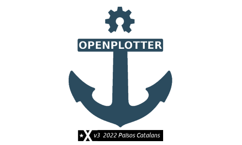

Welcome to OpenPlotter's documentation!
#######################################

.. toctree::
   :maxdepth: 1
   :caption: Description
   :name: sec-description

   description/what_is_openplotter
   description/features
   description/examples
   description/what_do_you_need
   description/how_does_it_work
   description/how_to_collaborate

.. toctree::
   :maxdepth: 1
   :caption: Getting started
   :name: sec-getting_started

   getting_started/downloading
   getting_started/installing
   getting_started/first_boot
   getting_started/updating
   getting_started/backup
   getting_started/recovery_system

.. toctree::
   :maxdepth: 1
   :caption: Settings App
   :name: sec-settings

   settings/settings_app

.. toctree::
   :maxdepth: 1
   :caption: OpenCPN Installer App
   :name: sec-opencpn

   opencpn/opencpn_app

.. toctree::
   :maxdepth: 1
   :caption: Signal K Installer App
   :name: sec-signalk

   signalk/signalk_app

.. toctree::
   :maxdepth: 1
   :caption: Network App
   :name: sec-network

   network/network_app

.. toctree::
   :maxdepth: 1
   :caption: Actions
   :name: sec-actions

   actions/what_are_actions
   actions/triggers
   actions/conditions
   actions/actions
   actions/examples

.. toctree::
   :maxdepth: 1
   :caption: Credentials
   :name: sec-credentials

   credentials/what_are_credentials
   credentials/mqtt
   credentials/twitter
   credentials/telegram
   credentials/encrypt

.. toctree::
   :maxdepth: 1
   :caption: Dashboards
   :name: sec-dashboards

   dashboards/what_are_dashboards
   dashboards/instrumentpanel
   dashboards/kip
   dashboards/nodered_dashboard
   dashboards/influxdb_grafana
