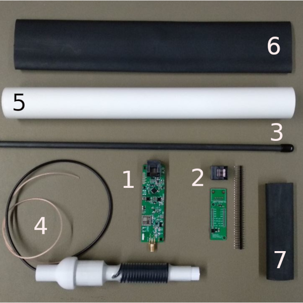

Assembling
##########

.. note::

	This is a summary of the `official assembly manuals <https://github.com/peterantypas/maiana/tree/master/latest/Manuals>`_.

1. The main PCBA (in ESD envelope).

2. The UART adapter (in ESD envelope).

3. The antenna tube.

4. The antenna core (coiled wire with SMA male on one end).

5. The main case (high-UV resistance PVC).

6. 1.5” 2:1 heat shrink tube, black.

7. ¾” 4:1 heat shrink tube, black.

Under construction
