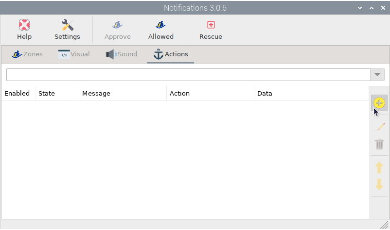
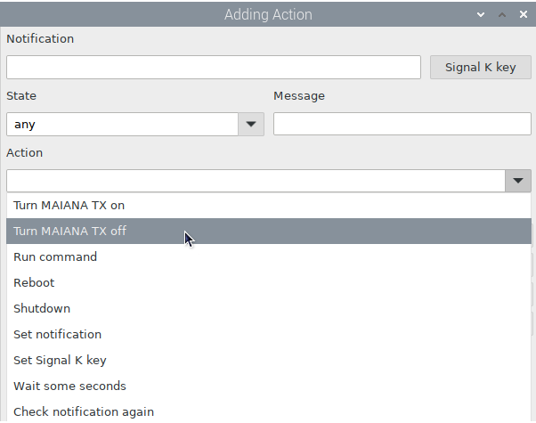
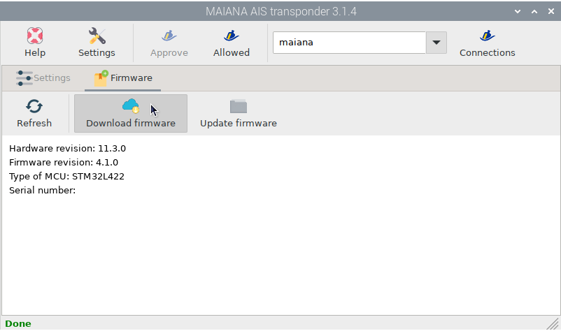
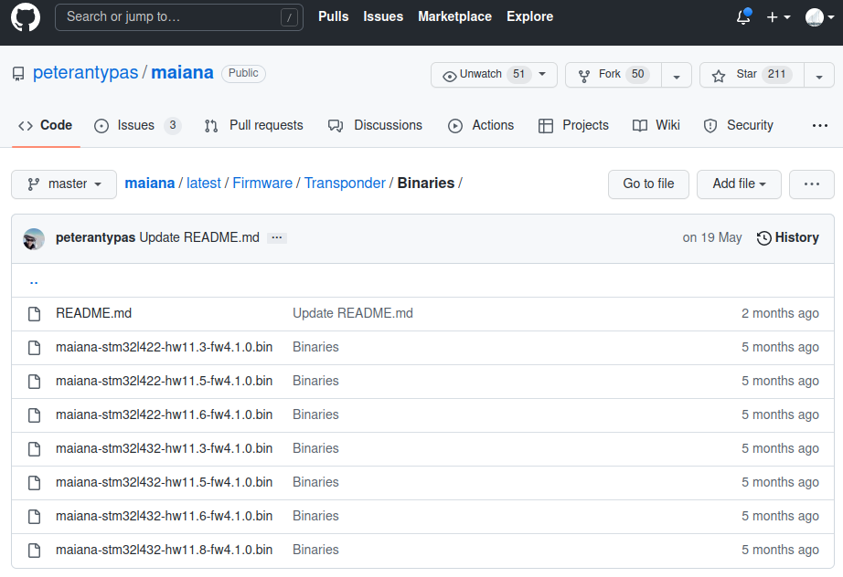
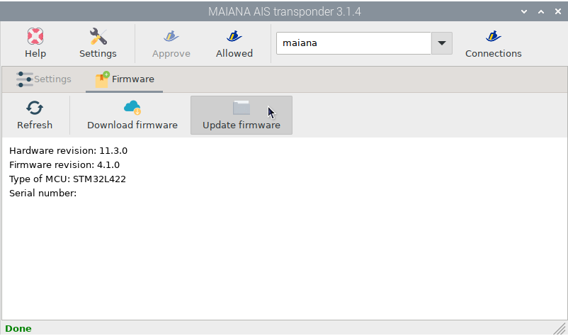

.. |OPmaiana| image:: img/openplotter-maiana.png
.. |OPuart| image:: img/uart.png
.. |OPserial| image:: img/usb.png
.. |OPrefresh| image:: img/refresh.png
.. |OPapply| image:: img/apply.png
.. |OPconnections| image:: img/connections.png
.. |OPsk| image:: img/sk.png
.. |OPinstall| image:: img/install.png
.. |OPswitch-on| image:: img/switch-on.png
.. |OPnotifications| image:: img/openplotter-notifications.png
.. |OPdownload| image:: img/update.png
.. |OPfile| image:: img/file.png

Configuring OpenPlotter
#######################

You can configure OpenPlotter to get AIS and GNSS data from a MAIANA transponder with just a few clicks. You will also learn how to enable transmission, configure the device, and update the firmware.

Getting AIS and GNSS data
*************************

MAIANA is ready to rceive and send AIS and GNSS data out of the box, just power on the device and connect by USB or UART to OpenPlotter. We want to send MAIANA data to the Signal K server so that any program like OpenCPN can access AIS and GNSS data. We will do it easily using the |OPserial| *OpenPlotter Serial* app.

If you are connected by UART, first of all you need to enable the UART interface of your Raspberry Pi. Click |OPuart| ``UART0`` and then click ``Yes``. Remember that enabling the UART interface will disable Bluetooth. If you are connected by USB, skip this step.

.. image:: img/maiana8.png
.. image:: img/maiana9.png

After enabling UART or just plugging in the USB and clicking |OPrefresh| ``Refresh``, you will see a new device listed. Select this new device and provide a short name for the *alias* and select NMEA 0183 under *data*. If it is connected by USB check *Remember device* and if it is connected by UART check *Remember port*. Click |OPapply| ``Apply`` when done.

.. image:: img/maiana10.png

Go to the |OPconnections| *Connections* tab and select the new device you just created. Click |OPsk| ``Add to Signal K`` and then click ``AUTO``. A connection will be created on the Signal K server for your device.

.. image:: img/maiana12.png
.. image:: img/maiana13.png

Make sure there is an OpenCPN enabled connection to the Signal K server and your are done.

.. image:: ../img/opencpnConnection.png
.. image:: ../img/opencpnAIS.jpg

Connecting to MAIANA
********************

Using the |OPmaiana| *OpenPlotter MAIANA AIS transponder* app you can manage all the settings of your device. Open *OpenPlotter Settings* app, select this app and click |OPinstall| ``Install``.

.. image:: img/maiana17.png

Once the *OpenPlotter MAIANA AIS transponder* app is installed, we have to create a connection between this app and the Signal K server. Open the app and a connection request will automatically be sent to the Signal K server. Click |OPsk| ``Approve`` to access the administrator of the Signal K server:

.. image:: img/maiana18.png

Select the new request and then select *Read/Write* in *Permissions* and click ``Approve``:

.. image:: img/maiana19.png
.. image:: img/maiana20.png

Go back to the *OpenPlotter MAIANA AIS transponder* app and click |OPrefresh| ``Refresh``:

.. image:: img/maiana21.png

Now we have to select the connection we previously configured with the *OpenPlotter Serial* app by clicking on the ``MAIANA Signal K connection`` field:

.. image:: img/maiana22.png

And that's it. All connections have been made and you will be able to communicate with MAIANA every time you open the *OpenPlotter MAIANA AIS transponder* app and the device is turned on. If you can not get a connection the first time, try again by clicking |OPrefresh| ``Refresh``.

.. image:: img/maiana23.png

Enabling transmission
*********************

If we want to enable transmission, we must provide the station data. Complete the form using this syntax for each field:

- MMSI (you should have one for your boat already)
- Vessel name (up to 20 alphanumeric characters, no punctuation. Use all caps)
- Call sign (may be empty if you don’t have one)
- Vessel type (this is the numeric type of the vessel, see below)
- LOA - Length in meters (integer only)
- Beam (width) in meters (integer only)
- Port Offset (meters from the port side where the unit is located)
- Bow Offset (meters from the bow where the unit is located)

For vessel type, here are some numeric values that apply to class B transponders:

- 30 - Fishing
- 34 - Diving
- 36 - Sailing
- 37 - Pleasure craft

Click |OPapply| ``Save station data`` when you are done:

.. image:: img/maiana24.png

You will see that the value of *Station data* has changed to *provided* in green:

.. image:: img/maiana25.png

There are 2 switches to turn on/off transmission:

:Hardware: There is a physical switch on all the adapters. The breakout board also has a pin for this. This switch has priority over the Software switch.

:Software: You will find a button *Software TX switch* in *OpenPlotter MAIANA AIS transponder* app.

This is the relation between the two states of these switches:

+----------+----------+-----+
| Hardware | Software | TX  |
+==========+==========+=====+
| ON       | ON       | ON  |
+----------+----------+-----+
| ON       | OFF      | OFF |
+----------+----------+-----+
| OFF      | X        | OFF |
+----------+----------+-----+

Turn on your Hardware switch and you will see that the value of *Hardware TX switch* has changed to *ON* in green:

.. image:: img/maiana26.png

Now click |OPswitch-on| ``Software TX switch`` and you will see that the value of *Software TX switch* has changed to *ON* in green and the value of *Status* has changed to *transmitting* in green:

.. image:: img/maiana27.png

Congratulations, you are already transmitting!

Notifications actions
*********************

If you have the |OPnotifications| *OpenPlotter Notifications* app installed, you will see two new actions added to the list to automatically turn the software TX switch on and off upon receiving a specific notification:

Detecting EMI
*************

MAIANA constantly checks for noise floor on both channels to detect any electromagnetic interference (EMI) near your device. If you enable |OPnotifications| ``Detect noise`` and the noise level is higher than 64, an alert notification will be sent to the Signal K server.

.. image:: img/maiana28.png

If you have the |OPnotifications| *OpenPlotter Notifications* app installed, you will see an alert window like this one:

.. image:: img/maiana29.png

Updating firmware
*****************

You will receive your MAIANA base kit with the latest stable firmware installed. Go to the |OPinstall| *Firmware* tab and click |OPrefresh| ``Refresh`` to see the version of your device:

.. image:: img/maiana30.png

Click |OPdownload| ``Download Firmware`` to find the bin file that corresponds to your MCU and hardware revision from the project page:

Ignore the last digit of your hardware revision -- it doesn't matter. So if you have board 11.3.0 with an STM32L422 processor, the right binary is maiana-stm32l422-hw11.3-fwXXX.bin where XXX is the latest revision you see here. If you already have this firmware on your board, there is no update:

Once the correct file is downloaded click |OPfile| ``Update firmware`` to start the firmware update process:

Select the file, click ``Open`` and finally ``Yes``:

.. image:: img/maiana31.png
.. image:: img/maiana32.png

The system will stop the Signal K server to make sure it can take control of the device and load the new firmware. When done, both the Signal K server and the device will reboot:

.. image:: img/maiana33.png
