Configuring OpenPlotter
#######################

Under construction

Getting AIS and GNSS data
*************************

Under construction

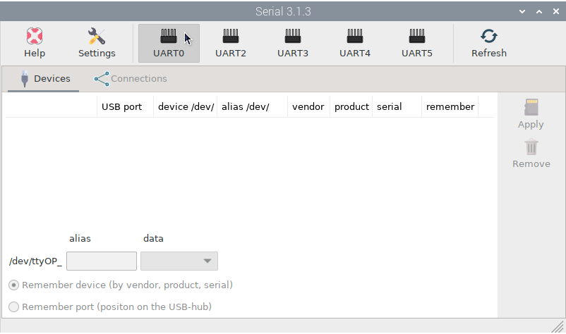
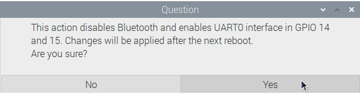
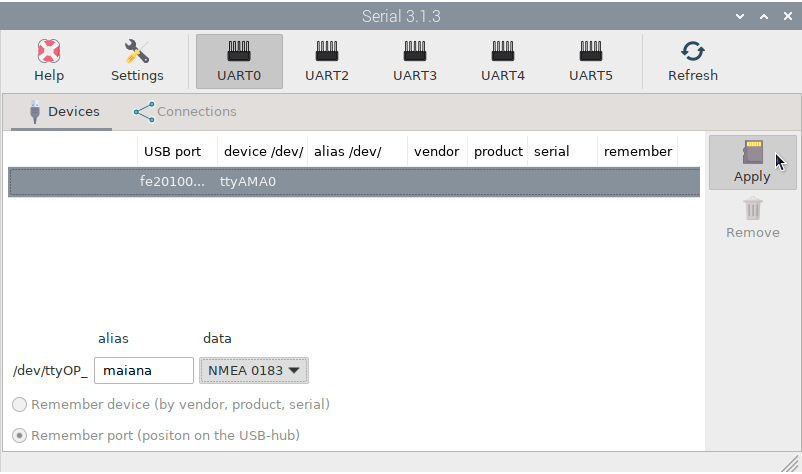
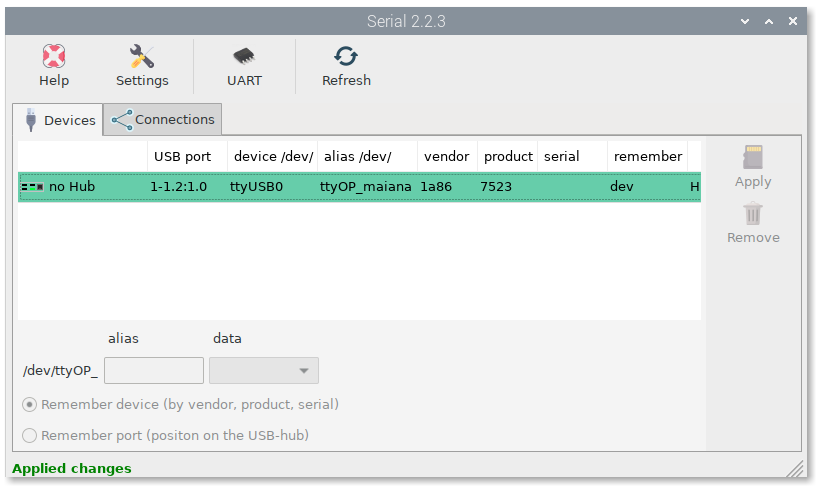
.. image:: img/maiana12.png
.. image:: img/maiana13.png
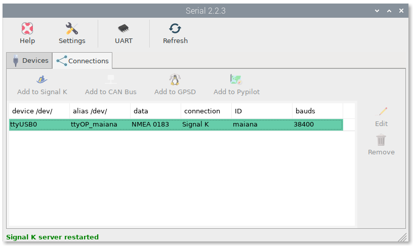
.. image:: img/maiana15.png
.. image:: img/maiana16.jpg

Connecting to MAIANA
********************

Under construction

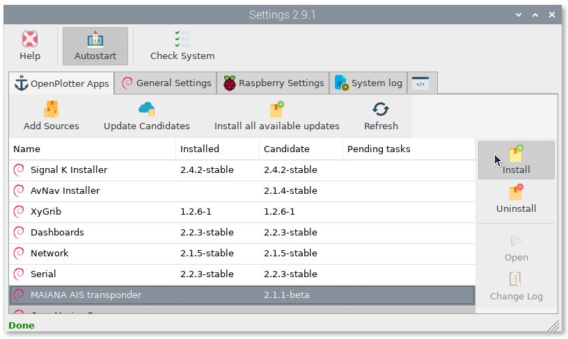
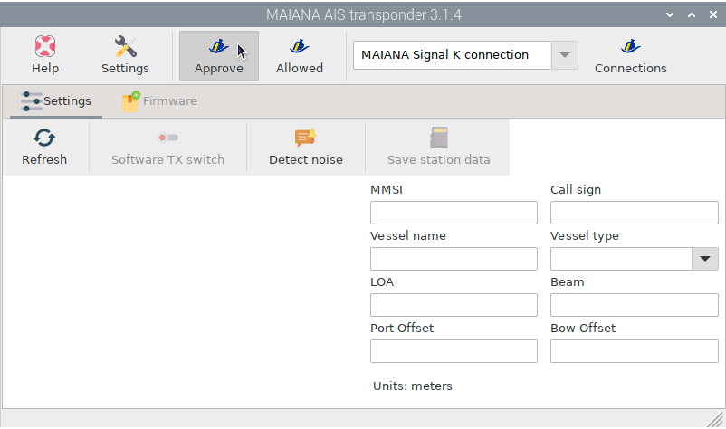
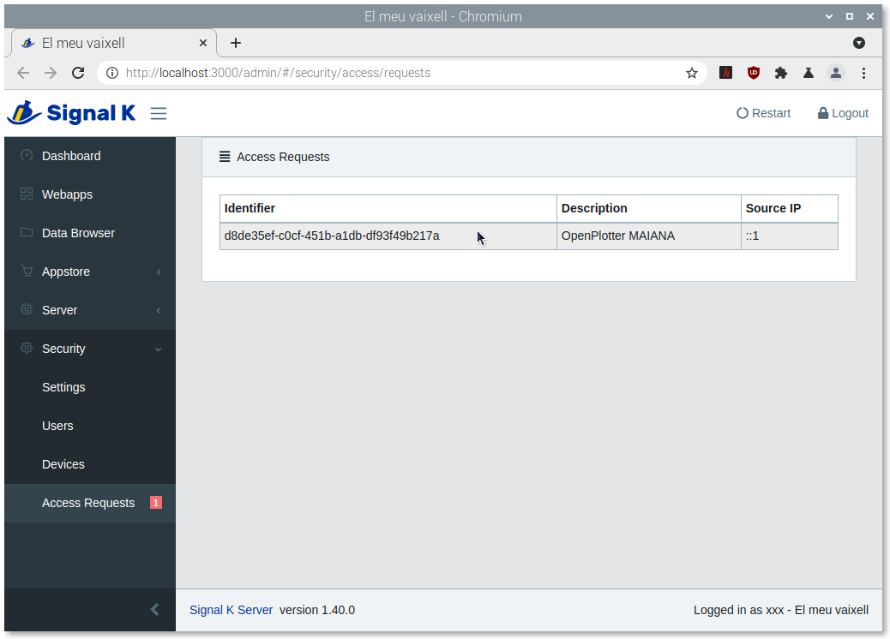
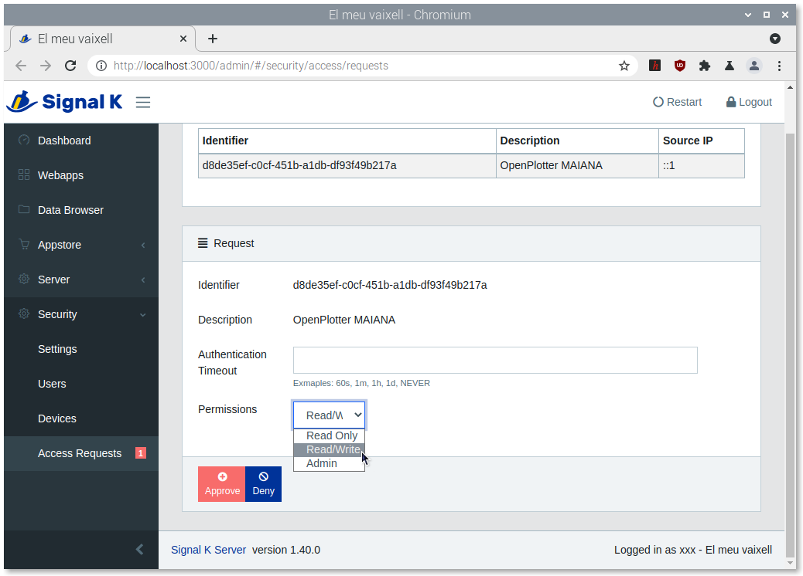
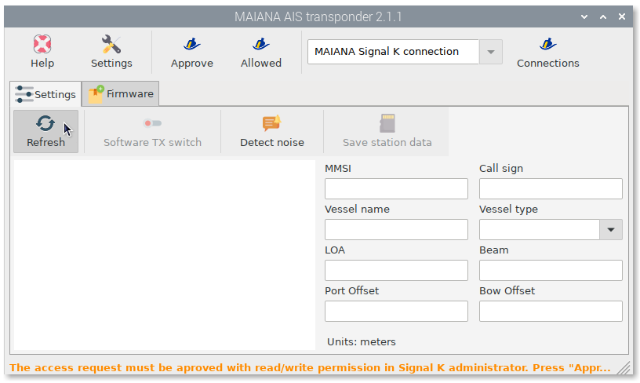
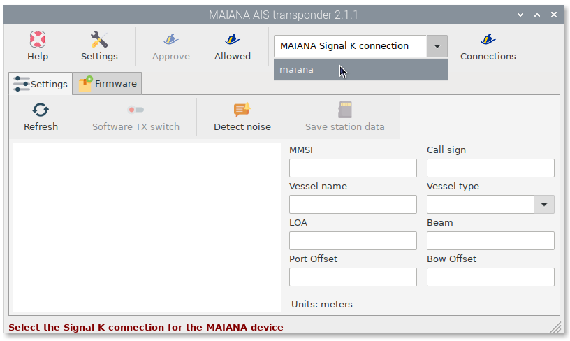
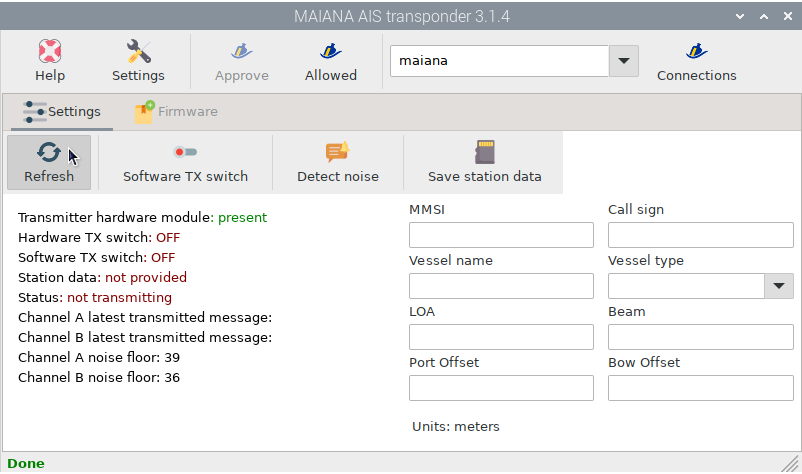

Enabling transmission
*********************

Under construction

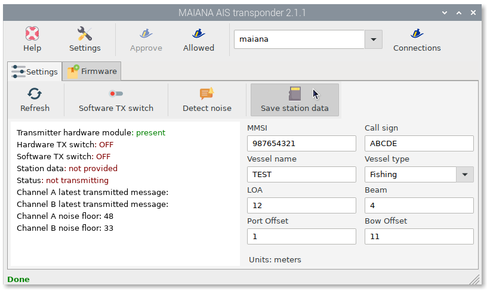
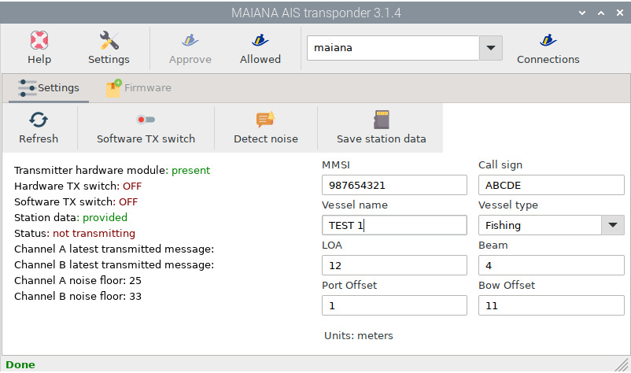
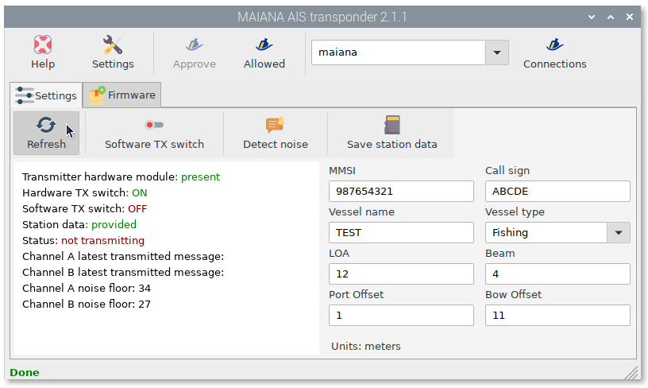
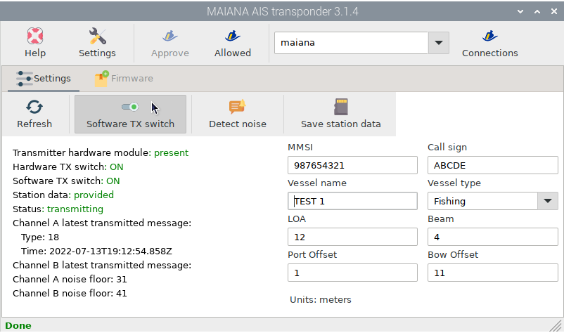

Detecting EMI
*************

Under construction

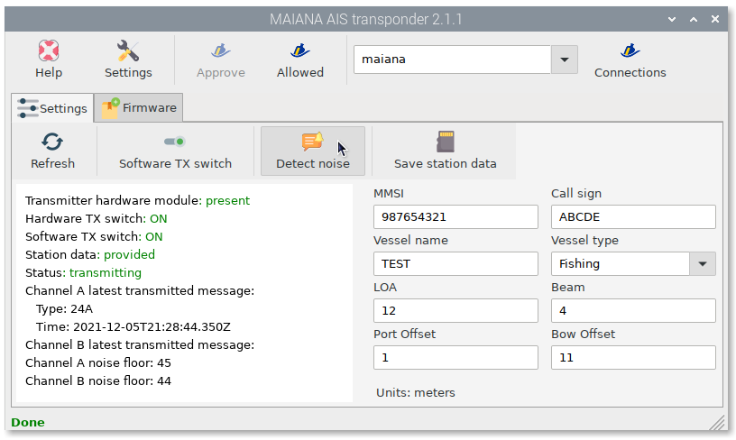
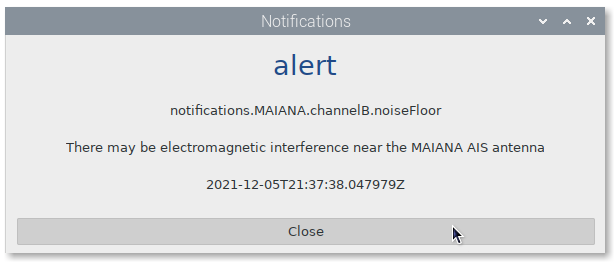

Updating firmware
*****************

Under construction

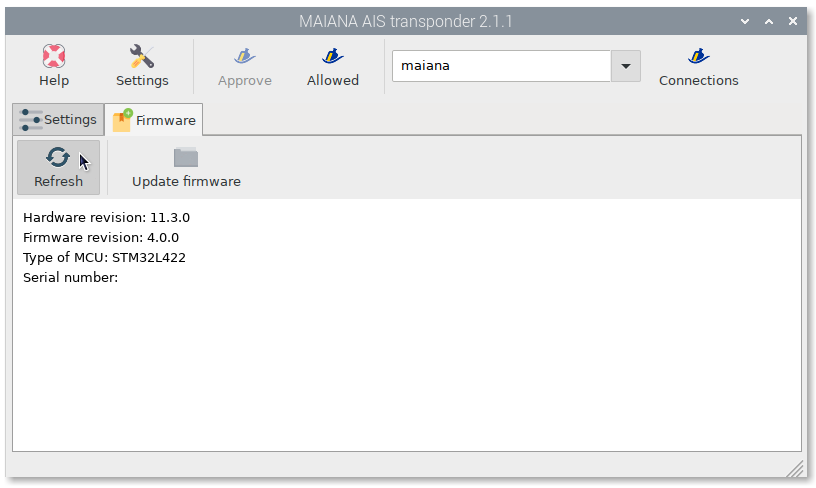
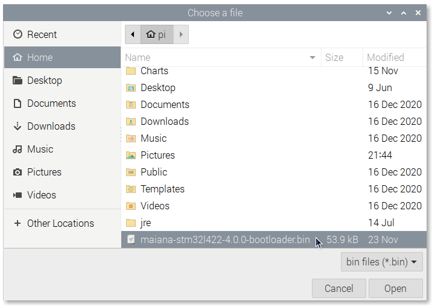
.. image:: img/maiana32.png
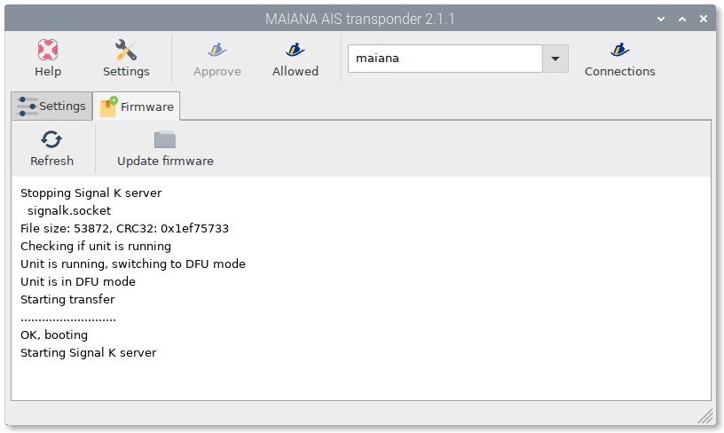
