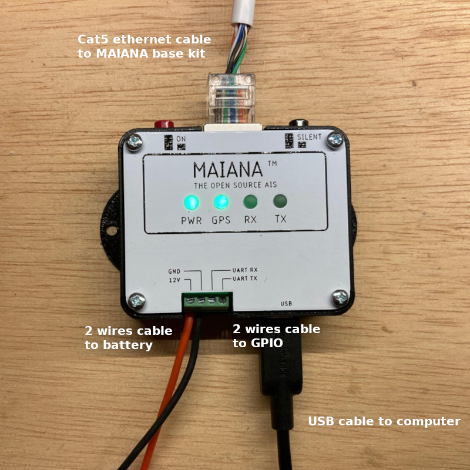
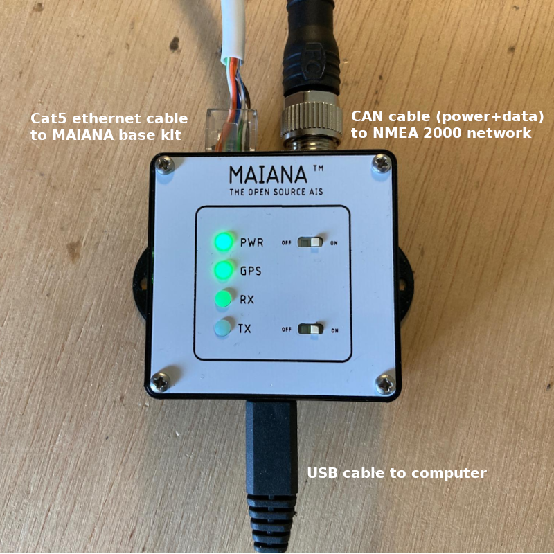

Connecting the base kit
#######################

After the MAIANA base kit assembly process, you need to connect it to your boat via the Cat5 ethernet cable to power it, get AIS/GNSS data and configure the device. You have 4 options:

Breakout board
**************

This board is included with the base kit and it is designed so that you can incorporate MAIANA into your projects. Both USB and UART connections are used to get AIS/GNSS data, configure the device or update the firmware.

 .. image:: img/usb-uart-adapter.png

If you want a power and/or TX switch, you can use simple rocker switches. A 1A-rated SPST can simply interrupt the main 12V supply.

If you want a hardware switch for *silent mode*, you need to remember that transmission is disabled if the TX_OFF signal is driven to a logic *high* (above 2V), so wire it as shown in the picture.

The LED signals are open drain outputs. Rather than supplying a voltage, they pull the cathode of the
LED to GND via a built-in 100 Ohm resistor. The voltage you apply to the anode is flexible (up to 30V tolerated), but the breakout supplies 3.3V so take advantage! That said, some LEDs may still draw too much current and will need an extra resistor added in series. You can wire that on either the anode or the cathode side.

USB + UART adapter
******************

Both USB and UART connections are used to get AIS/GNSS data, configure the device or update the firmware. This adapter has the same functions as the included *breakout board* but incorporates status LEDs, switches and is soldered and assembled.

USB + RS422 Adapter
*******************

USB connection is used to get AIS/GNSS data, configure the device or update the firmware. RS422 connection is used only to send AIS/GNSS data to the NMEA 0183 network of your boat. This adapter incorporates status LEDs, switches and is soldered and assembled.

.. image:: img/usb-rs422-adapter.png

USB + CAN Adapter
*****************

USB connection is used to get AIS/GNSS data, configure the device or update the firmware. CAN connection is used only to send AIS/GNSS data to the NMEA 2000 network of your boat and power the device. This adapter incorporates status LEDs, switches and is soldered and assembled.

