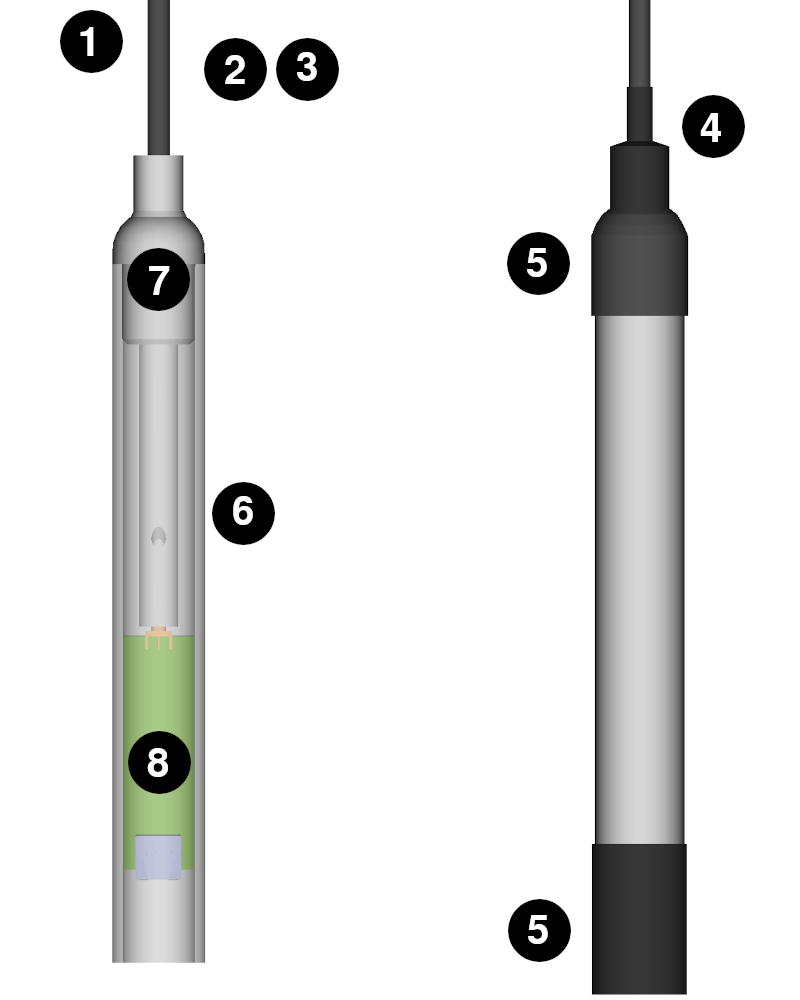

MAIANA AIS Transponder
######################

.. image:: img/maiana1.png

MAIANA™ is the first Open Source AIS transponder.

The main difference between MAIANA and all commercial AIS devices is that it is a self-contained unit, all AIS and GNSS circuits are located in the antenna housing. MAIANA receives GNSS and AIS data on both channels and can be enabled as a class B transponder. The transponder outputs just over 2 Watts (+33dBm). It has a verified range of over 20 nautical miles on a masthead and 10+ miles on a pushpit.

.. note::
	This product is available in the `OpenMarine Shop <http://shop.openmarine.net/>`_.

	On the `official page <https://github.com/peterantypas/maiana>`_ you will find the full specification and a better option for US/Canada users to get a kit. 

**Disclaimer**

MAIANA™ devices are not finished products, they need to be assembled by end users to function. MAIANA™ devices are distributed for research and development purposes. MAIANA™ devices are delivered with the ability to transmit disabled by default and have not been tested for compliance with regulations governing transmission of radio signals. End users are legally responsible for using the MAIANA™ device for transmission. We do not recommend to rely solely on MAIANA™ devices for navigation and collision avoidance.

**Assembly**

.. image:: img/items.png

#. The vinyl end cap for the antenna tube.
#. 48” of ⅜” 2:1 heat shrink tube, folded.
#. The antenna tube (two telescopic sections).
#. 6” of ¾” 4:1 heat shrink tube, black (enough for 2 builds).
#. 12” of 1.5” wide heat shrink tubing, black (enough for 2 builds).
#. The main case (high-UV resistance PVC).
#. The antenna core (coiled and stripped coax with SMA male on one end).
#. The main PCBA (in ESD envelope).
#. The unsoldered breakout board (in ESD envelope).

Easy assembly. To complete the installation you will need:

- A pair of strong scissors for cutting (thick) heat shrink tubing.
- A heat gun for the heat shrink tubing. You will need this both on your workbench for the initial assembly, as well as on your boat for the final installation. Alternatives: `How to Use Heat Shrink Tubing Without a Hot Air Gun <https://clevercreations.org/heat-shrink-tubing-without-heat-gun/>`_. Beware of anything that projects a flame, as it can easily melt the PVC enclosure!
- 1” OD steel railing or a similar diameter fiberglass mast on your boat. This is the preferred way to mount the unit. You may, of course, use your own mechanism, but then you are responsible for sealing the (bottom) cable end from moisture.
- A Cat5 cable for connecting the main unit to the breakout board in the cabin. This should be a regular *patch* cable and not a *crossover* cable. Pick one with appropriate length and flexibility to suit your installation. The exact configuration of the cable (568A or 568B) is not important.
- Some kind of instant glue to secure the end cap of the antenna tube.
- If you are using the included breakout board you will need a soldering iron for the RJ45 connector and “breakaway” pin headers. All other optional adapters are mounted and soldered.

.. note::

	Download the `official assembly manuals <https://github.com/peterantypas/maiana/tree/master/latest/Manuals>`_.