.. |OPserialUart| image:: img/uart.png
.. |OPserialUSB| image:: img/usb.png
.. |OPserialApply| image:: img/apply.png
.. |OPserialConnections| image:: img/connections.png
.. |OPserialSK| image:: img/sk.png
.. |OPpypilot| image:: img/autopilot.png
.. |OPpypilotServices| image:: img/process.png

Hacking the Moitessier HAT 1/2
##############################

.. important:: 

	The `Moitessier HAT developers <https://www.rooco.eu/2021/03/09/our-plans-with-moitessier-hat/>`_ dropped support for the drivers leaving hundreds of users with unusable devices on Raspberry OS bullseye. Despite the promise of transferring manufacturing to interested companies or opening up the sources of hardware and software, this has never happened. At OpenMarine we consider this unacceptable and we promise to never again support closed and proprietary products.

	In this document, we offer a way to hack the Moitessier HAT 1 and 2 models without damaging the hardware or software to get rid of the drivers and give it a second life using most of its features in OpenPlotter v3.x.x.

This hack will make any Moitessier HAT 1 or 2 work again without drivers. The goal is to trick the HAT into thinking it is running without being connected to a Raspberry (standalone mode) and forward the AIS/GNSS data output to UART0 instead of SPI0.0. The rest of the data (compass, heel, trim, temperature and pressure) will work as usual. The shutdown button is the only thing that will not work with this hack.

What do you need?
*****************

You just need a jumper, the pin header extender that comes with your Moitessier HAT and some small pliers to pull out some pins.

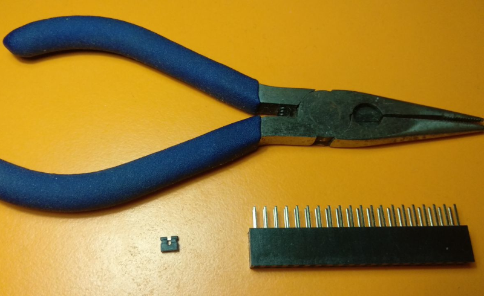

With the help of the pliers we have to pull hard on pins 27 and 28 (GPIO0 and GPIO1) until we extract them. In this way we prevent the EEPROM from connecting to the Raspberry and the HAT thinks that it is working in standalone mode.

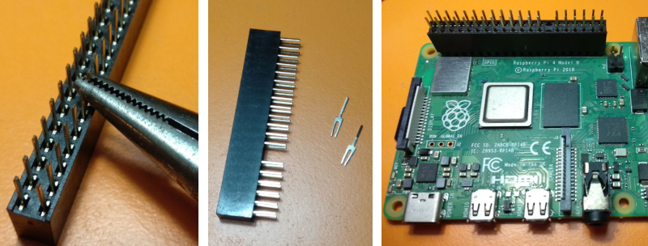

Finally, we need to bridge the pins that you see in the picture below using a jumper. In this way we send the data from a back door, which all Moitessier HAT models have, to the pin 10 of the Raspberry (GPIO15 UART0 RX). And that is it, now you just have to configure OpenPlotter to receive data in this new situation.

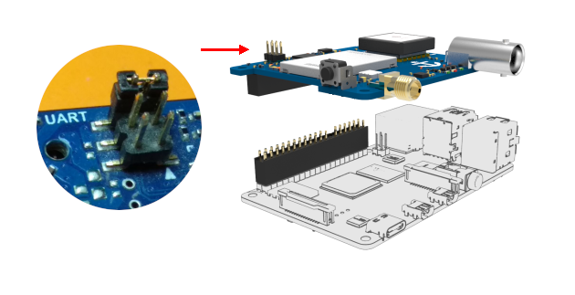

Configuring AIS and GNSS reception
**********************************

After mounting the Moitessier HAT using the modified header extender, go to the |OPserialUSB| *OpenPlotter Serial* app and enable a serial port in the GPIO header of the Raspberry Pi by clicking the |OPserialUart| ``UART0`` icon:

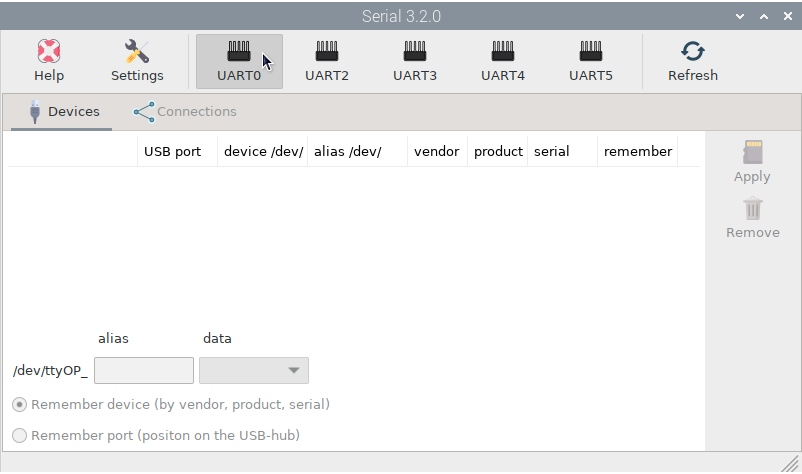

Acknowledge the warning, and reboot the Raspberry Pi:

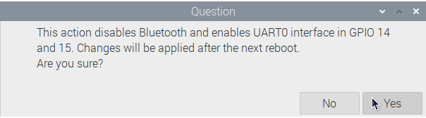

After the reboot, launch the *OpenPlotter Serial* app again. On the |OPserialUSB| *Devices* tab, you should now see a new entry. Select the line with *ttyAMA0*, give it an alias (for example aisgnss) and select *NMEA 0183* from the data dropdown, then press |OPserialApply| ``Apply``:

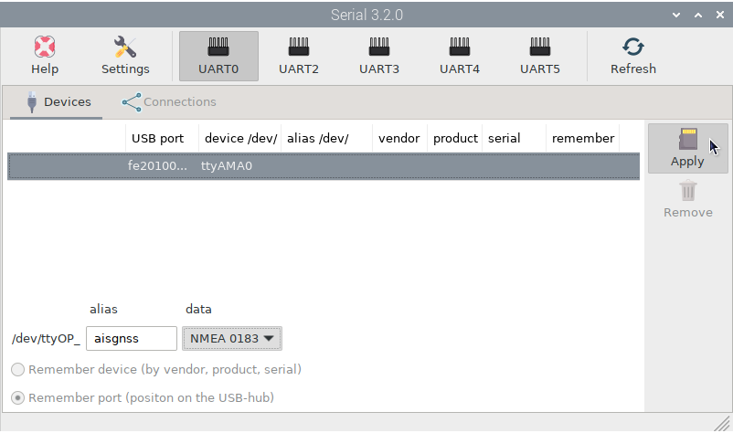

Now we need to connect the *ttyOP_aisgnss* device to the Signal K server, the central data processing hub of OpenPlotter. Switch to the |OPserialConnections| *Connections* tab, select the *ttyOP_aisgnss* device and click |OPserialSK| ``Add to Signal K``:

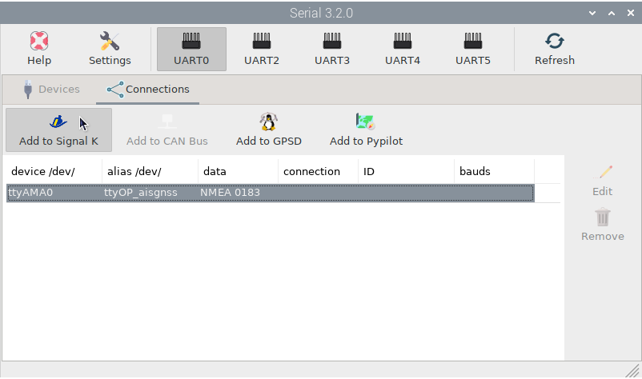

Select *921600* as the *Baud Rate* and press ``AUTO``.

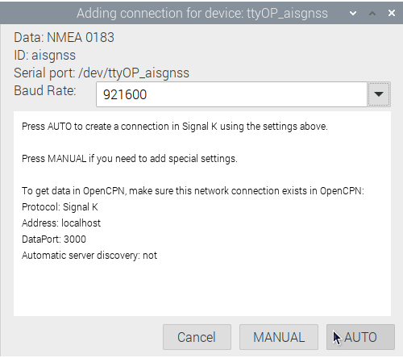

You are done, the Signal K server and any program connected to it, such as OpenCPN, should now receive AIS data. Check OpenCPN to make sure there is a connection to the Signal K server and it is getting data from your Moitessier HAT:

.. image:: ../img/opencpnConnection.png

.. figure:: ../img/opencpnAIS.jpg

	AIS and GNSS

Configuring compass, heel and trim reception
********************************************

Go to the |OPpypilot| *OpenPlotter pypilot* app. You should see *Detected IMU: MPU-925x* in |OPpypilotServices| *Services* tab. Select *Enable IMU Only* and you are done:

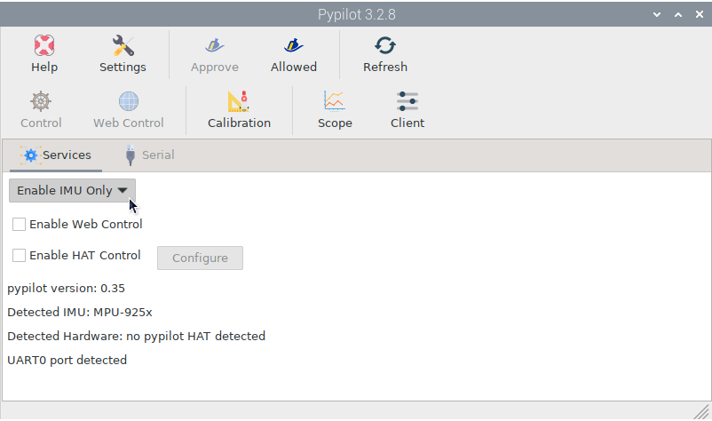

The Signal K server and any program connected to it, such as OpenCPN, should now receive magnetic heading, heel and trim data:

.. figure:: img/compass6.png

	Magnetic Heading (circle), Course Over Ground (square)

.. important:: 

	To get reliable magnetic heading readings you have to calibrate the compass following the steps of the Pypilot :ref:`compass calibration<calibration>` chapter.

Configuring pressure reception
******************************

Go to the |OPi2c| *OpenPlotter I2C* app and click |OPi2c| ``Add``:

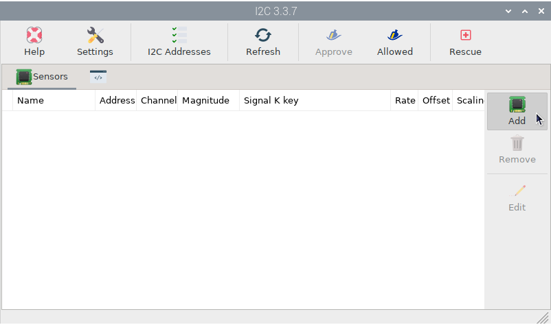

Select *MS55607-02BA03* sensor, *0x77* address (0x68 is the IMU) and press ``OK``:

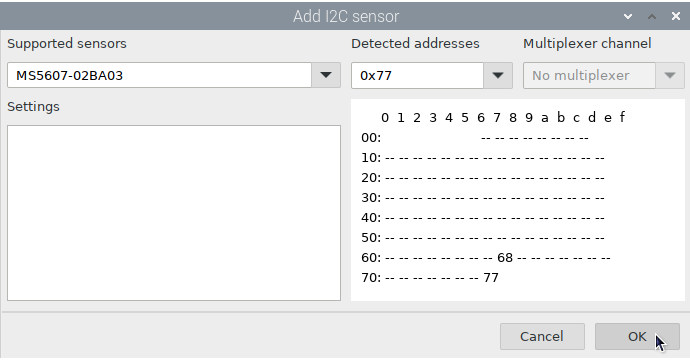

A Signal K key will be created for pressure by default. You can assign another one for temperature. Select the *temperature* item and click |OPi2cEdit| ``Edit``:

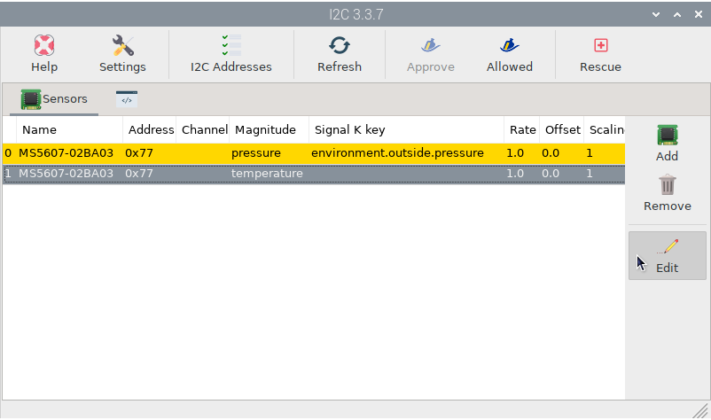

The temperature sensor is affected by the heat produced by the Raspberry and the HAT itself, so we can not assign this value to environment.inside.temperature key, we should use something like environment.inside.moitessier.temperature. We do not need to check this temperature every second, so we will select 5 seconds as *Rate*. Click ``OK`` when you are done:

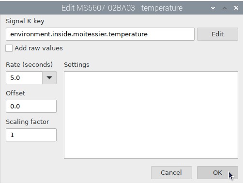

We do not need to check the pressure every second either, so we will edit the *pressure* item to put 30 seconds in *Rate*:

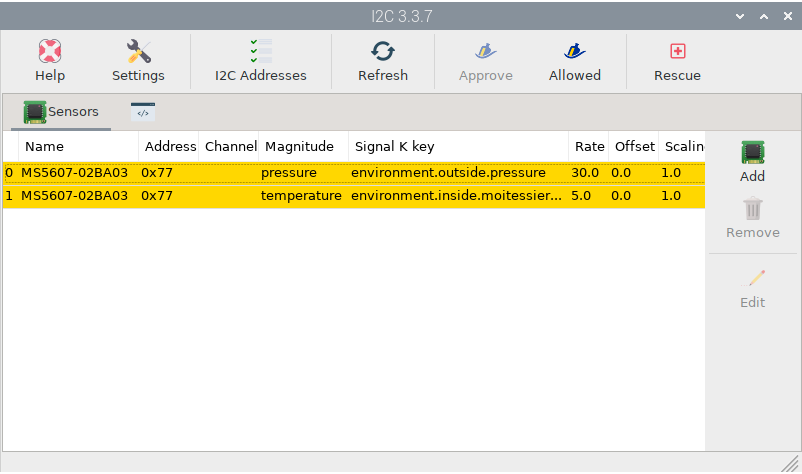

You are done, the Signal K server and any program connected to it, such as OpenCPN, should now receive pressure data:

.. figure:: img/pressure10.png

	Heel, Pitch and Pressure
