Configuration
#############

.. sidebar:: OpenPlotter Moitessier HAT edition

   `Download <https://nx8035.your-storageshare.de/s/mgakCZ5BSJYsysa>`_ the img or NOOBS file and follow the :ref:`basic manual<getting_started_installing>` to install it on your SD card.

The easiest way to make Moitessier HAT work on Raspberry Pi is to download and install a special OpenPlotter edition. Everything is preinstalled and preconfigured in *OpenPlotter Moitessier HAT* edition and it will work out of the box, just plug and sail!

It is recommended to read the rest of the chapter to learn how to configure the HAT on your own and be able to play with its settings.

.. important::
	If you are using the *OpenPlotter Moitessier HAT* edition, the only thing you should do is calibrate the compass following the steps of the :ref:`Pypilot compass calibration<calibration>` chapter.

If you are not using the *OpenPlotter Moitessier HAT* edition, you have to be sure the list of apps below are installed. These apps have to be installed from ``OpenPlotter Settings`` interface.

- ``OpenCPN Installer``
- ``Signal K Installer``
- ``Serial``
- ``Pypilot``
- ``Moitessier HAT``
- ``I2C``

After installing these apps go to ``Moitessier HAT`` app and click on ``Check System``:

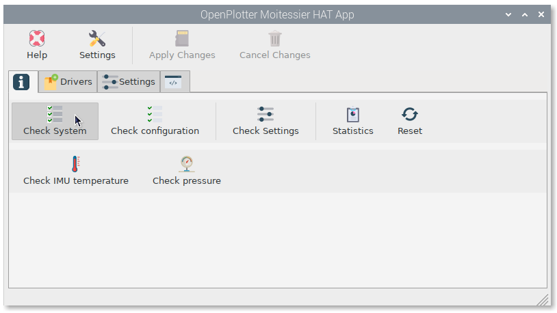

You could see some error messages because SPI and I2C interfaces are disabled or the Moitessier HAT driver is not installed yet:

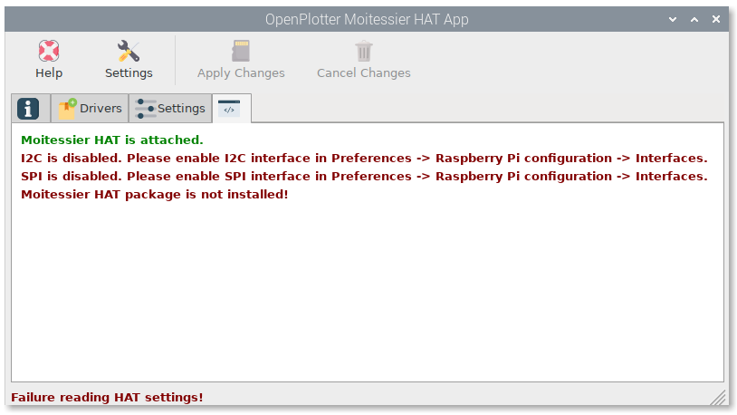

SPI and I2C must be enabled before installing the drivers. Go to applications menu and enable both of them in ``Preferences -> Raspberry Pi configuration -> Interfaces``:

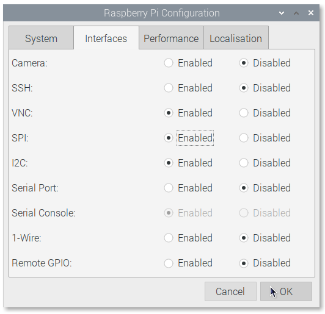

Installing drivers
******************

The driver must match your kernel version. After updating your system, the kernel could be also updated and your HAT will stop working. In ``Drivers`` tab you will find your current kernel version. Select the package matching your kernel and click on ``Install``. The drivers will be installed and the system rebooted. The package may need to do this twice, you will be notified.

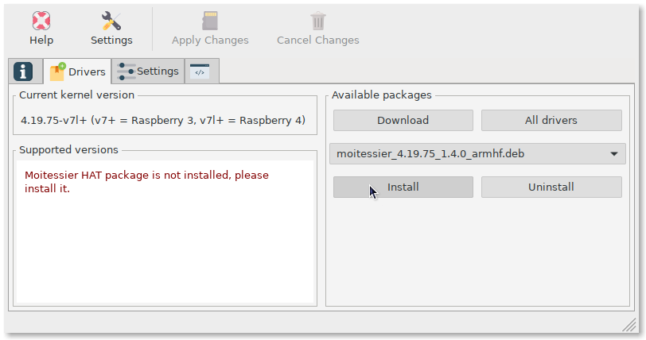

After rebooting you should see a list of kernels supported by the installed driver. If your current kernel is not supported by any of the available packages, click on ``Download`` and the system will try to find a suitable package from Internet. If this fails too, click on ``All drivers`` to go to *Rooco* site and ask them when the package will be available.

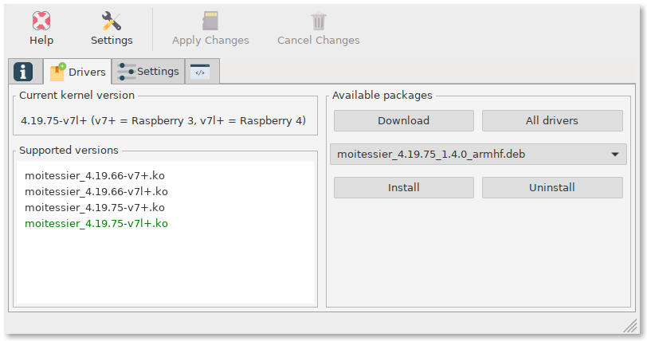

If everything went well, you should see something like this by clicking on ``Check System`` again:

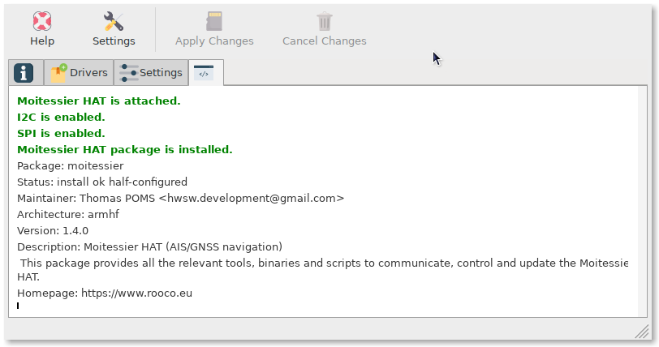

Now you are ready to configure your system. Go to ``Info`` tab and click on ``Check configuration``. The goal is to send all data to the ``Signal K`` server to be shared with any program that need data from our HAT like OpenCPN. The rest of apps will help us to do this.

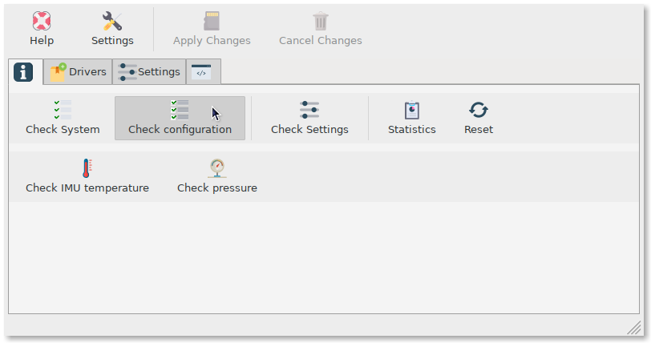

Configuring AIS and GNSS reception
**********************************

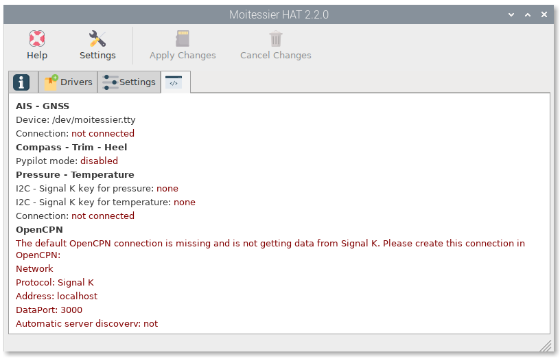

Go to ``Serial`` app and select the HAT from the the list of detected devices in ``Devices`` tab. Provide a short ``alias`` and select NMEA 0183 as the format of the expected ``data``. Finally click ``Apply``:

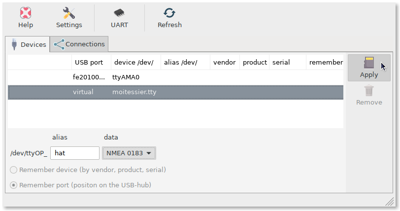

Go to ``Connections`` tab, select the HAT from the list, click on ``Add to Signal K`` and in the next window click ``AUTO``. This way we are creating a serial connection in ``Signal K`` server using the settings provided by ``Serial`` app.

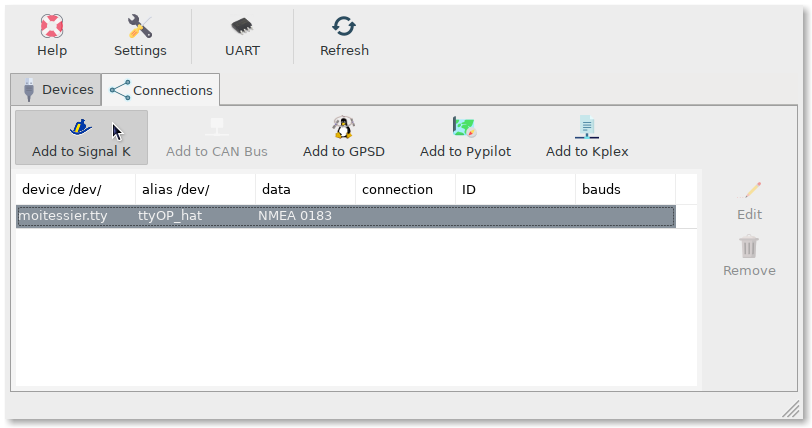

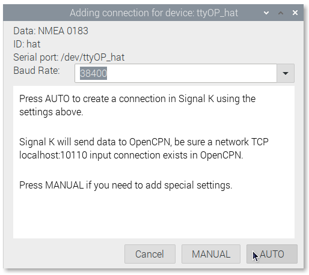

.. note::
	If you are going to use an autopilot you should select ``Add to Pypilot`` and finally connect pypilot to ``Signal K``. See :ref:`pypilot<pypilot>` chapter for details.

When the serial connection with our HAT has been created, ``Signal K`` will send the received NMEA 0183 data to any program connected to the network connection below.

+------------+------------+-----------+
|  Protocol  |   Address  |   Port    |
+============+============+===========+
|    TCP     |  localhost |   10110   |
+------------+------------+-----------+

Be sure this connection exists in OpenCPN and you are done. You should get position and AIS targets:

.. image:: img/gps5.jpg

Configuring compass, heel and trim reception
********************************************

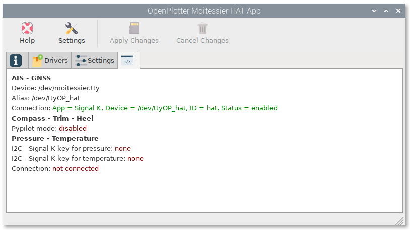

Go to ``Pypilot`` app an select ``Only compass``.

.. note::
	If you are going to use an autopilot you should select ``Autopilot``. See :ref:`pypilot <pypilot>` chapter for details.

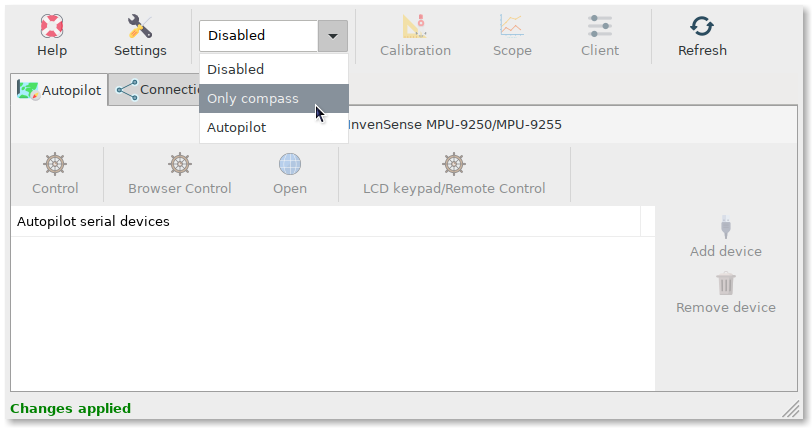

Then go to ``connections``, select the available connection and click on ``Add connection``. This way we are creating a network connection in ``Signal K`` to receive heading, pitch and heel data.

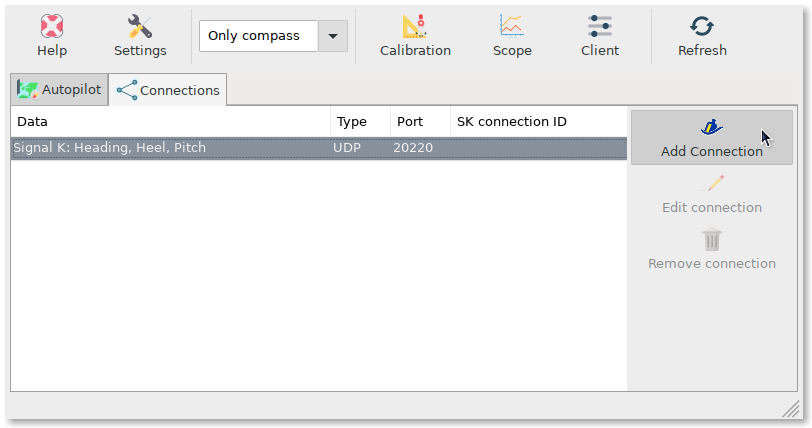

If you select ``Only compass`` pypilot generates heading, pitch and heel data in Signal K format. If we want to send these data to OpenCPN we need to convert it into NMEA 0183. Go to ``Signal K server`` and ``login`` (upper right). Go to ``Server`` > ``Plugin Config`` in the left menu. Click on ``Convert Singnal K to NMEA 0183`` and check ``active`` and ``HDM - Heading Magnetic``.

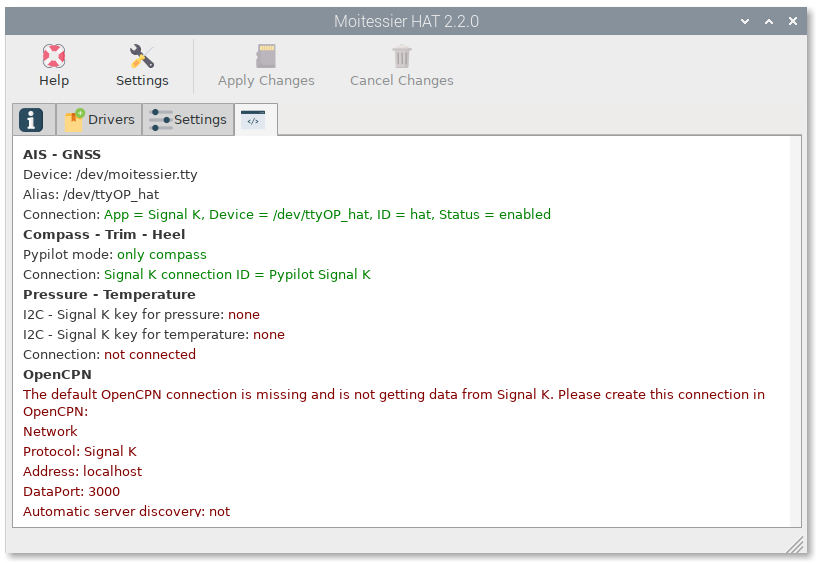

Scroll down, check ``XDR - (PTCH-ROLL) - Pitch and Roll`` and click on ``Submit``.

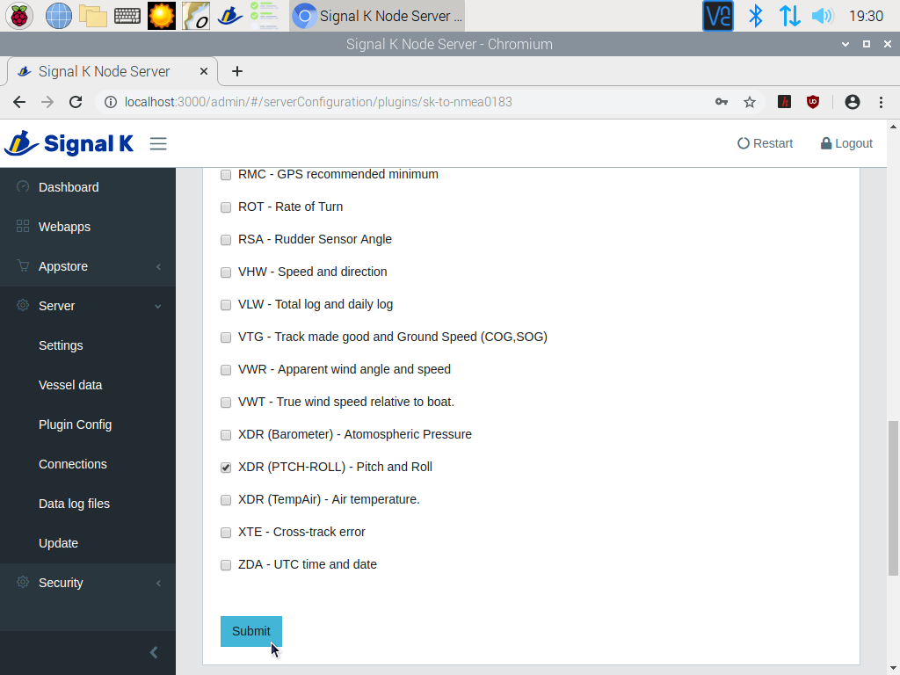

Signal K server will start sending the NMEA 0183 data to any program connected to the network connection below.

+------------+------------+-----------+
|  Protocol  |   Address  |   Port    |
+============+============+===========+
|    TCP     |  localhost |   10110   |
+------------+------------+-----------+

Be sure this connection exists in OpenCPN and you are done.

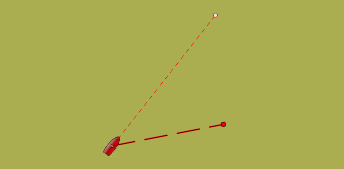

.. important::
	To get reliable heading readings you have to calibrate the compass following the steps of the :ref:`Pypilot compass calibration<calibration>` chapter.

Configuring pressure reception
******************************

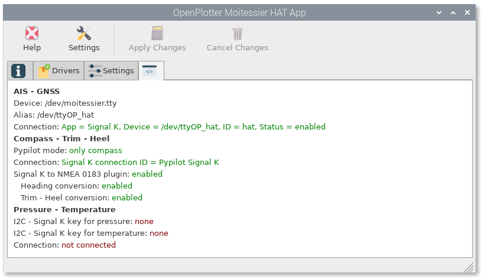

Go to ``Sensors`` tab in ``I2C`` app an click ``Add``.

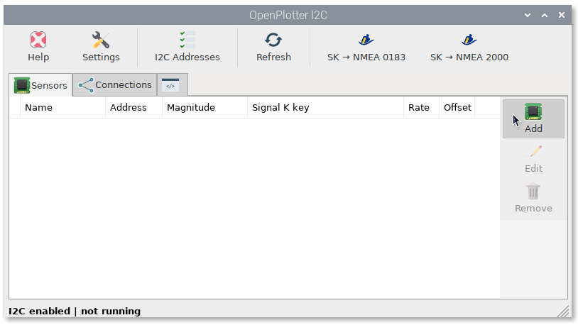

Select ``MS5607-02BA03`` in the list of detected sensors and click ``OK``.

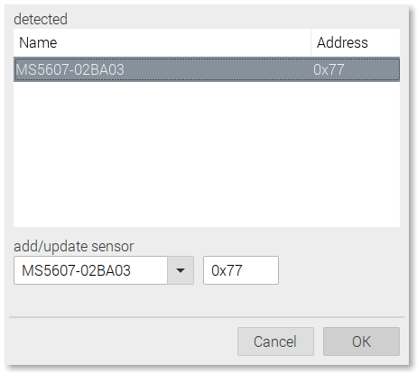

A Signal K key will be created for pressure by default. You can assign another one for temperature. The temperature sensor is affected by the heat produced by the Raspberry and the HAT itself, so we can not assign this value to environment.inside.temperature key, we should use something like environment.openplotter.temperature. Select ``temperature`` and click in ``Edit``.

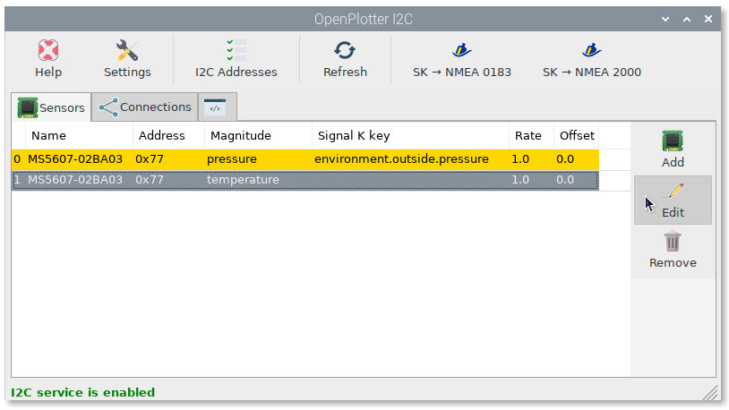

To choose a Signal K key click ``Edit``.

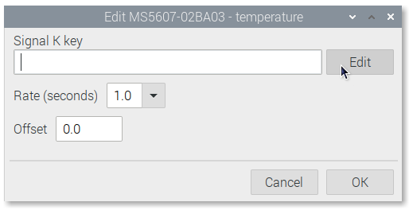

Select ``environment`` in the first column and ``inside.*.temperature`` in the second column. Write *openplotter* in the ``Replace`` field, press ``Replace`` button and the wildcard will be replaced by *openplotter*. Press ``OK``.

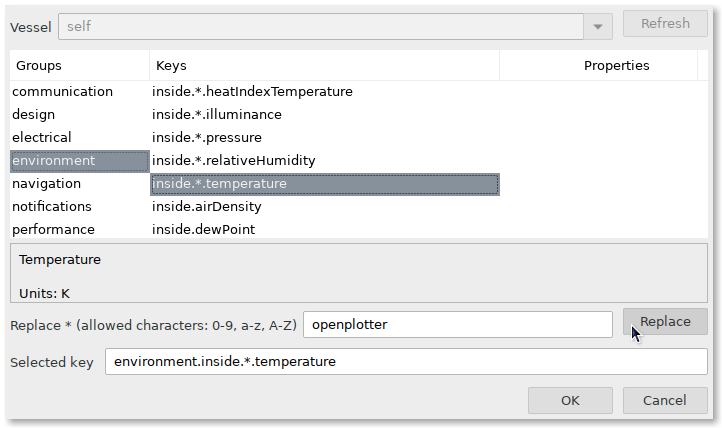

We do not need pressure or temperature data every second so we will select another ``Rate``. Click ``OK``. Edit the ``pressure`` value to select another ``Rate`` too.

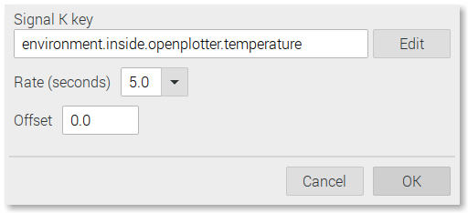

Go to ``Connections`` tab, select ``MS5607-02BA03`` sensor and click in either ``Add Connection`` to create a new network connection in ``Signal K`` or ``Edit port`` if you want to send these data to any existing network connection in ``Signal K``.

.. image:: img/pressure8.png

``I2C`` app generates data in Signal K format. If we want to send pressure data to OpenCPN we need to convert it into NMEA 0183. Go to ``Signal K server`` and ``login`` (upper right). Go to ``Server`` > ``Plugin Config`` in the left menu. Click on ``Convert Singnal K to NMEA 0183``, check ``XDR (Barometer) - Atmospheric Pressure`` and press ``Submit``.

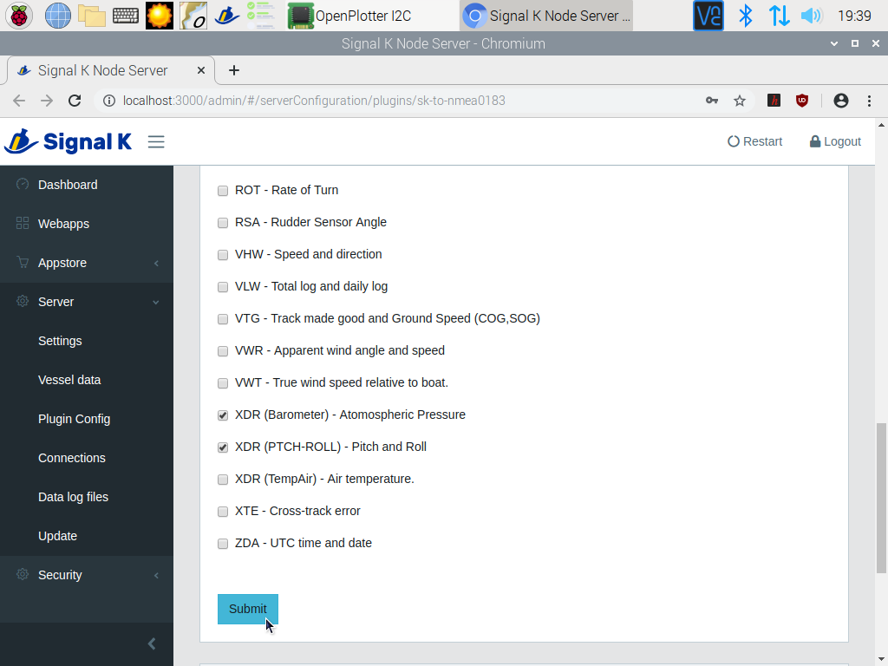

Signal K server will start sending the NMEA 0183 data to any program connected to the network connection below.

+------------+------------+-----------+
|  Protocol  |   Address  |   Port    |
+============+============+===========+
|    TCP     |  localhost |   10110   |
+------------+------------+-----------+

Be sure this connection exists in OpenCPN and you are done.

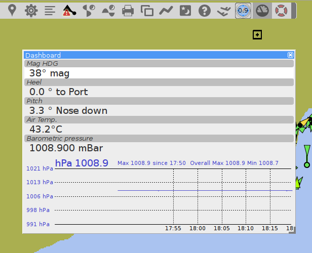