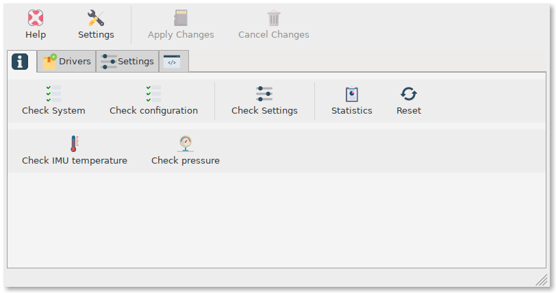

Configuration
#############

.. sidebar:: OpenPlotter Moitessier HAT

   `Download <https://nx8035.your-storageshare.de/s/mgakCZ5BSJYsysa>`_ the img or NOOBS file and follow the :ref:`manual to install<getting_started_installing>` it on your SD card.

The easiest way to make Moitessier HAT work on Raspberry Pi is to download and install a special OpenPlotter distribution. Everything is preinstalled and preconfigured in *OpenPlotter Moitessier HAT* and it will work out of the box, just plug and sail!

However, you should read the rest of this section to learn how to configure the HAT on your own and be able to play with its settings.

Installing drivers
******************

Configuring GNSS and AIS reception
**********************************

Configuring compass, heel and trim reception
********************************************

Configuring pressure reception
******************************

