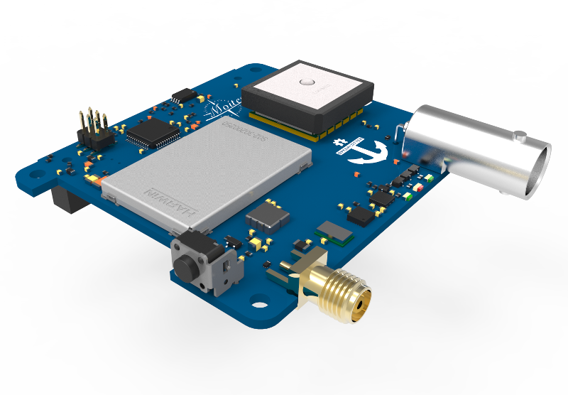
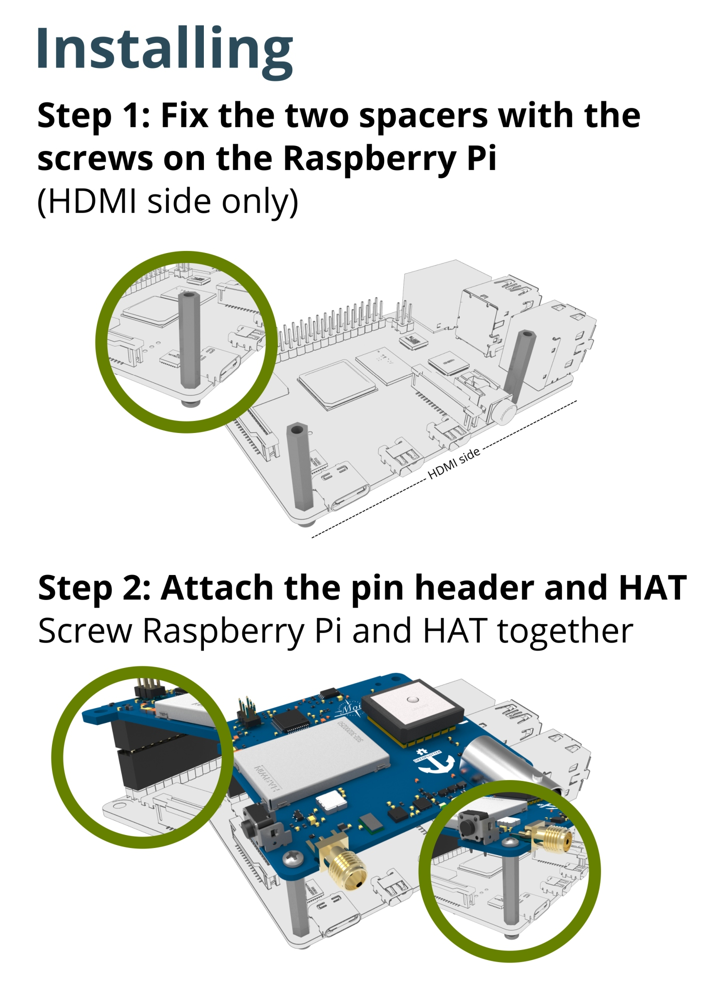
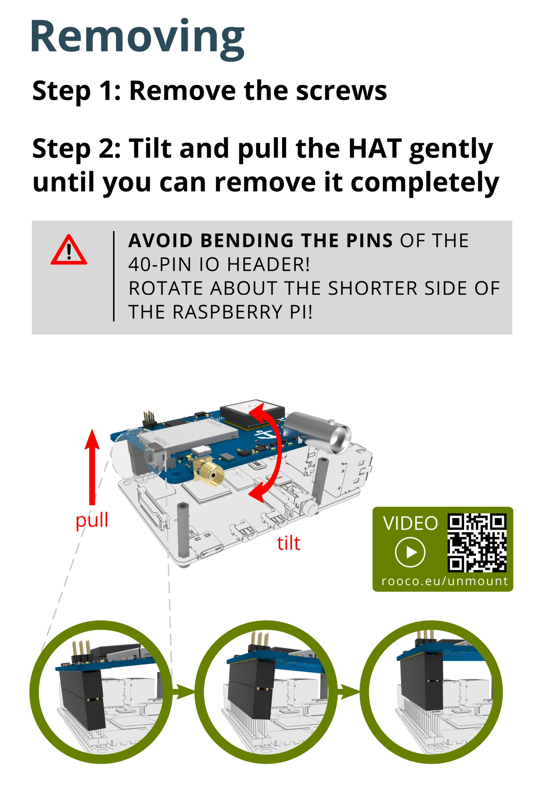
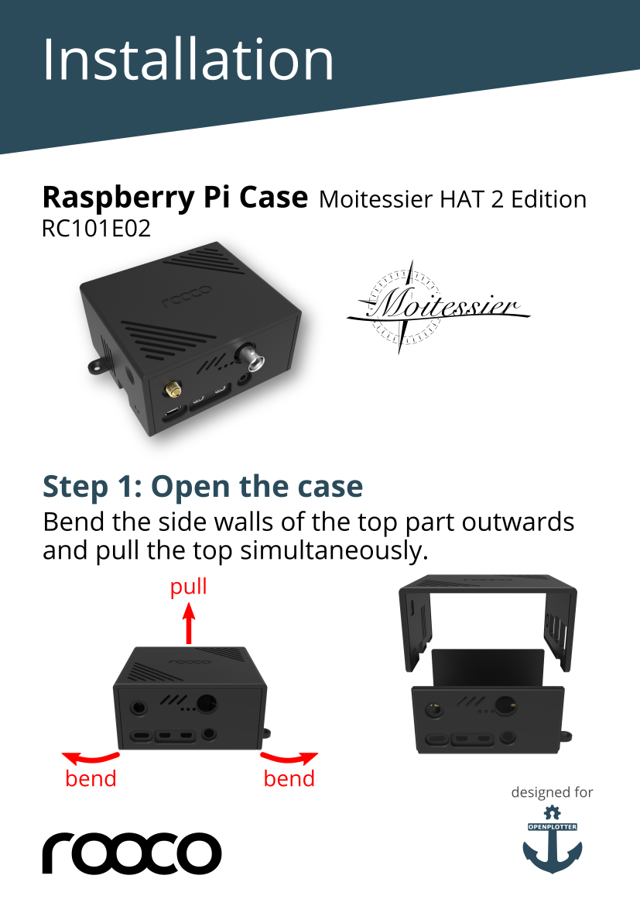
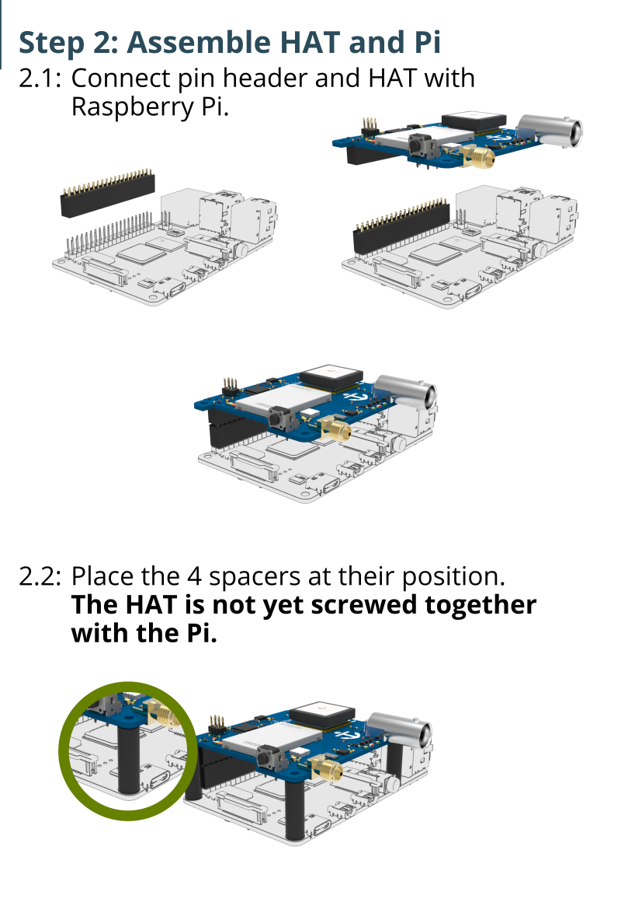
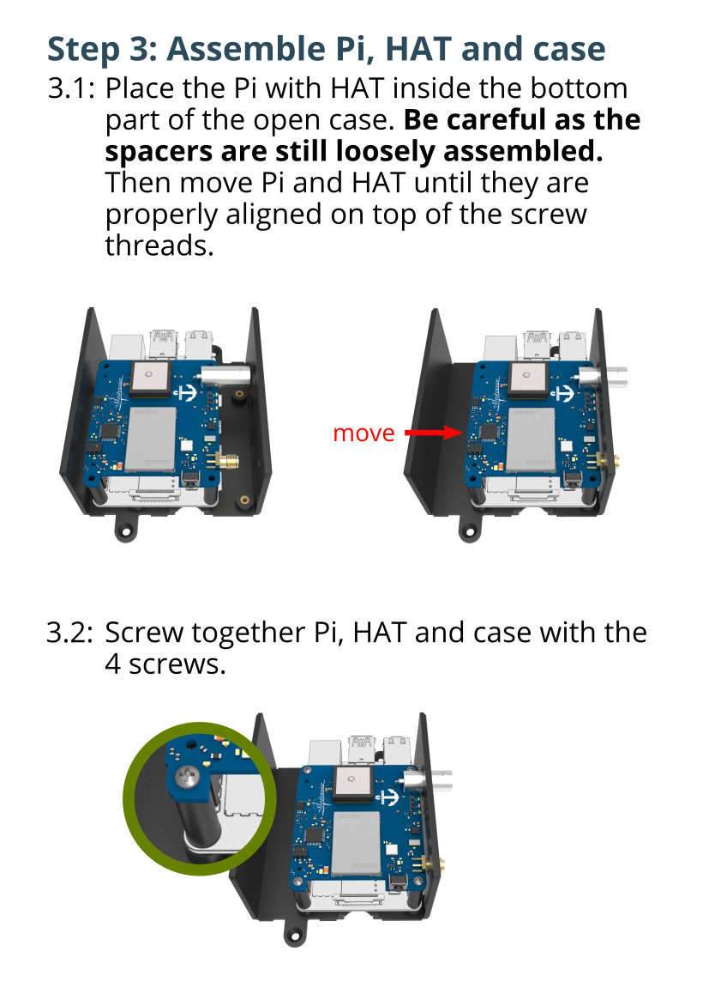
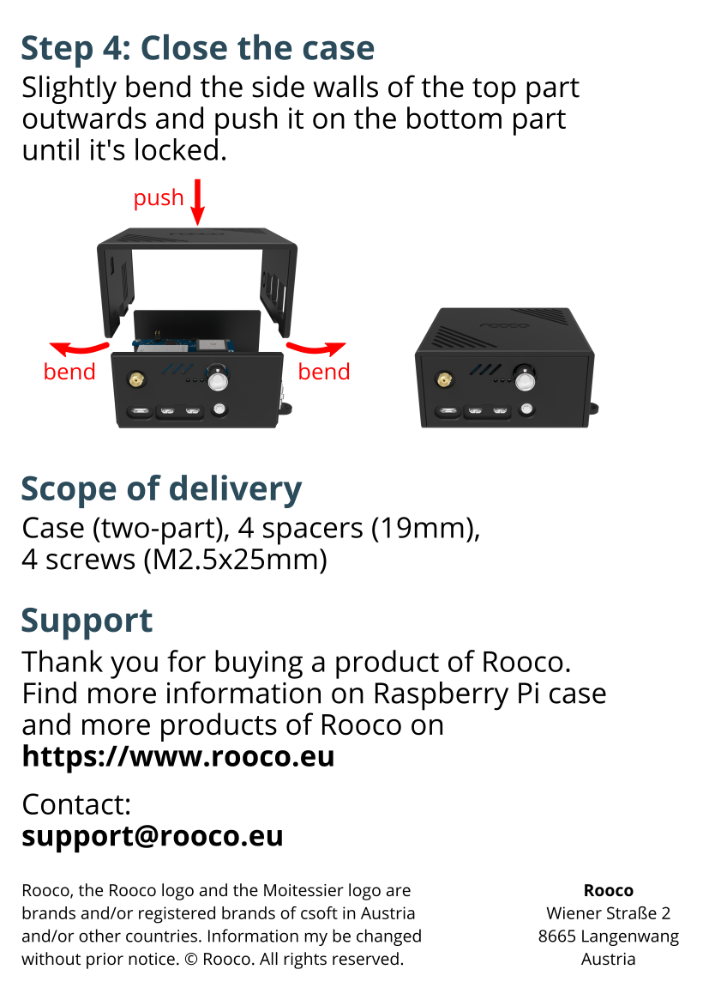
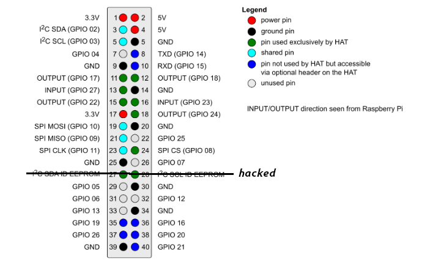

Moitessier HAT 2
################

.. note::
	You can buy this item in the `store <https://shop.sailoog.com/>`_.

Features
********

* High-sensitivity (better than -112 dBm) dual channel AIS receiver with SMA antenna connector.
* High-performance GNSS receiver with integrated patch antenna and external antenna support via BNC connector.
* Compass, heel and trim from gyroscope, accelerometer and magnetometer sensors (IMU).
* Barometric pressure.
* Standalone usage or in combination with Raspberry Pi (). Sensors are directly accessible via Raspberry Pi. Standalone usage requires 3.3V power supply and sensors are controlled by the HAT’s microcontroller.
* Fully compatible with Raspberry Pi models supporting 40-pin IO header.
* Data communication via SPI (AIS, GNSS and meta data) and via I2C (sensor data).Data accessible via device driver and device file.
* Supports ID EEPROM and automatic device tree loading.
* 3 status LEDs (AIS status, GNSS status, error).
* Shutdown button
* Firmware upgradeable via Raspberry Pi
* Full OpenPlotter compatible. Plug and play.

.. admonition:: Shutdown button

	You may now safely shutdown your OpenPlotter / Raspbian OS via the Moitessier HAT 2 shutdown switch. This will prevent your SD card image from crashing when turning off your Pi with power-off only.

	.. image:: img/shutdown.png
		:align: center

Mounting the HAT
****************

Removing the HAT
****************

.. danger::
	You can damage your Raspberry or your HAT if you do not remove it carefully, please watch this video before removing:

.. raw:: html

    <iframe title="vimeo-player" src="https://player.vimeo.com/video/273692504" width="640" height="360" frameborder="0" allowfullscreen></iframe>

Mounting the HAT into the case
******************************

.. note::
	You can buy this item in the `store <https://shop.sailoog.com/>`_.

Pinout
******

The HAT is controlled by the Raspberry Pi using several GPIOs. Green marked signals are not shareable with other hardware. Pins marked blue are not used by the HAT itself, but are accessible for extension purpose on optional headers on the HAT. I2C and SPI bus can be shared with other hardware. Keep in mind that this is not applicable for the chip select used with the SPI bus, which is exclusively used by the HAT.

