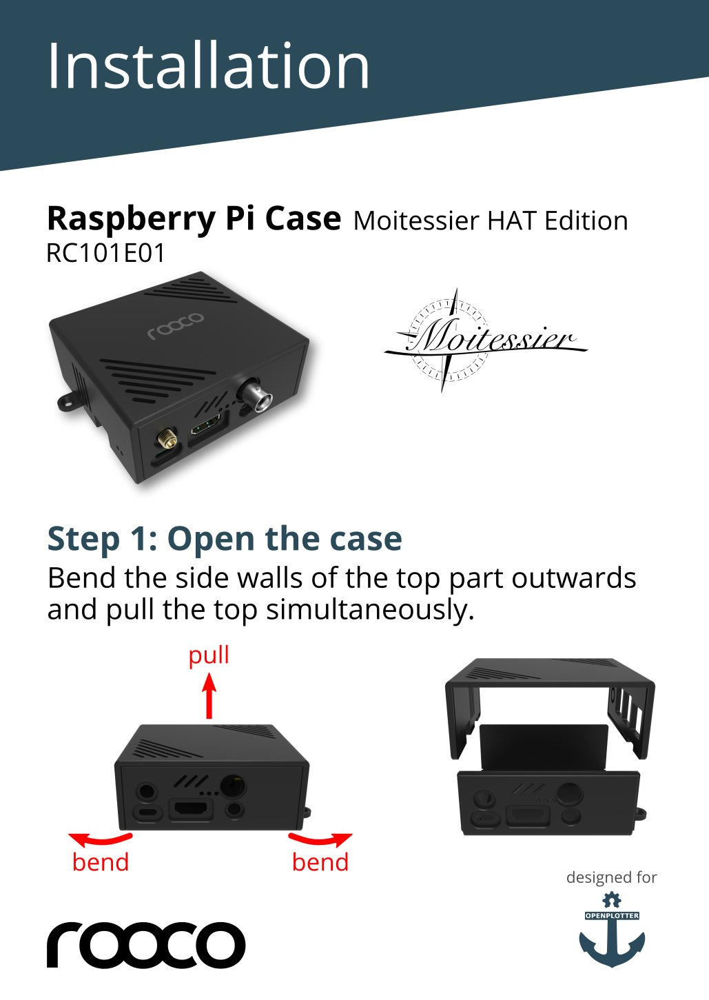
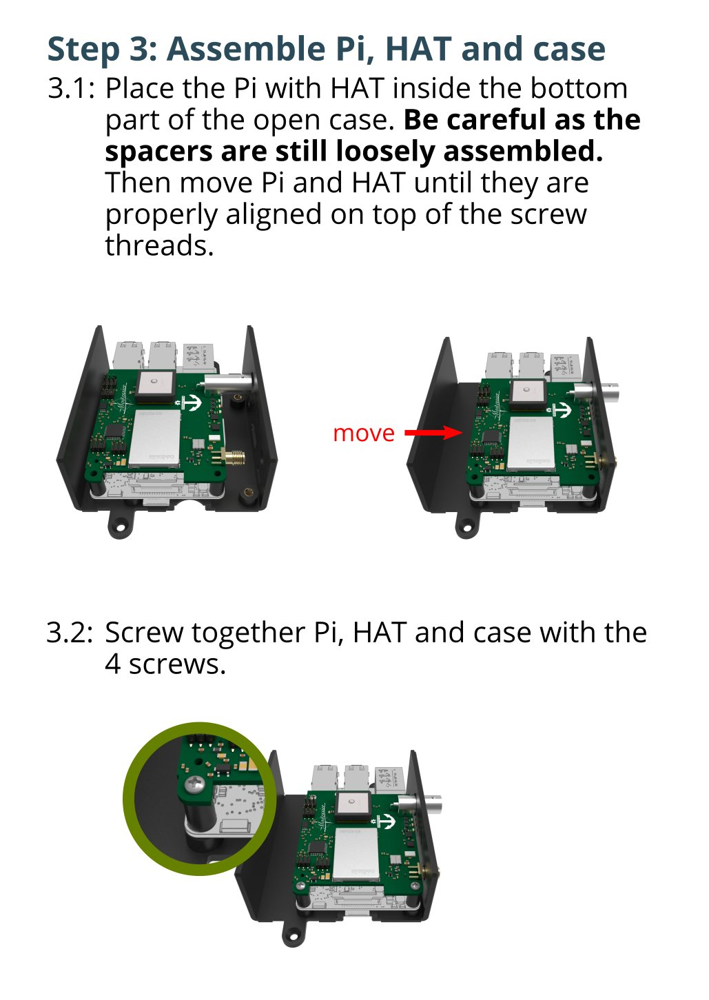
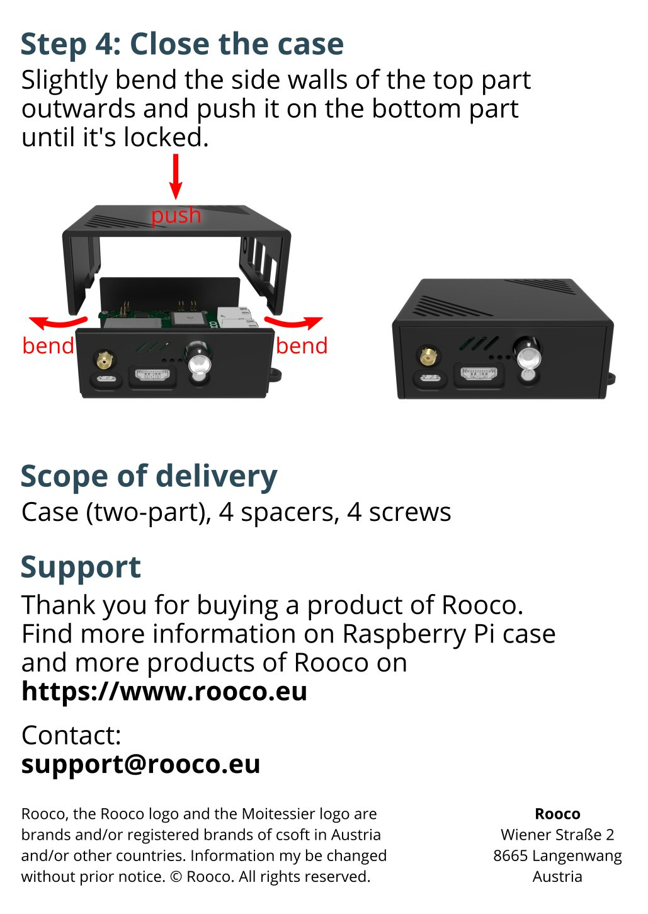

Moitessier HAT 2
################

.. important::
	Moitessier HAT 2 manual is under construction. Manual for `Moitessier HAT 1 <https://docs.sailoog.com/openplotter-v1-x-x/tools/moitessier-hat>`_.

.. image:: img/docs1.png

.. note::
	You can buy this item in the `store <https://shop.sailoog.com/>`_.

Features
********

* High-sensitivity (better than -112 dBm) dual channel AIS receiver with SMA antenna connector.
* High-performance GNSS receiver with integrated patch antenna and external antenna support via BNC connector.
* Compass, heel and trim from gyroscope, accelerometer and magnetometer sensors (IMU).
* Barometric pressure.
* Standalone usage or in combination with Raspberry Pi (). Sensors are directly accessible via Raspberry Pi. Standalone usage requires 3.3V power supply and sensors are controlled by the HAT’s microcontroller.
* Fully compatible with Raspberry Pi models supporting 40-pin IO header.
* Data communication via SPI (AIS, GNSS and meta data) and via I2C (sensor data).Data accessible via device driver and device file.
* Supports ID EEPROM and automatic device tree loading.
* 3 status LEDs (AIS status, GNSS status, error).
* Shutdown button
* Firmware upgradeable via Raspberry Pi
* Full OpenPlotter compatible. Plug and play.

Mounting the HAT
****************

.. image:: img/mounting1.jpg

Removing the HAT
****************

.. image:: img/mounting2.jpg

.. danger::
	You can damage your Raspberry or your HAT if you do not remove it carefully, please watch this video before removing:

.. raw:: html

    <iframe title="vimeo-player" src="https://player.vimeo.com/video/273692504" width="640" height="360" frameborder="0" allowfullscreen></iframe>

Mounting the HAT into the case
******************************

.. image:: img/case2.jpg

.. note::
	You can buy this item in the `store <https://shop.sailoog.com/>`_.