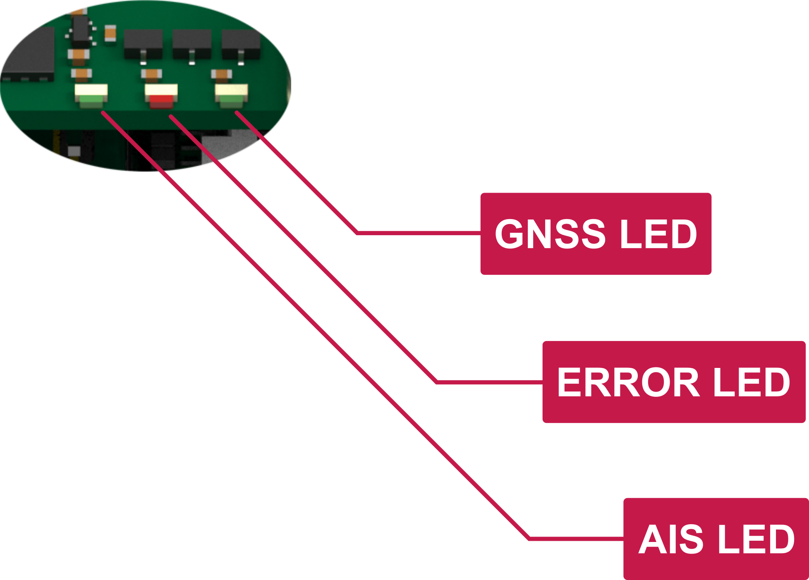
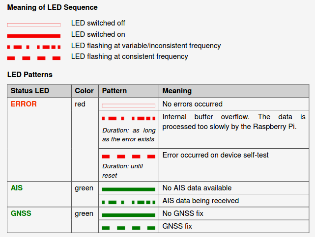

.. |ss| raw:: html

    <strike>

.. |se| raw:: html

    </strike>

Moitessier HAT 2
################

.. important:: 

	The `Moitessier HAT developers <https://www.rooco.eu/2021/03/09/our-plans-with-moitessier-hat/>`_ dropped support for the drivers leaving hundreds of users with unusable devices on Raspberry OS bullseye. Despite the promise of transferring manufacturing to interested companies or opening up the sources of hardware and software, this has never happened. At OpenMarine we consider this unacceptable and we promise to never again support closed and proprietary products.

	In this document, we offer a way to hack the Moitessier HAT 1 and 2 models without damaging the hardware or software to get rid of the drivers and give it a second life using most of its features in OpenPlotter v3.x.x.

.. image:: img/docs1.png

Features
********

* High-sensitivity (better than -112 dBm) dual channel AIS receiver with SMA antenna connector.
* High-performance GNSS receiver with integrated patch antenna and external antenna support via BNC connector.
* Compass, heel and trim from gyroscope, accelerometer and magnetometer sensors (IMU).
* Barometric pressure.
* Standalone usage or in combination with Raspberry Pi. Sensors are directly accessible via Raspberry Pi. 
* Fully compatible with Raspberry Pi models supporting 40-pin IO header.
* Data communication via |ss| SPI (AIS, GNSS and meta data) |se| and via I2C (sensor data). |ss| Data accessible via device driver and device file |se|.
* |ss| Supports ID EEPROM and automatic device tree loading |se|.
* 3 status LEDs (AIS status, GNSS status, error).
* |ss| Shutdown button |se|.
* |ss| Firmware upgradeable via Raspberry Pi |se|.
* Full OpenPlotter compatible. Plug and play.

.. admonition:: Shutdown button

	|ss| You may now safely shutdown your OpenPlotter / Raspbian OS via the Moitessier HAT 2 shutdown switch. This will prevent your SD card image from crashing when turning off your Pi with power-off only |se|.

	The shutdown button needs the abandoned driver and it will not work when used in "hacked" mode.

	.. image:: img/shutdown.png
		:align: center

Mounting the HAT
****************

.. image:: img/mounting1.jpg

Removing the HAT
****************

.. image:: img/mounting2.jpg

.. danger::
	You can damage your Raspberry or your HAT if you do not remove it carefully, please watch this video before removing:

.. raw:: html

    <iframe title="vimeo-player" src="https://player.vimeo.com/video/273692504" width="640" height="360" frameborder="0" allowfullscreen></iframe>

Mounting the HAT into the case
******************************

.. image:: img/Case-2-Quick-Installation-Web-P1.png
.. image:: img/Case-2-Quick-Installation-Web-P2.png
.. image:: img/Case-2-Quick-Installation-Web-P3.png
.. image:: img/Case-2-Quick-Installation-Web-P4.png

Pinout
******

The HAT is controlled by the Raspberry Pi using several GPIOs. Green marked signals are not shareable with other hardware. Pins marked blue are not used by the HAT itself, but are accessible for extension purpose on optional headers on the HAT. I2C and SPI bus can be shared with other hardware. Keep in mind that this is not applicable for the chip select used with the SPI bus, which is exclusively used by the HAT.

.. image:: img/pinout.png

Antennas
********
	
.. tip::
	For the best receiving performance, ensure that the cable lengths  of the antennas are as short as possible.

.. caution::
	It is recommended to use pigtail adapters to reduce mechanical force on the antenna connectors.

	.. image:: img/antennas1.png
			:align: center

**AIS Antenna**

The Moitessier HAT supports all popular VHF/AIS antennas. Please note the following features when selecting an antenna:

- 50 Ohm impedance
- SMA male connector for direct connection, or any other connector using a proper pigtail adapter
- Frequency range at least 161.95 MHz to 162.05 MHz
- RG 174 coaxial cable or better

.. caution::
	The coaxial cable attached to the SMA connector should have a maximum outside diameter of 3.7 mm. Larger diameters might cause mechanical force to the antenna connector.

A suitable splitter also enables the Moitessier HAT to share the VHF antenna of other radio equipmenton a ship. 

.. danger::
	Use splitters only that physically decouple the Moitessier HAT from any transmitter while transmission is in progress.

**GNSS Antenna**

Your device has an internal patch antenna. If it is not possible to  fit the HAT with an unobstructed view of the sky (such as below deck), an external GNSS antenna is required. Use a standard, active GNSS antenna that is fitted with a BNC connector.

Status LEDs
***********
	

