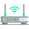
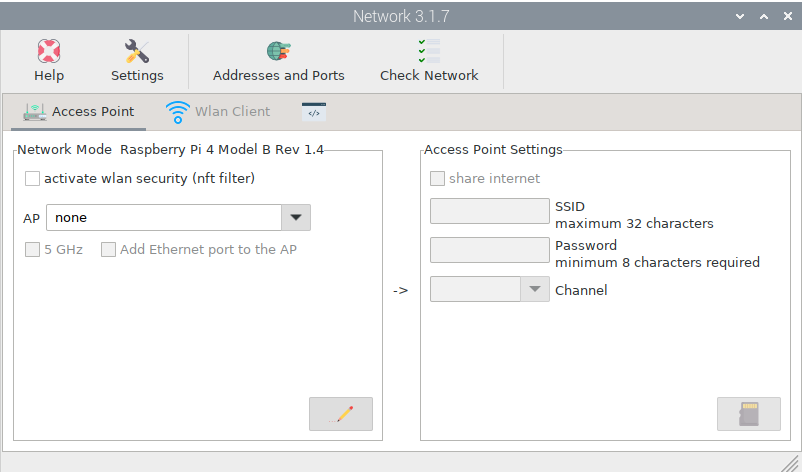
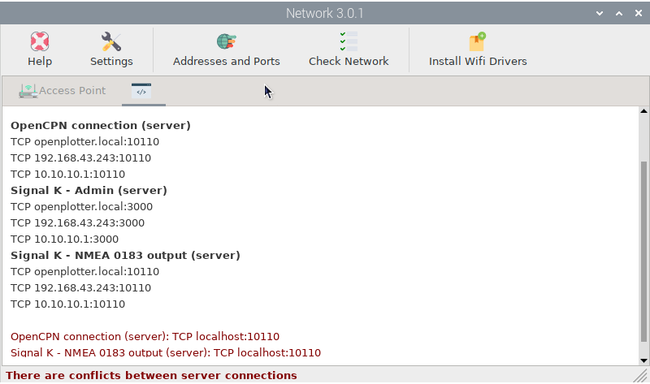
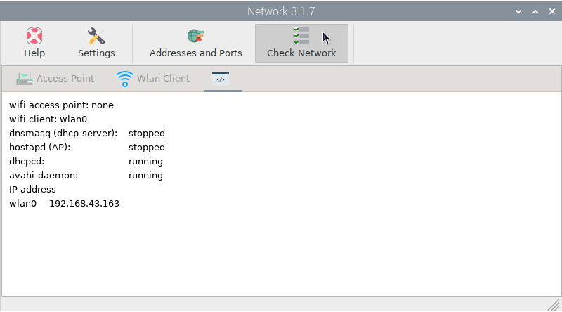
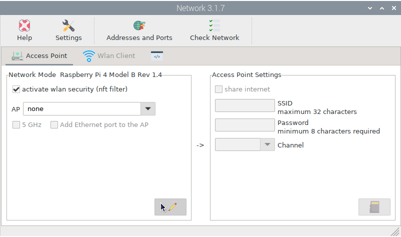
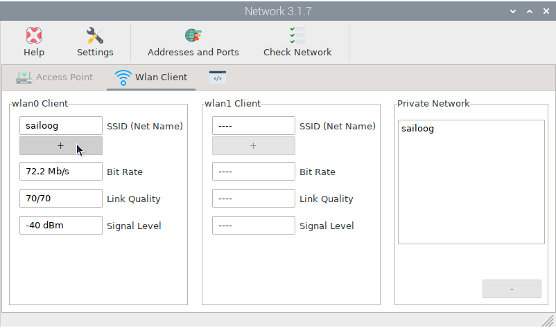

.. |mhelp| image:: ../img/help.png
.. |mSettings| image:: ../img/settings.png

.. |OPnetAdd| image:: img/ports.png
.. |OPnetCheck| image:: img/check.png
.. |OPnetEdit| image:: img/edit.png
.. |OPnetSave| image:: img/ok.png

|OPnet| Network
###############

.. note::
	To run this app type this in a terminal:

	.. parsed-literal::

		openplotter-network

|mhelp| ``Help`` opens an offline copy of this documentation in a browser and |mSettings| ``Settings`` opens the main app *OpenPlotter Settings*.

The purpose of this app is to provide useful information about your network and create an access point (AP) that other devices can connect to in order to share data.

|OPnetAdd| ``Addresses and Ports`` is a really useful tool. It will inform you about all the ports that are being used in your system by different applications and the existence of possible conflicts between them:

|OPnetCheck| ``Check Network`` is another useful tool to know the status of your network at any time:

Security
********

If you are connected to the marina's public WiFi and that access point is not properly configured or secured, any device connected to the same access point will access your system's open resources like the Signal K server, some data streams, dashboards, etc. 

To avoid this, check ``activate wlan security (nft filter)``, click |OPnetEdit| ``Edit`` and finally |OPnetSave| ``Save``. After reboot, any device trying to connect to your system will be blocked:

If you trust your marina's public WiFi or you are also connected to a local network using a second WiFi device, such as a USB dongle, you can grant access to your system only to devices connected to that trusted access point. Go to the |OPnetWifi| ``Wlan Client`` tab and add the trusted access point to the *Private Network* by clicking ``+``:

